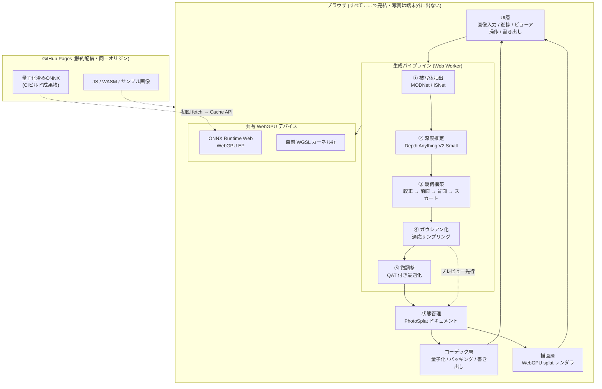

# 02. アーキテクチャ

## 2.1 全体像



処理は一方向に流れる。④の直後に**プレビュー用のドキュメントを確定させて描画層に渡す**ため、
ユーザーは⑤の微調整を待たずに操作を開始できる。⑤が終わると、ドキュメントが差し替わって画質が向上する。

## 2.2 レイヤ構成と責務

| レイヤ | 責務 | やらないこと |
|---|---|---|
| UI層 | 画像の受け取り、進捗表示、ビューアのカメラ操作、書き出しの起動 | 数値計算、GPUリソースの直接操作 |
| パイプライン層 | 写真から `PhotoSplatDocument` を作る一連の処理 | 描画、ファイル形式の知識 |
| ランタイム層 | WebGPUデバイスの生成と共有、ONNXセッションの管理、WGSLカーネルの実行 | パイプラインの手順の知識 |
| コーデック層 | 量子化、`.pgs` / `.spz` / `.ply` の相互変換 | 幾何の意味の解釈 |
| 描画層 | ドキュメントを画面に出す | ドキュメントの生成・改変 |
| 状態管理 | `PhotoSplatDocument` の保持と差し替え通知 | 計算 |

**モジュール間の唯一の共通言語は `PhotoSplatDocument`** である（§2.4）。
パイプラインはこれを作り、描画層とコーデック層はこれを読む。3者は互いを知らない。

### 依存の向き

```
UI ──▶ 状態管理 ◀── パイプライン ──▶ ランタイム
        │                              ▲
        ├──▶ 描画層 ───────────────────┘
        └──▶ コーデック層
```

ランタイム層（WebGPUデバイス）だけがパイプラインと描画層の双方から使われる。
**WebGPUデバイスは全体で1つだけ生成して共有する**（§2.5）。

## 2.3 実行モデル — メインスレッドとWorker

| 処理 | 実行場所 | 理由 |
|---|---|---|
| UI・カメラ操作 | メインスレッド | DOM操作が必要 |
| 描画ループ | メインスレッド | canvas への描画。60fps を維持するため他の重い処理を置かない |
| セグメンテーション・深度推定 | **Worker** | 数百msブロックするとタップ操作が固まる |
| 幾何構築・ガウシアン化 | **Worker** | 同上 |
| 微調整（QAT最適化） | **Worker** | 2.5秒間ブロックする。プレビューの操作性を守るため必須 |
| 量子化・パッキング | **Worker** | PNG/WebPエンコードを含む |

GitHub Pages は COOP/COEP ヘッダを返せないため `SharedArrayBuffer` が使えない。
そのため Worker との受け渡しは **`ArrayBuffer` の transfer**（ゼロコピー移譲）で行う。コピーは発生しない。

> **重要な帰結**: `SharedArrayBuffer` が無いということは、ONNX Runtime Web の **WASM バックエンドがシングルスレッドに制限される**ということでもある。
> これが D5「WebGPU必須」の技術的な根拠である。WASM シングルスレッドでの深度推定は10秒SLOに収まらない。
> `coi-serviceworker` による回避策は存在するが、Service Worker を導入しない方針（D11）と、WebGPU があれば不要であることから採用しない。

### WebGPU デバイスと Worker

`GPUDevice` は Worker に transfer できない。そこで次の構成をとる。

- **推論と重い計算用のデバイス**: Worker 内で独自に `requestAdapter()` → `requestDevice()` して生成
- **描画用のデバイス**: メインスレッドで生成
- 両者の間のデータ受け渡しは `ArrayBuffer` 経由（GPU→CPU→GPU）

GPU⇄CPU の往復が入るが、受け渡すのは1回きり（微調整済みガウシアン群、後述の通り約2.4MB）なので数ms で済み、10秒予算に対して無視できる。
デバイスを2つ持つコストより、描画スレッドをブロックしない利益が大きい。

## 2.4 中心データ構造 `PhotoSplatDocument`

パイプライン・描画・コーデックの3者が共有する唯一の型。**画像平面に紐づいた表現**であることが最大の特徴で、
これが軽量化設計（[04](./04-compression.md)）の土台になっている。

```ts
/** 生成結果1件を表す。全モジュールがこれだけを介してやり取りする。 */
interface PhotoSplatDocument {
  /** 作業グリッドの解像度。既定 512×512。 */
  readonly width: number;
  readonly height: number;

  /** 仮想カメラの内部パラメータ。深度から3D位置を復元するのに必須。 */
  readonly camera: {
    /** 焦点距離（ピクセル単位）。EXIF から取得、無ければ FOV 55° 相当を仮定。 */
    focalPx: number;
    /** 主点。既定は画像中心。 */
    cx: number; cy: number;
  };

  /** 深度の正規化パラメータ。z = nearZ + depth01 * (farZ - nearZ) */
  readonly depthRange: { nearZ: number; farZ: number };

  // ---- 画像平面に並んだ属性 (width × height) ----
  /** 前面の深度。0..65535 の16bit。 */
  readonly frontDepth: Uint16Array;
  /** 前面の色 (RGB, sRGB, 8bit)。 */
  readonly frontColor: Uint8ClampedArray;
  /** 不透明度 兼 占有マスク。0 は「ガウシアンなし」を意味する。 */
  readonly alpha: Uint8ClampedArray;
  /** 背面までの厚み。0..65535。0 は背面シェルなしを意味する。 */
  readonly thickness: Uint16Array;
  /** 背面の色。省略時は前面色から導出する（§03参照）。 */
  readonly backColor?: Uint8ClampedArray;

  // ---- 画像平面に載らない補助ガウシアン ----
  /** 深度不連続の縁を塞ぐスカート。数が少ないので個別に持つ。 */
  readonly skirt: LooseGaussians | null;

  /** 生成の由来と設定。書き出し時にメタデータとして埋める。 */
  readonly meta: DocumentMeta;
}

/** 画像平面に載らないガウシアンの素の配列表現。 */
interface LooseGaussians {
  count: number;
  position: Float32Array;   // count * 3
  normal: Float32Array;     // count * 3 （回転はここから導出）
  scale: Float32Array;      // count * 2 （サーフェルなので2軸）
  color: Uint8ClampedArray; // count * 3
  opacity: Uint8ClampedArray; // count
}
```

### なぜこの形なのか

素朴な実装なら「ガウシアンの配列」を持つところを、**画像平面に並んだ属性マップ**として持っている。理由は3つ。

1. **位置を保存しなくてよい。** ピクセル座標 `(u,v)` と `frontDepth[v*w+u]` と `camera` があれば3D位置が一意に決まる。
   3成分のfloat（12バイト）が、深度1成分（2バイト）に縮む。
2. **回転とスケールを保存しなくてよい。** 法線は深度マップの局所勾配から解析的に求まる。
   サーフェルの向きは法線に一致させるので、回転は導出可能。スケールも深度と隣接ピクセル間隔から決まる。
3. **画像コーデックがそのまま使える。** 隣接ピクセルの値が似ているため、PNG の予測フィルタや WebP の空間予測が最大限効く。
   一般の3DGS圧縮ではこの並び順を作るために重いソートが要る（[04](./04-compression.md#432-なぜ本設計では並べ替えが不要か)）。

`skirt` だけは画像平面に載らない（深度の縁から「はみ出す」位置に置くため）が、
全体の5%程度の個数なので、素の配列で持ってもサイズへの影響は小さい。

## 2.5 ランタイム層 — WebGPUデバイスの共有

```ts
/** Worker内で1つだけ生成し、ONNXとWGSLカーネルで共有する。 */
class GpuRuntime {
  readonly device: GPUDevice;
  /** ORT に同じデバイスを使わせる。二重確保を避けVRAMを節約する。 */
  readonly ortSessionOptions: ort.InferenceSession.SessionOptions;
  ...
}
```

ONNX Runtime Web の WebGPU EP には、外部で作った `GPUDevice` を渡す口がある。
これを使わないと ORT が自前でデバイスを確保し、推論結果を取り出すたびに CPU 経由の往復が発生する。
同一デバイスを共有すれば、**深度推定の出力テンソルを GPU バッファのまま自前 WGSL カーネルに渡せる**。

これは10秒予算の中で効く最適化のひとつで、512×512×f32 の往復（約1MB × 数回）を丸ごと省ける。

## 2.6 モデルレジストリ (D6 への対応)

ライセンス方針が未定のため、モデルは**設定ファイルで差し替え可能**にする。

```jsonc
// models/registry.json — CIとブラウザの双方が読む単一の真実
{
  "$schema": "./registry.schema.json",
  "profiles": {
    // 既定。MIT / Apache-2.0 のみ。商用利用に制約なし。
    "permissive": {
      "depth":       "depth-anything-v2-small",
      "mattePerson": "modnet",
      "matteObject": "isnet-general"
    },
    // 非商用でよい場合に切り替えるプロファイル。背景除去の精度が上がる。
    "research": {
      "depth":       "depth-anything-v2-small",
      "mattePerson": "modnet",
      "matteObject": "rmbg-1.4"
    }
  },
  "models": {
    "depth-anything-v2-small": {
      "source": "hf:depth-anything/Depth-Anything-V2-Small",
      "onnx":   "hf:onnx-community/depth-anything-v2-small/onnx/model.onnx",
      "license": "Apache-2.0",
      "commercialUse": true,
      "quantization": { "mode": "q4f16", "excludeOpTypes": ["LayerNormalization", "Softmax"] },
      "expectedBytes": 19100000,
      "inputSize": [518, 518]
    },
    "modnet": {
      "source": "hf:Xenova/modnet",
      "onnx":   "hf:Xenova/modnet/onnx/model.onnx",
      "license": "Apache-2.0",
      "commercialUse": true,
      "quantization": { "mode": "uint8", "perChannel": true },
      "expectedBytes": 6600000,
      "inputSize": [512, 512]
    },
    "isnet-general": {
      "source": "hf:imgly/isnet-general-onnx",
      "onnx":   "hf:imgly/isnet-general-onnx/onnx/model.onnx",
      "license": "MIT",
      "commercialUse": true,
      "quantization": { "mode": "uint8", "perChannel": true },
      "expectedBytes": 44100000,
      "inputSize": [1024, 1024]
    },
    "rmbg-1.4": {
      "source": "hf:briaai/RMBG-1.4",
      "license": "bria-rmbg-1.4 (非商用)",
      "commercialUse": false,
      "quantization": { "mode": "uint8", "perChannel": true },
      "expectedBytes": 44400000,
      "inputSize": [1024, 1024]
    }
  }
}
```

- **CI** はこれを読んでダウンロード・量子化し、`commercialUse: false` のモデルがビルドに含まれる場合は警告を出す。
- **ブラウザ** は `profiles` の該当エントリを見て、必要なモデルだけを遅延ロードする。
- プロファイルの切り替えは、この JSON の1行と再デプロイだけで完了する。

### 調査で確定したモデル候補

| 用途 | モデル | ライセンス | 元サイズ | 量子化後 | 備考 |
|---|---|---|---|---|---|
| 深度推定 | Depth Anything V2 Small | **Apache-2.0** | 99.1 MB | **19.1 MB** (q4f16) | 唯一の必須モデル。V2 の Base/Large は CC-BY-NC のため使用不可 |
| 人物マット | MODNet (Xenova) | **Apache-2.0** | 25.9 MB | **6.6 MB** (uint8) | 人物特化。軽くて速い |
| 汎用マット | ISNet-general (img.ly) | **MIT** | 176.1 MB | **約44 MB** (uint8, CIで生成) | 物体全般。量子化版は未公開のため自前で作る |
| 汎用マット（代替） | RMBG-1.4 | **非商用** | 176.2 MB | 44.4 MB (公開済) | 精度は高いが商用不可。`research` プロファイル専用 |
| 汎用マット（不採用） | BiRefNet-ONNX | MIT | 972.7 MB | fp16でも489.7 MB | モバイルには大きすぎる |

## 2.7 ディレクトリ構成

```
cc_create3dgs/
├─ .github/workflows/
│   ├─ deploy.yml              # ビルド → 量子化(キャッシュ) → テスト → バジェット → Pages
│   ├─ quantize.yml            # 量子化設定変更時の精度差分レポート (PRコメント)
│   ├─ test.yml                # PR時の単体・結合テスト
│   └─ budget.yml              # 性能バジェット監視
│
├─ docs/                       # 本設計書
│
├─ models/
│   ├─ registry.json           # モデルレジストリ (§2.6)
│   ├─ registry.schema.json
│   ├─ calibration/            # 量子化較正用の画像 (12枚, 各~100KB)
│   └─ .gitignore              # *.onnx をコミットしない (D7)
│
├─ scripts/
│   ├─ fetch_models.py         # registry.json に従い HF から取得
│   ├─ quantize.py             # ONNX量子化。設定は registry.json から
│   ├─ calibrate.py            # 量子化前後の精度差分を測定
│   └─ budget_check.mjs        # サイズ・品質バジェットの検証
│
├─ public/
│   └─ samples/                # 同梱サンプル画像 (D12)。人物2枚・物体3枚
│
├─ src/
│   ├─ main.ts
│   ├─ ui/                     # 日本語UI (D11)
│   │   ├─ Dropzone.ts         #   ファイル選択 / D&D / 貼付 (D12)
│   │   ├─ Progress.ts         #   段階別の進捗表示
│   │   ├─ Viewer.ts           #   ビューアのカメラ操作
│   │   └─ ExportPanel.ts      #   書き出しUI
│   │
│   ├─ runtime/
│   │   ├─ GpuRuntime.ts       # WebGPUデバイスの生成と共有 (§2.5)
│   │   ├─ OrtSession.ts       # ONNXセッションの遅延ロードとキャッシュ
│   │   └─ capability.ts       # WebGPU 対応判定と機能検出
│   │
│   ├─ pipeline/
│   │   ├─ index.ts            # 段階の直列実行と進捗通知
│   │   ├─ worker.ts           # Worker エントリ
│   │   ├─ 1-matte.ts          # ① 被写体抽出
│   │   ├─ 2-depth.ts          # ② 深度推定 (タイル分割含む)
│   │   ├─ 3-calibrate.ts      # ③a 深度の較正・メトリック化
│   │   ├─ 4-shell.ts          # ③b 前面/背面シェル・厚み推定
│   │   ├─ 5-skirt.ts          # ③c スカート生成
│   │   ├─ 6-gaussianize.ts    # ④ 適応サンプリング
│   │   ├─ 7-refine.ts         # ⑤ QAT付き微調整
│   │   └─ wgsl/               #   各段のWGSLカーネル
│   │
│   ├─ codec/
│   │   ├─ quantize.ts         # 属性の量子化・逆量子化 ([04])
│   │   ├─ pgs.ts              # .pgs 独自形式 ([05])
│   │   ├─ spz.ts              # .spz 書き出し ([05])
│   │   └─ ply.ts              # .ply 書き出し ([05])
│   │
│   ├─ render/
│   │   ├─ SplatRenderer.ts    # レンダラ抽象 (D9のリスク緩衝, [06])
│   │   ├─ backends/three.ts   #   Three.js ネイティブ実装
│   │   ├─ backends/wgsl.ts    #   自前WGSL実装 (r186未リリース時のつなぎ)
│   │   └─ wgsl/               #   ラスタライズ・ソートカーネル
│   │
│   └─ doc/
│       └─ PhotoSplatDocument.ts  # §2.4 の型定義と生成・検証
│
└─ tests/
    ├─ unit/                   # コーデックの往復・量子化誤差
    ├─ golden/                 # 参照出力との比較用データ
    └─ e2e/                    # Playwright + headless Chrome (WebGPU)
```

## 2.8 技術スタック

| 領域 | 採用 | 理由 |
|---|---|---|
| 言語 | TypeScript (strict) | 属性配列の取り違えが致命的なため、型で守る |
| ビルド | Vite | Worker とWGSLのバンドルが素直。Pages 向けの `base` 設定が容易 |
| UIフレームワーク | **なし（素のDOM）** | 画面が3つ（入力・進捗・ビューア）しかない。バジェット280KBに対しフレームワークは割に合わない |
| 推論 | ONNX Runtime Web (WebGPU EP) | transformers.js より低レベルだが、前後処理を自前WGSLで書くため制御が必要。バンドルも小さい |
| 描画 | Three.js WebGPURenderer + splat | D9。ただし [06](./06-rendering.md) の緩衝レイヤ経由 |
| 数値計算 | 自前 WGSL | 幾何構築・微調整・量子化はすべてGPUで行う |
| テスト | Vitest + Playwright | |
| 量子化 | Python + onnxruntime.quantization | CI専用。ブラウザには載らない |
