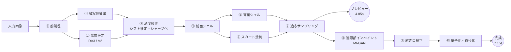

# 03. 生成パイプライン

写真1枚から `PhotoSplatDocument` を作るまでの全工程。**v2 で見直した箇所は各節の冒頭に「v2」と記す。**

## 3.1 全体の流れ



v1 との違いは、⑧に**インペイント**が入り、⑨の微調整が**継ぎ目補正**に縮小されたこと。
品質投資の主軸を「入力視点の再現精度」から「入力視点からは見えない部分の妥当さ」へ移している。
入力視点の再現は、深度由来の3DGSでは元から高い。斜めから見たときの破綻こそが体験を決める。

## 3.2 ⓪ 前処理

| 手順 | 内容 |
|---|---|
| EXIF 読み取り | 回転タグを適用して正立させる。焦点距離は DA3 の `intrinsics` から得るので、EXIF は DA3 が使えないときの予備 |
| 色空間 | sRGB を仮定。Display P3 の写真は sRGB に変換 |
| リサイズ | **長辺 1024px**。作業グリッドと一致させる（v2） |
| 正方化 | アスペクト比を保ったままレターボックスで正方形に。パディング領域は α=0 |
| 深度用入力 | 518px 版（全体パス）と、被写体バウンディングボックスを 2×2 に分けた 518px 版 ×4（タイルパス）を別に作る |

**作業グリッドは 1024×1024（v2, D17）。** 色プレーンは写真そのものであり、ここが品質の天井になる。
1024² は深度タイルパスの実効解像度（1036²）とも揃う。被写体の画面占有率が典型的に 35〜45% なので、
前面シェルの画素数は約 37万〜47万。適応サンプリング後のガウシアン数は [04](./04-compression.md#43-l1--個数の削減) 参照。

軽量プリセットのみ 512² を使う。

### 3.2.1 レターボックスの詰め物は端の画素で埋める（v2.3、実写で判明）

詰め物を黒のままモデルへ渡すと、内容の縁に強い段差ができる。MODNet はそこに反応して、画像の左端に沿った縦帯を前景と誤判定していた（y=900 の行で、腕は x=314 からなのに x=226 から被写体とされ、プールサイドを 88 画素ぶん含んでいた）。被写体の内部にも穴が 2 か所できていた。

詰め物を端の画素で伸ばすと、どちらも消える。深度モデルの内部パラメータの推定も変わる（焦点距離 891px → 1133px）。

α は 0 のまま残す。後段が「ここに被写体は無い」と判別する意味は変えず、変えるのはモデルが見る RGB だけである。

## 3.3 ① 被写体抽出

物体モード = ISNet-general（uint8 約44MB, 1024² 入力, 約1.5s）単体。
モードはUIのトグルで明示的に選ばせる（既定は人物）。

### 3.3.1 人物モードは二段（v2.5）

**領域は u2netp、輪郭は MODNet。** MODNet（uint8 6.6MB, 512², 約0.35s）だけだと、床に座った人物で敷物を α=254 で被写体に含める。閾値の問題ではなく、肖像マッティング用のモデルにとってその構図が分布外である。実測でモデルの 28% が敷物になった（docs/09 §V7）。

u2netp（Apache-2.0, fp16 2.4MB, 320², ImageNet 正規化）は同じ写真で敷物を α=0/17 と正しく除く。逆に 320² なので輪郭は粗い（頭部の輪郭長 54,461 対 MODNet 67,226）。そこで u2netp を 4px 膨らませて「門」にし、その中では MODNet の値をそのまま通す（`applyMatteGate`）。u2netp が取れなければ MODNet 単体に落ちる。

> u2netp を uint8 で量子化してはいけない。出力が飽和し、ほぼ全画素が被写体になる。fp16 は fp32 と同一。

後処理: ガイデッドフィルタ（半径4）→ 小連結成分除去（最大成分の2%未満）→ 内部の穴埋め → 外側2pxの軟化。

> MODNet は 2020 年のモデルで髪の毛の抜けが弱い。品質を優先するなら人物にも ISNet を使う選択肢を UI に残す（「精密モード」）。
> 時間は +1.1 秒。プリセット「高品質」ではこれを既定にする。

## 3.4 ② 深度推定

**v2: モデルを Depth Anything 3 Small（以下 DA3-S）を第一候補、Depth Anything V2 Small（V2-S）を代替とし、PoC で実機比較して確定する（D15）。**

| | DA3-S | V2-S |
|---|---|---|
| ライセンス | Apache-2.0 | Apache-2.0 |
| ONNX (fp32) | 104.7 MB | 99.1 MB |
| q4f16 見込み | 約 22 MB | 19.1 MB（実測） |
| 出力 | **深度** + **信頼度** + **外部/内部パラメータ**（PoC-1 で実機確認済み） | **逆深度**のみ（スケールとシフトの両方が不定） |
| 品質 | 公式に「DA2 を大幅に上回る」 | 実績豊富 |
| ORT WASM 動作（実測） | **13.3 s @fp32**（PoC-1） | 19.8 s @q4f16 / 12.9 s @uint8 |
| ORT WebGPU 動作 | 未検証（対応端末が手元に無い） | 未検証 |

DA3-S を第一候補にする理由は2つ。

1. **シフト不定性が無い。** V2-S の逆深度 `d` から `z = 1/(a·d + b)` で深度を得るとき、未知の `b` は被写体の**形**（膨らみ・平坦さ）を直接歪める。
   スケール `a` は「大きさ」を変えるだけだが、`b` は顔の彫りを浅くしたり、平らな箱を膨らませたりする。DA3-S は深度を直接予測するため、この自由度が最初から無い
2. **焦点距離を推定する。** v1 は EXIF が無ければ「画角 55°」を仮定していた。画角の誤りは遠近感の誤りとして出る。

**PoC-1（2026-09-07, Android 10 実機）で両方とも確認できた。** ONNX の出力は4つあった。

```
predicted_depth [1,1,518,518]   confidence [1,1,518,518]
extrinsics      [1,1,3,4]       intrinsics [1,1,3,3]
```

`intrinsics` は `[fx 0 cx; 0 fy cy; 0 0 1]` の形で、実測値から `fx = fy ≈ 702.8`、
`cx = cy ≈ 259 = 518/2` と読める。**焦点距離が直接得られるので、EXIF も画角55°の仮定も不要**。

> **入力の階数に注意（v2.2 で判明）。** DA3 は**多視点モデル**なので、入力 `pixel_values` は
> `[batch, views, 3, H, W]` の **5階**である（1枚だけ渡すときは `views=1`）。NCHW を決め打ちで
> 渡すと onnxruntime が `Invalid rank for input: pixel_values Got: 4 Expected: 5` で弾く。
> 出力に `[1, 1, ...]` という接頭辞が付くのも同じ理由（batch と views）。
> 実装では宣言された階数から形を組み立てる（`inputDims`）。

さらに `confidence` は設計に無かった収穫で、信頼度の低い画素の深度を捨てる判断に使える
（マットの縁や、テクスチャの無い平坦部で深度が当てにならない箇所）。

これにより決定 D23 で DA3-Small の採用を確定した。V2-S は DA3 が動かない端末向けの予備として残す。

### 2パス構成（v1 から継続）

| パス | 入力 | 目的 | 時間 |
|---|---|---|---|
| 全体パス | 518² に縮めた全体 | 大域構造 | 0.8 s |
| タイルパス | 被写体 BBox を 2×2 分割、各 518² | 細部（顔の凹凸、彫り） | 1.6 s |

タイルは全体パスとの重なり領域で `a·d + b`（V2）または `a·d`（DA3）を最小二乗フィットして整合させ、継ぎ目をラプラシアンブレンドで融合する。
1024² グリッドに対して深度の実効解像度が 1036² になり、色プレーンと解像度が揃う（v2 で 1024² にした主な理由の一つ）。

### 3.4.1 タイルパスは任意ではない（v2.2、実写で判明）

**全体パスだけでは、人物の顔に立体構造がまったく出ない。** 実写のポートレートで確かめた。

1024² に載せた写真を 518² に縮めて推論すると、顔は画面のごく一部になる。返ってくる深度マップの顔は**のっぺりした楕円**で、鼻筋も眼窩も唇も現れない。同じ顔を切り出して 518² で推論し直すと、鼻筋・眼窩・顎が現れる。

| | 顔の見え方 |
|---|---|
| 全体パス（1024² の全身を 518² で推論） | 起伏のない楕円。鼻も眼窩も無い |
| タイルパス（顔を切り出して 518² で推論） | 鼻筋・眼窩・顎が出る |

これが「人物の立体感が足りない」の**主因**である。したがってタイルパスは品質の上積みではなく、人物モードでは事実上必須。軽量プリセットで切ると顔は平坦になる（UI にもそう書く）。

### 3.4.2 `confidence` は使えなかった（v2.2、実測）

PoC-1 で「設計に無かった収穫」として期待した `confidence` 出力は、実写で測ると**被写体内でほぼ一定**だった（p1=1.000 / p50=1.027 / p99=1.095）。深度の外れ値（p95 超）の confidence 中央値は 1.000、それ以外は 1.030 で、**差はあるが判別に使える幅ではない**。信頼度による画素の切り捨ては断念し、外れ値は分位でのクリップで扱う。

### 3.4.3 タイルは正方形で、長辺にだけ並べる（v2.3、実写で判明）

タイルパスを入れた直後、**顔が割れる**という不具合が出た。原因はタイルの置き方で、外接矩形を一律 2×2 に割っていたことによる。実写（1116×2000 の全身）で測ると:

| 測定項目 | 値 |
|---|---|
| 外接矩形 | 550 × 916 |
| タイル寸法（旧 2×2） | 330 × 550 |
| 518² へ渡したときの横伸び | **1.67 倍** |
| 縦の継ぎ目の位置 | x = 476（重なり帯 421..531） |
| 頭部の位置 | x 401..579、y 152..440 |
| 継ぎ目が横切る顔幅の割合 | **62%** |
| 顔がタイルに収まる割合 | **78.6%**（21.4% が欠落） |

二重に壊れていた。

1. **アスペクト比の破壊。** タイルが縦長（330×550）なのに、正方の 518² へそのまま引き伸ばしていた。顔が横に 1.67 倍伸びた状態で推論され、返る深度が使えない。
2. **顔を切る継ぎ目。** 外接矩形の左右中央に縦の継ぎ目が来る。立った人物では、そこがちょうど顔である。左右のタイルはそれぞれ独立に尺度を合わせるので、顔の中央に段差が入る。

**立った人物の外接矩形は縦長で、横幅はもともと 518 に近い。** 横に割っても解像度は増えず、顔を切る害だけが残る。

**訂正後の置き方。** タイルは常に**正方形**とし、**長辺にだけ**並べる。短辺は 1 枚で覆いきる。

| | 旧（2×2） | 新（正方・長辺のみ） |
|---|---|---|
| タイル寸法 | 330 × 550 | 550 × 550 |
| 横伸び | 1.67 倍 | 無し |
| 顔の被覆率 | 78.6% | 100% |
| 顔まわりの拡大率 | — | 0.94 倍（全体パスは 0.51 倍） |
| 枚数 | 4 | 2 |

融合後の顔の断面で測った最大の隣接段差は、縦 0.215 → 0.146、横 0.154 → 0.092 と、全体パスより**小さくなった**。段差を増やさずに構造だけが増えている。

正方形にする効用は解像度でもある。550² のタイルは 518² へ 0.94 倍で入るので、ほぼ等倍。全体パス（1024² → 518² = 0.51 倍）の約 1.8 倍の解像度が顔に当たる。

なお、外接矩形が正方に近い構図（バストアップ）では割る理由が無いので 1 枚で済ませる。残りが辺の 10% 以下なら分割しない。

実装は `src/pipeline/0-preprocess.ts` の `depthTiles` と `expandToSquare`、検証は `tests/unit/preprocess.test.ts`。

### 3.4.4 融合の尺度合わせは被写体の中だけで行う（v2.3、実写で判明）

`fuseDepth` はタイルを全体パスへ最小二乗で合わせるが、**タイル矩形の全画素**を使っていた。被写体の外は合わせようがない。単眼深度は遠景に安定した値を返さないので、切り出し方が違えば空やプールの深度は別物になる。

実写で測った内訳:

| | 被写体の画素 | 背景の画素 | 背景の割合 |
|---|---|---|---|
| 頭のタイル | 84,440 | 129,004 | **60%** |
| 胴のタイル | 164,676 | 48,768 | 23% |

| 合わせ方 | 頭タイルの倍率 | 残差 |
|---|---|---|
| 全画素（旧） | 1.222 | 0.476 |
| 被写体だけ（新） | **1.049** | **0.125** |
| 背景だけ | 1.230 | 0.598 |

背景の残差は被写体の 5 倍で、その背景が 60% を占めていたので、倍率が 1.05 ではなく 1.22 に決まっていた。被写体の深度が丸ごと 16% 押し出されることになる。`FuseParams.subject` に α を渡し、被写体の中だけで合わせる。

### 3.4.5 顔だけは専用モデルで起こす（v2.6）

深度モデルは顔をほぼ平らな楕円として返す。DA3 は Small でも Base でも鼻・眼窩・唇が出ず、入力解像度を上げても顔だけをタイル推論しても変わらない（docs/09 §V9 の表）。**モデルを大きくする方向では解けない。**

顔専用の landmark モデル（478 点の 3D 座標、fp16 2.8MB）で面を起こし、深度の細部の帯だけを差し替える。大域（頭が空間のどこにあるか）は深度モデルのまま。

- **顔検出モデルは載せない。** マットの頭部（首のくびれで切る）を初期位置にして推論し、返った landmark で切り直す。最大 4 回、スコアがいちばん高いものを採る。
- **尺度は幾何から決める。** landmark の z は crop の画素と同じ尺度なので、距離 Z・焦点 f から `Z / f` で実寸に直す。アフィン当てはめは使えない（合わせる相手＝深度モデルの顔に構造が無く、符号すら定まらない）。
- **顔の外は触らない。** 重みは landmark の外接矩形から作る楕円で、外へ羽根で落とす。
- **失敗しても生成は止めない。** 顔が写っていない写真のほうが普通である。

実装は `src/pipeline/geometry/faceSurface.ts`（純粋な計算）と `generate.ts` の `applyFaceDepth`（モデルの実行）に分かれる。

#### 大域は足さない — landmark 面は「細部だけ」を持ち込む（v2.6.1 で訂正）

> **実装で判明した設計の誤り（2026-09-08）。**
> v2.6 は「ラプラシアンブレンドで混ぜ、粗い側の 1 層だけ深度モデルに固定する」としていた。
> これでは細部の帯に絞れておらず、顔の輪郭に沿った隆起を作る。訂正する。

1024² の 6 段ピラミッドで固定されるのは波長 64px より粗い成分だけである。顔の幅が
145px の写真では、顔の丸みはほぼ landmark 面に置き換わっていた。

ところが **landmark 面は「この人の頭がどれだけ丸いか」を知らない**。カメラを向いた
顔の統計的な型でしかないので、大域は深度モデルと食い違う。プールの写真で実測:

| | 楕円の中の奥行き |
|---|---|
| 深度モデル（DA3）の顔 | 49 mm |
| landmark 面 | 17 mm |
| 顔の大きさ（landmark 外接幅） | 51 mm |

顔の半径ほどの尺度で **15 mm** 食い違う。この食い違いを楕円の重みで切った結果、
左頬が 7mm 手前へ、額が奥へ動く低周波のうねりが出た（docs/09 §V13）。

landmark モデルが知っているのは細部だけである。だから細部だけを足す。

    起伏 = (z − その場の大域の z) × Z / f
    出力 = 深度モデル + 重み × 起伏

「その場の大域」は、楕円の中だけを数える半径 `trendRadius`（楕円半径の 0.5 倍）の
箱平均。足す量が作りからして大域成分を持たないので、**重みの羽根がどこを通っても
輪ができない**。頭の位置も顔の丸みも深度モデルのものが残る。

プールの写真での効果（較正後、鼻先と頬の深度差）:

| | 鼻先 − 頬 | 楕円の縁 − 中央 |
|---|---|---|
| 顔モデルなし | −5.97 mm | +3.94 mm |
| v2.6（混ぜる） | **−3.56 mm** | +2.95 mm |
| v2.6.1（細部だけ足す） | **−8.56 mm** | +5.00 mm |

v2.6 は隆起を作っただけでなく、**鼻を平らにしていた**（−5.97 → −3.56）。

## 3.5 ③ 深度較正

### 3.5.1 尺度 a の決定（v1 と同じ）

「被写体の奥行き ≈ 短辺の 0.65 倍」を仮定し、被写体領域の深度の 5〜95 パーセンタイル幅がそれに対応するよう `a` を決める。
被写体の重心を `z = 1.0` に置く。UI の「立体感」スライダで 0.3〜1.2 に可変。

### 3.5.2 逆深度の係数を閉形式で解く（v2.1 で全面的に差し替え）

> **実装で判明した設計の誤り（2026-09-07）。**
> v2 は「シルエット帯で `Σ(n·v)²` を最小化してシフト b を推定する」としていたが、
> 実装して検算した結果、**この目的関数は b を同定できない**ことが分かった。訂正する。

#### v2 の方法が成立しない理由

コストは b が小さい（＝被写体が膨らむ）ほど単調に下がり続け、内点に最小値を持たない。
合成球（真値 b = 0.35）で測った値:

| b | 奥行き幅 | コスト `Σ(n·v)²` |
|---|---|---|
| 0.05 | 0.2424 | 0.3041 |
| 0.35（真値） | 0.1405 | 0.4029 |
| 1.50 | 0.0384 | 0.6375 |
| 6.00 | 0.0047 | 0.8560 |

最小化すると際限なく膨らむ。奥行き幅を固定しても単調性は解消しなかった
（幅固定で b を 0.05→0.4 と動かすと、コストは 0.296→0.446 と単調に増える）。

原因は幾何にある。シルエット帯で `n·v` が小さくなるのは「被写体が膨らんでいる」ことの
帰結であって、**膨らみの正しさを測る量ではない**。輪郭で `n·v = 0` になるのは
滑らかな曲面なら何であれ成り立つ性質で、b を選ぶ手がかりにならない。

#### さらに、b はそもそも形をほとんど変えない

奥行き幅を固定したうえで b を実行可能な全域で動かし、真値との形の差を測った。

| b | 真値（b=0.35）との最大差 ÷ 奥行き幅 |
|---|---|
| 0.02 | 4.72 % |
| 0.10 | 3.81 % |
| 0.35 | 0 % |
| 0.435 | 3.20 % |

**全域で 5% 以内。** v2 が心配した「b が被写体の膨らみ・平坦さ、つまり形そのものを歪める」
という問題は、奥行き幅（＝UI の「立体感」スライダ）を決めた時点で解消している。
歪みを生むのは b ではなく幅であり、幅はユーザーが直接触るパラメータである。

#### v2.1 の方法 — 2つの制約から直接解く

最適化をやめ、次の2つの制約から `a` と `b` を閉形式で解く。

1. 被写体の深度の中央値を 1.0 に置く → `a·d50 + b = 1`
2. 被写体の深度幅を目標値 `S` にする → `z(d5) − z(d95) = S`

`z = 1/(a·d + b)` に代入すると `a` の2次方程式になる。

```
S·k·a² + (S·m − Δ)·a + S = 0
  m = d5 + d95 − 2·d50
  k = (d5 − d50)(d95 − d50)
  Δ = d95 − d5
```

`a > 0` かつ被写体の全域で `a·d + b > 0` となる根を採る。

**合成球で検算すると、真の (a, b) を誤差 0.000% で復元する。**
立体感スライダの全域（0.3〜1.2）で解が存在することも確認済み。

得られたもの:

- 法線マップを20回作り直す最適化（約 60ms）が丸ごと不要になった
- 結果が決定的になった（局所最適や探索範囲への依存が無い）
- DA3 経路と V2 経路が同じ形を出すようになった（どちらも中央値と幅を揃えるため）

DA3-S 経路ではそもそもシフト自由度が無いので、線形に中央値と幅を合わせるだけでよい。

実装は `src/pipeline/3-calibrate.ts` の `solveAffine`、検証は
`tests/unit/calibrate.test.ts`。

### 3.5.3 エッジ保存シャープ化と境界処理（v2）

単眼深度モデルの出力は物体の縁で滑らかにぼける（数画素にわたって前景と背景の中間の深度が出る）。
これをそのままガウシアン化すると、縁から背景へ向かって**引き伸ばされた面**（rubber sheet）ができ、斜めから見ると帯状に見える。v1 にはこの対策が無かった。

**(a) ジョイントバイラテラルフィルタによるシャープ化**

```
z'(p) = Σ_q w_s(|p−q|) · w_c(|I(p)−I(q)|) · w_α(|α(p)−α(q)|) · z(q)  /  Σ w
σ_s = 3px,  σ_c = 8/255（色差）,  σ_α = 0.15
```

色 `I` と α をガイドにするので、色の境界（＝多くの場合、深度の境界）をまたいで平均しない。深度のぼけが色の縁に沿って締まる。

**(b) 深度エッジでのスナップ**

強い深度勾配（深度レンジの 1.8% 以上/px）の 2px 以内にある画素は、色の類似度で「手前側」「奥側」のどちらに属するかを判定し、
その側の中央値深度に置き換える。中間値を残さないことで rubber sheet を根本から無くす。

**(c) 境界画素の深度を内側から引く**

α の軟化境界（0 < α < 0.5）の画素は、深度モデルには背景が混ざって見えている。
これらの深度は使わず、**最も近い α ≥ 0.5 の画素の深度**で置き換える（距離変換1回で求まる）。
縁の半透明ガウシアンが被写体の面上に乗り、背景側へ飛び出さなくなる。

合計 約 0.15 秒。

### 3.5.4 実寸を保つ・外れ値を切る・局所を持ち上げる（v2.2、実写で全面改訂）

v2 は「奥行き ÷ 短辺 = 0.65」を指定して深度を引き伸ばしていた。実写で測ると、これは**人物の形を壊していた**。

| | 現状 (v2) | 実寸 | 実寸 + 局所強調 ×3 |
|---|---|---|---|
| 奥行き ÷ 高さ | **1.47** | 0.63 | 0.67 |
| 顔の局所起伏（見かけ比） | 4.40% | 2.80% | **4.91%** |

奥行きが高さの 1.47 倍——**人間より深い物体**になっていた。単位立方体への正規化は最大辺で割るので、その「奥行き」が基準になり、被写体の本体はそのごく一部に押し込められる。横から見ると髪と胴体が後ろへ長く尾を引いて見えたのはこれが理由。

**訂正後の手順。**

1. **外れ値を先に切る。** 被写体内の p1..p99 でクリップしてから範囲を決める。髪やマットの染み出しは被写体の 5% ほどの画素で裾を長く伸ばし、実測では p95→p99.5 の裾だけで奥行きの 37% を占めていた。
2. **実寸をそのまま使う。** DA3 は内部パラメータ付きの実寸深度を返すので、比を決め打ちで引き伸ばさない。奥行き ÷ 高さが 0.15〜0.9 を外れたときだけ、その範囲へ引き戻す（モデルの実寸が当てにならない場合の保険）。逆深度しか出さない V2 系は絶対スケールを持たないので、従来どおり比を指定する。
3. **局所の起伏だけ持ち上げる。** 被写体の短辺の 4% の半径で平滑化し、そこからのずれを 3 倍する。大域の形（＝実寸の比率）は平滑化した成分が持つので変わらず、上がるのは顔の凹凸や服のしわだけ。

**引き戻しは実寸経路だけに効かせる。** `depthToWidthRatio` が渡されているときは、呼び出し側が奥行きを明示していて、手順 2 で目標幅ぴったりに引き伸ばし済み。そこへ 0.15〜0.9 のクランプを重ねると、比を上げても上限で頭打ちになり、立体感スライダが効かなくなる（自分のテストで見つけた）。

`depthToWidthRatio` は「立体感」スライダとして残すが、既定は実寸。

### 3.5.5 局所強調は帯域を絞る／スカートの閾値は分布から決める（v2.3、実写で判明）

出力した `.splat` を解析したところ、**顔が縦に割れていた**。原因は 2 段にまたがっていた。

**症状の正体はスカートだった。** 全 520,094 スプラットのうち 40% がスカートで、顔じゅうに縦の帯が林立していた。設計上スカートは遮蔽境界を塞ぐ少数の補填である。

**なぜ増えたか。** スカートを立てる判定は「深度の段差が `skirtThreshold`（0.02、正規化深度）を超えるか」だった。これは固定値だが、深度の勾配の大きさは較正の仕方で変わる。実写での隣接画素の差:

| 構成 | 隣接差 p90 | スカート比 |
|---|---|---|
| 全体パスのみ・強調なし（v2.1 相当） | 0.024 | 21.1% |
| 全体パスのみ・強調 ×3 | 0.046 | 47.8% |
| タイル融合・強調なし | 0.031 | 41.5% |
| **タイル融合・強調 ×3（v2.2）** | **0.057** | **63.1%** |

閾値 0.02 が、もともと隣接差の p90 に当たっていた。つまり**普通の顔の傾斜が最初から 1 割方「不連続」と判定されていた**ところへ、局所強調が勾配を倍にしたため、面のほとんどが段差扱いになった。

**訂正 1: 局所強調は帯域を絞る。** 素朴なアンシャープマスク（`z − 大半径の平滑化`）は、**画素ごとのノイズまで boost 倍する**。深度は 518² から 1024² へ引き伸ばしているうえ、量子化と融合のむらも乗るので、最細部はほとんどノイズである。3 つの帯に分ける。

| 帯 | 中身 | 扱い |
|---|---|---|
| 大半径より粗い | 大域の形 | そのまま（比率を保つ） |
| 小半径〜大半径 | 顔の凹凸 | **boost 倍** |
| 小半径より細かい | ほぼノイズ | そのまま |

小半径は `max(3, 大半径/8)`。下限を置くのは、ノイズが画素ごとに乗るもので、その尺度が被写体の大きさに依らないため。比例させるだけだと小さい被写体で内側が 1〜2px になり、ノイズを均せない。

**訂正 2: スカートの閾値を分布から決める。** 深度ギャップの分位（既定 p98）と固定値の大きいほうを使う。段差かどうかの本来の判定は `skirtStepRatio`（まわりに比べて勾配が跳ねているか）が受け持つ scale-free な検査なので、絶対値のほうは「小さすぎる段差を捨てる床」に徹させる。

結果（実写、高品質相当）:

| | スカート枚数 | スカート比 |
|---|---|---|
| 訂正前 | 517,352 | 63.1% |
| 帯域を絞る | 161,299 | 34.8% |
| ＋分位で決める | **8,328** | **2.7%** |

分位を上げても穴は増えない。30°振ったときの穴率は p90（スカート 21.5%）で 27.0%、p98（2.7%）で 28.7%、スカート無しで 29.7%。p90 まで下げても p98 から 1.6 ポイントしか改善せず、そのために 7.5 万枚を足すのは割に合わない。

### 3.5.6 輪郭のにじみは α が 1 の内側にも続く（v2.3、実写で判明）

§3.5.3(c) の引き込みは α の軟化部分（0 < α < 0.5）だけを対象にしていた。実写で測ると、にじみは **α が 1 の内側にも 8 画素ほど続く**。シルエットから 1px の画素は 56% が最奥に張り付いていた。

放置すると、輪郭に沿って最奥のサーフェルの膜ができる。正面からは体の陰で見えないが、20°回すと体の後ろへ平らな板として現れる。被写体の 6.9% がこれだった。

`pullBoundaryDepthInward` に `coreDistance` を足し、シルエットから一定距離以内を、それより内側の値で置き換える。作業グリッドの 0.8%（1024² なら 8px）。1px の縁で 56% → 7.2%。

芯が残らないほど細い被写体では何もしない。触ると構造ごと消えるため。

壊れ方の型と検査は docs/09 にまとめた。

### 3.5.7 奥行きの妥当性は「幅」で見る（v2.4、他実装との比較で改訂）

理想的な出力（別実装の結果）を解析したところ、**奥行き ÷ 幅 = 0.895** だった。私たちは 1.899 で、体が視線方向に 2 倍伸びていた。少し回すだけで崩れるのはこれが原因である。

**高さではなく幅で見る。** 奥行き ÷ 高さは構図で大きく変わる（全身 0.36 / バストアップは 1 に近い）ので、一つの範囲では縛れない。人はどこを切っても「幅とおおよそ同じだけ奥行きがある」。実測でも 頭 0.69 / 胸 0.77 / 腰 0.91 と安定していた。

**DA3 の実寸は絶対値としては当てにならない。** こちらの加工を一切かけない生の実寸ですら、奥行き ÷ 身長 が 0.506（理想 0.356）と 1.4 倍あった。形の相対関係は使い、全体の伸びだけを `PLAUSIBLE_DEPTH_TO_WIDTH`（0.40〜0.85）で抑える。実測ではどの写真でも上限に張り付くので、事実上「妥当な奥行きへ正規化する」処理になっている。実寸を信じきれない以上それが正しい。

上限を 0.85 に置くのは、この後に背面シェルが厚みを上乗せするため。厚み 0.12 で 0.04 ほど足され、点群としては 0.9 前後に着地する。

壊れ方の型と検査は docs/09 §V4 にまとめた。

### 3.5.8 奥行きの妥当性は「帯ごと」に見る（v2.5、座位の写真で改訂）

§3.5.7 の全体値だけでは足りない。床に座った人物では、伸ばした脚が全体の幅を決めるので**全体の比が正しいまま胴だけが 8 倍深い**。35° 回すと胴が横方向の裂け目に割れる。

`flattenImplausibleBands` は高さ方向の帯ごとに 奥行き ÷ 幅 を見て、上限（`PLAUSIBLE_BAND_DEPTH_TO_WIDTH = 0.70`）を超えた帯だけ、その帯の中央値 m(y) のまわりの広がりを k(y) 倍する。m は動かさないので帯どうしの前後関係は保たれ、体が分断されない。

三点、順番と分母の取り方が結果を決める。

1. **§3.5.7 の全体クランプより後に置く。** 先に潰すと全体の比が下限 0.40 を割り、全体クランプが拡大し直して打ち消す（胴が 2.40 → 3.06 と悪化した）。
2. **比の分母は帯の外接幅でなく行ごとの幅。** 外接幅だと胴と脚の境目の帯が、脚の幅で胴の奥行きを割って素通りする。
3. **行の幅は 5 行の中央値までしかならさない。** 移動平均にすると幅の階段が前後ににじみ、境目の手前がまた素通りする。

上限 0.70 は実写 2 枚（座位・立位）で振って決めた。人体の帯ごとの比は姿勢と部位で 0.14〜1.05 と 7 倍も違うので、絞りすぎると本物の形まで潰れる。根拠の表は docs/09 §V6 にある。

### 3.5.9 輪郭の帯は信用しない（v2.6）

縁の深度は内部の 40 倍ばらつく（docs/09 §V8 の表）。放置して局所強調（§3.5.3）を掛けると、顎・首・肩・手の縁が前後へ棘のように飛び出す。

対策は 2 つで、順番が要る。

1. `calmSilhouetteRim` で先に均す。帯の中で内側ほど原形を残すよう、重みを距離で線形に落として箱平均へ寄せる。
2. `enhanceRelief` の `rimBand` で、強調を輪郭で 1 倍へ落とす。アンシャープマスクは輪郭で平均の窓が片側に欠けるので、その差は形ではなく窓の欠けかたを写している。

**戻しきるまでの距離は、棘を均す帯とは別に決める（v2.6、docs/09 §V12）。** `boostTaperBand` が返す **基底のぼかし半径の 2 倍**を使う。窓が欠けるのは輪郭から半径ぶんの範囲なので、そこを抜けるまでに戻すと輪郭に沿った隆起（アンシャープのハロ）が残る。実写で輪の高さが +1423 → +636 になった。立ち上がりは平滑（smoothstep）にする。直線だと倍率の折れ目がそのまま深度の折れ目になる。

帯の幅は被写体の短辺 × `RIM_BAND_RATIO`（0.035）。推論解像度 518² の 1 画素が作業グリッドでどれだけ広がるかで決まるので、絶対画素数では置かない。

これは §3.5.3(c) の `pullBoundaryDepthInward` を置き換えない。あちらは最外周のにじみ（背景が混ざって奥へ張り付くほう）が対象で、内側 8〜24px に残る棘には効かない。両方要る。

## 3.6 ④⑤⑥ 幾何構築

### 3.6.1 ④ 前面シェル

v1 と同じ。各画素を逆投影し、5×5 近傍の平面フィットで法線を求め、サーフェル（接平面内2軸）を置く。
`scale = 1.4 · z / focalPx`、傾斜面では `1/max(|n·v|, 0.3)` 倍に伸ばす。リム処理（境界 2px の α 減衰・スケール 1.5 倍・法線の視線方向ブレンド）も同じ。

### 3.6.2 ⑤ 背面シェル（**v2.6 で既定オフ**）

**作らないのが既定になった。** 開いたレリーフ 1 枚を出す。実測にもとづく判断で、理由は 2 つある。

1. **自分のビューアでは 1 枚も描かれない。** サーフェルの法線で表裏を落としているので、±60° の範囲では背面シェルが全部カリングされる。実写で、背面あり・なしの描画枚数を 0°/20°/40°/60° で数えると **完全に一致した**（231k / 213k / 182k / 164k）。見えないものに枚数の 19% を払っていた。
2. **他のビューアでは害になる。** 面カリングは通常の 3DGS には無い最適化である。書き出した `.splat` を一般のビューアで開くと背面シェルがそのまま描かれ、`backShade` で暗くした殻が前面越しに透けて斑に見える。参照実装（他ソフト）が背面を持たないのはこのためだろう。

**代償は小さい。** シルエット内側の穴率は 60° で 1.4% → 1.8%、連結性は 100% のまま。引き換えに枚数が 23%、ファイルが 9.18 MB → 7.43 MB になる。

背面シェルを作らないなら厚みマップ（④）も要らないので、その計算も飛ばす。

> `backShell: true` を渡せば従来どおり作れる。物体モードで裏まで見せたい用途が出たときのために機能は残す。

以下は背面シェルを作る場合の仕様（v2.5 まで既定だったもの）。

**厚み**は v1 と同じ楕円断面プロファイル `t = T · sqrt(1 − (1 − D/Dmax)²)`。D はシルエットの内部距離変換。密度は前面画素の 1/4（2×2 統合）。

**背面の色は v2 で被写体モード別に変える。** v1 の「前面色の水平反転」は、人物では**顔の鏡像が後頭部に現れる**ため不気味になる（v1 自身も R3 で懸念していた）。

| モード | 背面色の生成 | 根拠 |
|---|---|---|
| **人物** | **縁色の行方向伸長**: 各行について、シルエット境界から内側 6px の色（左右それぞれ）を取り、行方向に線形補間。縦方向に σ=12px でぼかし、厚みに応じて 0.50〜0.60 倍に減光 | 後ろから見えるのは「髪の色」「服の色」であり、それは輪郭付近の色そのもの。顔のパーツは一切出ない |
| **物体** | 前面色の水平反転 × 減光（v1 と同じ） | 多くの物体は左右対称に近く、鏡像が裏面として妥当 |

いずれも 512² で生成し `backColor` プレーンとして**保存する**（v1 は導出で済ませたが、人物モードの生成則を読込側に持たせるより保存したほうが単純で、60KB 程度で済む）。

### 3.6.3 ⑥ スカート幾何

深度エッジの奥側に、奥へ向かって伸びる帯状のガウシアンを生成する。長さは深度ギャップに比例、不透明度は奥へ 1.0 → 0.0。v1 と同じ幾何。

**実装で足りなかった条件（v2.2）。**

1. **段差の判定に「勾配の跳ね上がり」を足す。** 深度差が閾値を超えたことだけを見ると、**急な斜面と本当の不連続を区別できない**。球の輪郭付近は勾配が無限大に近づくので、合成した半球では輪郭全周に 800 枚のスカートが立った。反対側の隣との差の 3 倍を超える所だけを段差とみなす。滑らかな斜面は前後の差がほぼ等しいのでここで落ちる。
2. **壁の向きは「勾配の向き」。** 崖に喩えると、左に台地（手前）・右に谷（奥）があるとき、崖の露出面は**右**を向く。視点を右へ振ると台地は谷より大きく左へ動き、台地の右端の裏が露出するからである。最初これを逆向きにしていたため、スカートは生成されるのに背面カリングで全部落ち、**描画数も絵も1画素も変わらなかった**。
3. **シルエットのすぐ内側には立てない。** そこはリム処理が受け持つ（v2.5 までは背面シェルも）。両方立てると輪郭が二重に厚くなる。

> **スカートは残す。** 「閉じた立体をやめる」対象は背面シェルであって、スカートではない。スカートが埋めるのは**前面の中にある深度の段差**（腕と胴の境目など）で、外すと 60° の穴率が 1.4% → 1.8% に増える。背面とは別の役割である。

**効果の実測**（`tests/e2e/pipeline.spec.ts`、段差のある場面を 34° 振って描画）。

| | スカート無し | スカート有り |
|---|---|---|
| シルエット内側の穴 | 9.34% | **0.08%** |
| 半透明（α < 200） | 17.98% | **1.99%** |
| 描画されたスプラット | 1,041 | 2,601 |

「それらしく見える」ではなく、穴の割合で毎回確かめる。
**色だけが v2 で変わる**: v1 は奥側の色を引き伸ばしていたが、v2 は ⑧ のインペイント結果からサンプルする（§3.7）。
インペイントが完了するまでは v1 方式の色で表示し、完了後に差し替える。

## 3.7 ⑧ 遮蔽部のインペイント

**v2 で追加（D16）。** 斜めから見た品質を決める最重要工程。

### 何を補完するか

視点を横に振ると、深度の不連続（腕と胴体の間、取っ手の内側、顎の下など）の**奥側**に、入力画像では手前の物体に隠れていた領域が露出する。
v1 はここに奥側の色を引き伸ばして置いていたが、これは「テクスチャが縞になって流れる」典型的な 2.5D の破綻を生む。

### 手順

```
1. 512² の作業コピーを作る（MI-GAN の入力解像度）
2. 各深度エッジについて、「手前側」の画素を、エッジから奥側へ幅 w のバンドでマスクする
     w = clamp( k · Δz_px , 4px , 32px )    Δz_px: 深度ギャップを画面上の視差に換算した値（±45° 時）
3. マスクした画像を MI-GAN に1回通す（全バンドを同時に補完）
4. 出力からバンド内の画素だけを取り、境界を 2px フェザーして `inpaint` プレーン (RGBA) に格納
5. スカートのガウシアンは、自身の位置に対応する `inpaint` の画素から色を取る
```

**実装で確定した点（v2.2）。**

- **帯の幅は式で決める。** 視点を横に b だけ動かすと深度 z の点は画面上で f·b/z ずれる。手前と奥でずれ方が違うぶんだけ奥側が露出するので、`w = f·b·Δz/(z_near·z_far)`、`b = z_near·tan(θ)`。θ は可動範囲の上限 45°（[06 §6.7](./06-rendering.md)）。これを 4〜32px に丸める。
- **マスクするのは奥側だけ。** 手前側は入力画像に写っているのだから塗り替えてはいけない。単体テストで「手前側が1画素もマスクされないこと」を確かめる。
- **背景をまたぐ段差は数えない。** 背景（α=0）の深度は推定されていないので、そこを段差とみなすとシルエット全周がマスクされる。
- **スカートは帯の中の位置に応じた色を採る。** 奥へ行く枚ほど、段差から遠い位置の色になる。全部を同じ画素から採ると、露出した領域が単色に潰れる。
- **プレビューはインペイントを待たない。** 先に組み立てて見せ、補完が終わったらスカートの色だけ差し替える（[03 §3.1](#31-全体の流れ) のフロー）。

MI-GAN（Picsart, ICCV 2023, MIT）は**モバイル向けに設計された**インペイントモデルで、uint8 量子化後 約 8MB、512² 入力を約 0.6〜0.9 秒で処理する見込み。
Places2 と FFHQ で学習されており、背景的なテクスチャと人物（顔・髪）の補完に強い。物体の細かな模様の補完は弱いが、
スカートは斜めから短時間見える領域なので「それらしいテクスチャが連続している」ことが重要で、正確さは求められない。

### 失敗時の縮退

MI-GAN のロードや推論に失敗した場合は v1 方式（奥側の色の引き伸ばし）に戻す。プレビューは既にその方式で表示されているので、ユーザーには「差し替えが起きない」だけに見える。

## 3.8 ⑨ 継ぎ目補正

**v2 で v1 の「QAT 付き微調整」を大幅に縮小した（D18）。** 理由は2つ。

1. **v1 の見積もりが非現実的だった。** 「1反復 6ms × 400 = 2.4 秒」とあったが、微分可能ラスタライズの forward + backward は
   デスクトップ GPU の gsplat でも 100k プリミティブ・1080p で 10〜20 ms/反復かかる。スマホ GPU はその 5〜10 倍遅い。実機では **16〜32 秒**になり、10 秒 SLO を単独で破壊する
2. **効果が入力視点にしか及ばない。** 教師は入力画像1枚。深度由来の3DGSは入力視点からはほぼ完全に再現できるので、得られるのは適応サンプリングの継ぎ目と重なりボケの補正程度。
   斜めから見た品質には一切寄与しない。ここに 2.4 秒を投じるより、インペイントに回すほうが品質に効く

### v2 の継ぎ目補正

```
反復:     40〜60 回（高品質プリセットで適応サンプリングが無効なら 30 回）
描画解像度: 256²（入力画像も 256² に縮小して教師にする）
最適化対象: 色と不透明度のみ（画素プレーンの値を直接更新）
損失:     0.8·L1 + 0.2·(1 − SSIM)
最適化器: Adam, lr 0.01
```

256² なら 1 反復 約 10ms、60 反復で 0.6 秒。目的は**四分木で統合したセル同士の継ぎ目**と、**サーフェルの重なりで生じる暗化**を均すことに限定する。
QAT（量子化を織り込んだ最適化）の看板は外す。色は 8bit、不透明度は 8bit で保存するが、その丸め誤差（1/255）は継ぎ目補正の収束誤差より小さく、織り込む意味がない。

補正結果は**画素プレーンに書き戻す**。統合セル内の全画素が同じ補正後の値を持つので、読込時に四分木を再計算しても同じガウシアンが得られる（[05 §5.2.3](./05-data-formats.md#523-読み込み手順)）。

## 3.9 時間予算（v2）

基準端末 iPhone 14 / Pixel 7 相当、モデルはキャッシュ済み、**物体モード・標準プリセット・1024²**。

| # | 段階 | 目標 | 累積 | 予算超過時の扱い |
|---|---|---|---|---|
| ⓪ | 前処理・EXIF・リサイズ | 0.10 s | 0.10 | — |
| ① | 被写体抽出（ISNet 1024²） | 1.50 s | 1.60 | 人物モードなら 0.35 s |
| ② | 深度・全体パス | 0.80 s | 2.40 | — |
| ② | 深度・タイルパス 2×2 | 1.60 s | 4.00 | **背景処理へ回す** |
| ③ | 較正（閉形式）・シャープ化・法線 | 0.29 s | 4.29 | — |
| ④⑤⑥ | 前面・背面シェル・スカート幾何 | 0.35 s | 4.70 | — |
| ⑦ | 適応サンプリング・ドキュメント確定 | 0.15 s | **4.79** | — |
| | **▶ プレビュー表示・操作可能** | | **4.79 s** | |
| ⑧ | 遮蔽部インペイント（MI-GAN 512²） | 0.90 s | 5.69 | 失敗時は引き伸ばし色のまま |
| ⑨ | 継ぎ目補正 60 反復 @256² | 0.60 s | 6.29 | 反復数を 30 に |
| ⑩ | 量子化・画像パッキング（1024²） | 0.80 s | **7.09** | **書き出し時まで遅延** |
| | **▶ 全処理完了** | | **7.09 s** | **上限 10.0 s** |

余裕 2.91 秒。シフト推定（約60ms）が閉形式化で不要になったぶん、v2 より少し広い。v1（余裕 2.4 秒）より広がっているのは、微調整の 2.4 秒がインペイント 0.9 秒と継ぎ目補正 0.6 秒に置き換わったため。
1024² 化による増分（③〜⑦で +0.3 秒、⑩で +0.25 秒）はその中に収まっている。

⑩を「書き出し時まで遅延」できるのが大きい。閲覧だけして書き出さないユーザーには量子化コストを払わせない。

**初回訪問時**の追加コスト（4G, 20Mbps 想定）:

| | 人物モード | 物体モード |
|---|---|---|
| モデルDL（見積もり） | DA3-S 22 + MODNet 6.6 + MI-GAN 8 = **36.6 MB** → 約 15 s | +ISNet 44 = **80.6 MB** → 約 32 s |
| モデルDL（**実測 v2.2**、WebGPU） | DA3-S q4f16 23.5 + MODNet 6.6 + MI-GAN 10.6 = **40.7 MB** → 約 16 s | +ISNet 44.3 = **85.0 MB** → 約 34 s |
| モデルDL（**実測 v2.2**、WASM） | DA3-S uint8 29.2 + MODNet 6.6 + MI-GAN 10.6 = **46.4 MB** → 約 19 s | +ISNet 44.3 = **90.7 MB** → 約 36 s |
| モデルDL（**実測 v2.5**、WASM） | 上記 + u2netp fp16 2.4 = **48.8 MB** → 約 20 s | +ISNet 44.3 = **93.1 MB** → 約 37 s |
| モデルDL（**実測 v2.6**、WASM） | 結果が出るまで **45.5 MB** → 約 18 s ／ インペイント込みの最大 **56.1 MB** | +ISNet 44.3 |

> **補助モデルは fp32 で配る。** u2netp と face-mesh は WebGPU に載せない（docs/09 §V10）ので、量子化しても速くならない。uint8 は u2netp で出力が飽和し、face-mesh では座標が平均 3.7 画素ずれて使えない。この 2 つで 9.7 MB を占める。
>
> **v2.6 で数え方を 2 行に分けた。** MI-GAN（10.6MB）は ⑧ インペイントでしか使わず、**プレビューを出した後**に、深度の段差がある写真だけ遅延取得する（読み込めなければ stretch へ縮退）。待ち時間の頭には乗らないので、「結果が出るまで」と「1 回の生成の最大」を別々に測る。顔モデル fp16 2.8MB はここで足した。

> **v2.5 で +2.4 MB。** 人物モードの領域判定に u2netp を足した（§3.3.1）。バジェットの警告線 40 MB は超えるが、失敗線 50 MB の内側。敷物を被写体として立体化するほうが害が大きいと判断した。

> **実測が見積もりを上回った理由（v2.2）。** 2つある。
> 1. **MI-GAN が 10.6 MB**（見積もり 8 MB）。uint8 量子化後の実測値。
> 2. **WASM 経路は uint8 を落とす。** 決定 D22 は設計を書いた後に PoC-1 の実測から出た決定で、
>    WASM では q4f16 が最遅・uint8 が最速だった。uint8 は q4f16 より大きいので、
>    WASM 経路の端末は 8 MB ほど余分に落とす。設計の 36.6 MB は WebGPU 経路の見積もりだった。
>
> WASM 経路が設計の意図（36.6 MB）より重いのは事実なので、CI のバジェットは
> **警告を出し続ける**設定にしてある（`budget.json` の warn 40 MB）。隠さずに見えるようにするため。
> 減らす手があるとすれば MI-GAN の遅延ロード（プレビューには不要）だが、
> 初回訪問の総ダウンロード量は変わらないので、体感の改善にとどまる。
| セッション初期化・シェーダコンパイル | 約 2.0 s | 約 3.0 s |

## 3.10 UI に出す調整パラメータ

| パラメータ | 範囲 | 既定 | 再実行される段階 | 効果 |
|---|---|---|---|---|
| 立体感 | 0.3 〜 1.2 | 0.65 | ③以降 | 奥行き幅。**形を決める主要パラメータ**（docs/03 §3.5.2） |
| 厚み | 0.0 〜 1.5 | 1.0 | ⑤以降 | 背面シェルの厚さ。0 で前面のみ |
| 画角 | 35° 〜 90° | DA3推定 → EXIF → 55° | ③以降 | 遠近感 |
| 精密マット | オン/オフ | 高品質でオン | ①以降 | 人物にも ISNet を使う（+1.1 s） |
| 品質 | 軽量 / 標準 / 高品質 | 標準 | ⑦以降 | [04 §4.7](./04-compression.md#47-品質プリセット) |

「立体感」「厚み」「画角」は ③ または ⑤ 以降の再実行で、モデル推論を伴わないため 0.5 秒以内に反映される。
インペイント（⑧）は幾何が変わると再実行が必要になるが、バンドの位置だけが変わり MI-GAN の再推論は 0.9 秒で済む。スライダ操作中はプレビューのみ更新し、指を離してから ⑧ を走らせる。
