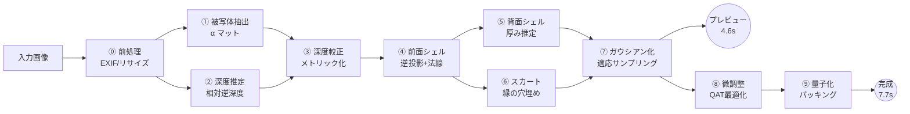

# 03. 生成パイプライン

写真1枚から `PhotoSplatDocument` を作るまでの全工程。

## 3.1 全体の流れ



## 3.2 ⓪ 前処理

| 手順 | 内容 |
|---|---|
| EXIF 読み取り | 回転タグ（Orientation）を適用して正立させる。`FocalLengthIn35mmFilm` があれば `camera.focalPx` の初期値に使う |
| 色空間 | sRGB を仮定。Display P3 の写真は sRGB に変換 |
| リサイズ | 長辺 1024px にリサイズ（セグメンテーション用）。深度推定用に別途 518px 版も作る |
| 正方化 | アスペクト比を保ったままレターボックスで正方形に。パディング領域は α=0 として最後まで持ち回る |
| 作業グリッド | 出力の作業解像度は **512×512** に固定する |

**作業グリッドを512×512に固定する理由**: これが本設計の最大ガウシアン数を決める。
512×512 = 262,144 は、偶然にも TripoSplat のガウシアン数上限と一致しており、品質の頭打ち点として妥当な水準。
被写体の画面占有率が典型的に35〜45%なので、前面シェルのガウシアン数の上限は約 92k〜118k になる（適応サンプリングでここからさらに約40%減る）。

EXIF に焦点距離が無い場合は **水平画角 55°** を仮定する（`focalPx = 512 / (2·tan(27.5°)) ≈ 491`）。
これはスマートフォンのメインカメラの典型値に近い。立体感の強さに直結するため、UIに調整スライダを出す（§3.9）。

## 3.3 ① 被写体抽出

D3（人物ポートレート / 物体単体）に対応し、2つのモデルを使い分ける。

```
人物モード → MODNet (uint8, 6.6MB, 512×512入力)     … 約 0.35 s
物体モード → ISNet-general (uint8, 約44MB, 1024×1024入力) … 約 1.5 s
```

### モード選択

**明示的なトグルをUIに置く**（既定は「人物」）。自動判定のために人物検出モデルを追加すると +10MB になり、
判定を誤ったときのリカバリもユーザーには不可解になるため、素直に選ばせる。

物体モードは初回選択時に44MBを追加ダウンロードするため、UIに「初回のみ約44MBの追加ダウンロード」と明示する。

### 後処理

生の α マットは境界がざらつくため、次を適用する。

1. **ガイデッドフィルタ**（半径4, ε=1e-4）で入力画像を参照して境界を整える。髪の毛の抜けが改善する
2. **小連結成分の除去**: 面積が最大成分の2%未満の島を除去。背景のノイズが消える
3. **穴埋め**: 被写体内部の α=0 の閉領域を埋める
4. **境界の軟化**: 外側2pxに向けて α を線形に落とす。シルエットのジャギーがそのままガウシアンの硬い縁になるのを防ぐ

すべて WGSL カーネルで実装。合計 約 0.1 s。

## 3.4 ② 深度推定

Depth Anything V2 Small (q4f16, 19.1MB) を使う。入力 518×518、出力は **相対逆深度**（affine-invariant disparity）。

### 品質のための2パス構成

D13（10秒予算内で品質最大化）を活かし、**2パスで深度を作る**。

| パス | 入力 | 目的 | 時間 |
|---|---|---|---|
| 全体パス | 518×518 に縮めた全体 | 大域的な奥行き構造を得る | 0.8 s |
| タイルパス | 被写体のバウンディングボックスを 2×2 に分割し各 518×518 | 細部（顔の凹凸、物体の彫りなど）の解像度を上げる | 1.6 s |

Depth Anything の出力は**スケールとオフセットが不定**なので、タイル同士・全体との間で値の整合が取れていない。
そこで各タイルについて、全体パスとの重なり領域で最小二乗フィットし `a·d + b` の形で合わせ込む。

```
タイル t について:  argmin_{a,b} Σ_{p ∈ 重なり} w(p) · (a·d_t(p) + b − d_global(p))²
重み w(p) は α マットと、タイル中心からの距離で決める（縁ほど信頼しない）
```

その後、タイル間の継ぎ目をラプラシアンブレンドで融合する。

**この2パス構成は品質への主要な投資**である。全体パスのみでは 518px の解像度が 512×512 の作業グリッドに
ほぼ1:1でしか対応せず、顔の起伏などが平坦になる。タイルパスで実効 1036px 相当まで上げることで、
前面シェルの細部が明確に改善する。1.6秒を投じる価値がある。

> 予算が逼迫した場合、タイルパスは**プレビュー表示後のバックグラウンド処理に回す**（§1.2 のルール2）。
> 全体パスだけでプレビューを出し、タイルパス完了後に差し替える。

## 3.5 ③ 深度較正 — 相対逆深度からメトリック深度へ

Depth Anything の出力 `d ∈ [0,1]` は逆深度の相対値であり、そのままでは3D位置に変換できない。

### 変換式

```
z(u,v) = 1 / (a · d(u,v) + b)      a > 0, a·d + b > 0
```

`a, b` が未知。単一画像からは原理的に決定できない（スケール不定性）ため、次のヒューリスティックで決める。

1. **被写体の奥行き比を仮定する。**
   被写体のシルエットの短辺方向の見かけサイズを `W_px`、カメラの焦点距離を `focalPx` とすると、
   距離 `z̄` にある被写体の実サイズは `W_px · z̄ / focalPx`。
   ここで **奥行き ≈ 短辺の 0.65 倍**（人物の頭部・胴体、および一般的な物体の平均的なアスペクト）を仮定する。

2. この仮定から、被写体領域内の逆深度の 5〜95 パーセンタイル幅が、上記の奥行きに対応するよう `a` を決める。
   パーセンタイルを使うのは、マットの縁に残る外れ値の影響を避けるため。

3. `b` は被写体の重心が `z = 1.0`（単位距離）に来るよう決める。以降すべての座標系はこの単位で扱う。

### なぜこれで十分か

半球カバー（D2, ±60°）では、**絶対スケールは意味を持たない**。重要なのは
「被写体の奥行きが、幅に対してどの程度あるか」という比だけであり、それを直接指定しているのがこの手法である。

比が間違っていると、視点を回したときに「平べったすぎる」または「間延びしている」と感じられる。
これは主観的な好みも含むため、**UIに「立体感」スライダを出して 0.65 を 0.3〜1.2 の範囲で調整可能にする**（§3.9）。
スライダ操作時は深度較正以降だけを再実行すればよく、モデル推論は不要なので即座に反映される。

## 3.6 ④⑤⑥ 幾何構築 — 前面・背面・スカート

D2「半球カバー、裏側は補完」を実現する中核。

### 3.6.1 ④ 前面シェル

各ピクセル `(u,v)` について、α > 閾値 なら3D位置を逆投影で求める。

```
z = z(u,v)
X = (u − cx) · z / focalPx
Y = (v − cy) · z / focalPx
```

**法線** は深度マップの局所勾配から求める。単純な中央差分はノイズに弱いので、
5×5 近傍で深度の平面フィットを行い、その平面の法線を採る。深度の不連続をまたぐ画素は
フィットから除外する（重み 0）。これをしないと、物体の縁で法線が横倒しになり、リムが不自然に光る。

**スケール**: サーフェルとして、接平面内の2軸のみ持つ。

```
s = k · z / focalPx        // 1ピクセルが距離 z で覆う実寸
scale_u = scale_v = s · 1.4  // 隣接サーフェルと少し重ねて隙間を防ぐ
```

法線が視線に対して寝ている（傾斜が強い）画素では、その方向にサーフェルを引き伸ばす。
`scale ∝ 1 / max(|n·v|, 0.3)`。傾斜面でサーフェル間に隙間が開くのを防ぐ。

### 3.6.2 ⑤ 背面シェル — 半球カバーの要

前面シェルだけでは、視点を横に回した瞬間に「紙のように薄い板」に見えてしまう。
**閉じた殻を作る**ことで、±60°どころか±90°近くまで破綻しない。

**厚みの推定**: シルエットの距離変換を使う。

```
D(u,v) = 被写体マスクの内部距離変換（境界からの距離、ピクセル単位）
Dmax   = max D

// 断面が楕円だと仮定した厚みプロファイル
t(u,v) = T · sqrt( 1 − (1 − D(u,v)/Dmax)² )

T は §3.5 で決めた被写体の奥行きの半分
```

`sqrt(1 − (1−r)²)` という形は、円柱ではなく**楕円断面**を与える。
これにより、シルエット境界では厚み0（前面と背面が接する＝殻が閉じる）、
中心では最大の厚み、という滑らかな立体になる。円柱状（厚み一定）にすると縁が角張って見える。

```
z_back(u,v) = z_front(u,v) + t(u,v)
法線 n_back = 前面法線の Z 成分を反転させ、さらに厚みの勾配で補正
```

**背面の色** — 3案を検討し、**案(b)を採用**する。

| 案 | 内容 | 時間 | 品質 | 判定 |
|---|---|---|---|---|
| (a) 前面色を減光 | `color_back = color_front × 0.55` | 0 s | 平板に見える | 却下 |
| **(b) 水平反転 + 減光 + 深度陰影** | `color_back = mirror_h(color_front) × shade(t)` | 0.02 s | 人物の後頭部・物体の裏面として自然 | **採用** |
| (c) インペイントモデル | LaMa等で裏面を生成 | +2 s, +50MB | 最良だが予算超過 | 却下 |

案(b)の根拠: 多くの被写体（人物、カップ、ぬいぐるみ、箱）は左右におおむね対称であり、
左半分の色を右に、右半分を左に持ってくると、裏面として違和感が少ない。
`shade(t)` は厚みが大きいほど暗くする係数（`0.45 + 0.25 · (1 − t/T)`）で、
裏側が奥まって見える簡易的な陰影を与える。

背面シェルは前面より**粗くてよい**。裏側は正面からは見えず、±60°でも斜めからしか見えないため、
**2×2ピクセルを1ガウシアンにまとめて 1/4 の密度で生成する**。これでガウシアン数の増加を約25%に抑えられる。

### 3.6.3 ⑥ スカート — 遮蔽解消による穴を塞ぐ

深度が不連続な縁（腕と胴体の間、取っ手の内側など）では、視点を動かすと
「それまで隠れていた領域」が露出し、そこに何も無いため穴が開く。

**処理**:

1. 深度勾配の大きさが閾値を超える画素を「深度エッジ」として検出する
2. エッジの**奥側**（深度が大きい側）に、そこから奥へ向かって伸びる帯状のガウシアンを生成する
3. 帯の長さは、その場所の深度ギャップに比例させる（ギャップが大きいほど長く伸ばす）
4. 帯の色は**奥側の色**を伸長したもの。手前側の色を使うと、動かしたときに手前の物体が滲んで見える
5. 帯の不透明度は、奥へ向かって 1.0 → 0.0 に減衰させる。硬い縁を作らないため

これは "3D Photo Inpainting" の Layered Depth Image を、モデルなしのヒューリスティックで軽量に近似したもの。
被写体が背景除去済みであるため、対象は**被写体内部の自己遮蔽エッジのみ**で、量が少ない（典型 8k〜12k ガウシアン、全体の約10%）。

処理時間 約 0.15 s。

### 3.6.4 リムの処理

シルエット境界のサーフェルは法線が視線に対してほぼ直交するため、視点を回すと消えて縁がちらつく。

- 境界から2px の範囲で α を 1.0 → 0.3 に落とす
- 同時にスケールを1.5倍にして、隣のサーフェルとの重なりを増やす
- 法線を少し外向きに倒す（境界の法線を視線方向に 30% ブレンド）

これらは前面シェル生成時に一括で行う。

## 3.7 ⑦⑧ ガウシアン化と微調整

### 3.7.1 ⑦ 適応サンプリング

全画素を1ガウシアンにすると 262,144 になるが、平坦な領域では過剰。
**四分木でグリッドを分割し、各セルの分散が閾値以下なら1つに統合する。**

```
セルを分割する条件（いずれか）:
  ・セル内の深度の分散 > θ_depth
  ・セル内の色の分散  > θ_color
  ・セル内に α の境界がある（マットの縁）
  ・セルサイズ > 8px （最大セルサイズの制限）
分割を止める条件:
  ・セルサイズ = 1px （それ以上分けられない）
```

統合されたセルは、そのセルを覆う1つの大きなサーフェルになる。
典型的な写真で **35〜45% のガウシアン削減**が得られ、品質の劣化はほぼ視認できない。
詳細は [04](./04-compression.md#42-l1-個数の削減)。

この時点で `PhotoSplatDocument` の暫定版が完成し、**描画層に渡してプレビューを開始する**（4.6秒地点）。

### 3.7.2 ⑧ 微調整 — 量子化を織り込んだ最適化

ここが10秒予算の使いどころであり、KISS-GS の「符号化を織り込んだ微調整」に相当する部分。

**目的**: 入力画像を教師として、ガウシアンの `color / opacity / scale` を最適化し、
(1) 深度推定の誤差 (2) 適応サンプリングによる情報損失 (3) **量子化による誤差** をまとめて吸収する。

```
for iter in 1..400:
    1. 現在の属性を量子化 → 逆量子化する（[04] のビット割当に従う）
    2. 元のカメラ位置から微分可能ラスタライズで画像を描画
    3. 損失 L = 0.8 · L1(描画, 入力) + 0.2 · (1 − SSIM(描画, 入力))
    4. 逆伝播。量子化の勾配は STE（Straight-Through Estimator）で素通しする
    5. Adam で color / opacity / scale を更新（位置と法線は固定）
```

**位置と法線を最適化しない**のが重要な設計判断。理由は3つ。

1. 位置を動かすと `PhotoSplatDocument` の「画像平面に紐づく」構造が壊れ、[04](./04-compression.md) の圧縮が全て効かなくなる
2. 単一視点からの最適化では位置は劣決定であり、動かすと過学習して他視点で破綻する
3. 更新するパラメータが減るぶん収束が速く、400反復が2.5秒に収まる

**量子化を織り込むことの効果**: 手順1がなければ、最適化された属性を後から量子化した時点で誤差が乗る。
織り込んでおけば、最適化が「量子化後に最良になる値」を探すので、**同じビット数で品質が上がる**。
KISS-GS はこの手法で追加 2.2× の削減を報告している。本設計では削減率ではなく、
**同一サイズでの品質向上**として効果を回収する（[04](./04-compression.md#46-qat-の効果測定)）。

**WGSL実装**: forward（ラスタライズ）と backward（勾配集約）を自前カーネルで書く。
512×512、約 99k ガウシアン、1反復あたり約 6ms。400反復で 2.4 秒。

## 3.8 時間予算

基準端末 iPhone 14 / Pixel 7 相当、モデルはキャッシュ済み（2回目以降の生成）を想定。

| # | 段階 | 目標 | 累積 | 予算超過時の扱い |
|---|---|---|---|---|
| ⓪ | 前処理・EXIF・リサイズ | 0.10 s | 0.10 | — |
| ① | 被写体抽出（物体モード, ISNet 1024²） | 1.50 s | 1.60 | 人物モードなら 0.35 s |
| ② | 深度推定・全体パス | 0.80 s | 2.40 | — |
| ② | 深度推定・タイルパス 2×2 | 1.60 s | 4.00 | **背景処理へ回す** |
| ③ | 深度較正・法線・厚み推定 | 0.25 s | 4.25 | — |
| ④⑤⑥ | 前面・背面シェル・スカート | 0.30 s | 4.55 | — |
| ⑦ | 適応サンプリング・ドキュメント確定 | 0.10 s | **4.65** | — |
| | **▶ プレビュー表示・操作可能** | | **4.65 s** | |
| ⑧ | 微調整 400反復（QAT付き） | 2.40 s | 7.05 | 反復数を200に減らす |
| ⑨ | 量子化・画像パッキング | 0.55 s | **7.60** | — |
| | **▶ 全処理完了** | | **7.60 s** | **上限 10.0 s** |

余裕 2.4 秒。この余裕は端末差（Pixel 7 の GPU は iPhone 14 より遅い場面がある）と、
被写体が画面いっぱいに写っている場合のガウシアン数増加を吸収するためのもの。

**初回訪問時**は、これに加えてモデルのダウンロードとセッション初期化がかかる。

| | 人物モード | 物体モード |
|---|---|---|
| モデルDL (4G, 20Mbps 想定) | 25.6 MB → 約 10 s | 63.1 MB → 約 25 s |
| ONNXセッション初期化・シェーダコンパイル | 約 1.5 s | 約 2.5 s |

初回のみであり、`Cache API` に保存して2回目以降は0になる。
UIでは「初回準備中」を生成処理とは別の進捗として明確に分けて表示する。

## 3.9 UI に出す調整パラメータ

生成後に再実行できる（＝モデル推論が不要な）パラメータだけをUIに出す。すべて即座に反映される。

| パラメータ | 範囲 | 既定 | 再実行される段階 | 効果 |
|---|---|---|---|---|
| 立体感 | 0.3 〜 1.2 | 0.65 | ③以降 | 奥行きの強さ。§3.5 の奥行き比 |
| 厚み | 0.0 〜 1.5 | 1.0 | ⑤以降 | 背面シェルの厚さ。0 にすると前面のみ（板） |
| 画角 | 35° 〜 90° | 55° (EXIF優先) | ③以降 | 遠近感。広角にすると誇張される |
| 品質 | 軽量 / 標準 / 高品質 | 標準 | ⑦以降 | 適応サンプリングの閾値と量子化ビット数のプリセット |

「品質」プリセットの中身は [04](./04-compression.md#47-品質プリセット) に定義する。
再実行は③または⑤以降なので、いずれも 0.5 秒以内に完了する。
