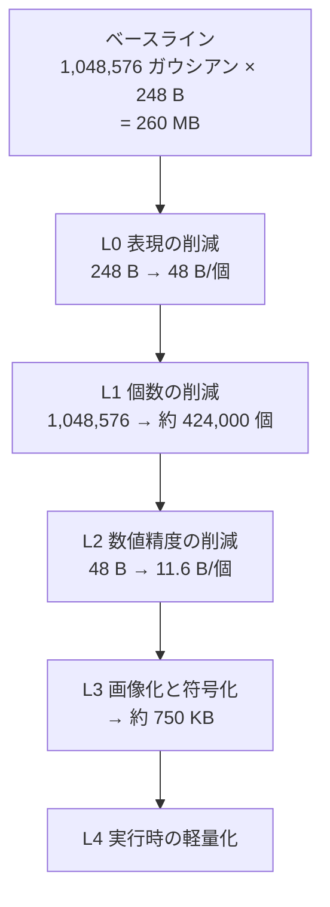

# 04. 軽量化・量子化設計

本設計書の中核。「量子化などの軽量化技術を深く」というご要望に対する回答。
v2 では作業グリッドを 1024² に上げ（D17）、微調整の QAT を外し（D18）、インペイントと背面色のプレーンを加えた（D16）。数値はすべて再計算している。

## 4.1 全体戦略 — 4つの階層



| 層 | 手法 | 削減率 | 累積サイズ（標準プリセット） |
|---|---|---|---|
| — | ベースライン (vanilla 3DGS PLY, SH次数3, 1024² 全画素) | — | 260.0 MB |
| L0 | 表現の削減 | **5.2×** | 50.3 MB |
| L1 | 個数の削減 | **2.5×** | 20.4 MB |
| L2 | 数値精度の削減 | **4.1×** | 4.92 MB |
| L3 | 画像化と符号化 | **6.6×** | **約 750 KB** |
| | **総合** | **約 350×** | |

> KISS-GS が報告する総合削減率は 85〜319×。本設計が同等以上に達するのは技術力ではなく、**単一画像由来という構造的な有利さ**による（§4.5）。

## 4.2 L0 — 表現の削減

v1 から変更なし。**画質の損失ゼロ**で 5.2×。

| 施策 | 削減 | 残 | 根拠 |
|---|---|---|---|
| SH 1〜3次を捨てて次数0に | −180 B | 68 B | 単一画像からは視点依存の色を観測できない。持たせても無根拠な外挿 |
| 標準PLYの未使用法線フィールドを捨てる | −12 B | 56 B | 常に0の遺物 |
| 回転クォータニオンを法線に | −4 B | 52 B | サーフェルの姿勢は法線で決まる |
| スケールを3軸から2軸へ | −4 B | **48 B** | サーフェルは厚みを持たない |

サーフェル化は本設計では品質低下を招かない（ガウシアンは深度マップの面素であり元から面）。副次的に**背面カリング**が可能になる（[06 §6.4](./06-rendering.md#64-背面カリング)）。

## 4.3 L1 — 個数の削減

### 4.3.1 3段階の削減（1024², 標準プリセット）

```
1024 × 1024 グリッド                     1,048,576 画素
  ↓ ① 背景除去（被写体占有率 40%）
前面シェル候補                              419,430
  ↓ ② 適応サンプリング（四分木統合、標準 −30%）
前面シェル                                  293,600
  + 背面シェル（前面画素の 1/4 密度）        104,858
  + スカート（深度エッジ由来、約 6%）         25,000
                                        ─────────
合計                                    約 424,000 ガウシアン
```

高品質プリセットは適応サンプリングを**無効**にし、約 549,000。軽量プリセットは 512² で約 99,000（v1 と同じ）。

### ① 背景除去
被写体単体という要件から画面の 60% が消える。2.5× で最大級。

### ② 適応サンプリング（v2: 既定を弱める / v2.2: 制御量を変更）
四分木でセルを分割し、一様なセルを1ガウシアンに統合する。分割条件は α 境界と最大セル 8px に加えて、**子4つの平均どうしのばらつき（群間分散）**が閾値を超えるか、子のどれかが分割されるか。

> **v2.2 の訂正**: v1 / v2 は「セル全体の分散」で判定すると書いていたが、それでは書き出し→読込で分割が変わる。理由と反例は [05 §5.2.3](./05-data-formats.md#523-読み込み手順) に記した。

**閾値ではなく統合率を指定する（v2.2）。** 統合率は写真によって大きく変わる。閾値を決め打ちにすると、合成した人物風の画像で 70% 統合された（設計が求めているのは 30%）。そこで下表の統合率を目標として**閾値を逆算し**、求めた閾値をマニフェストに書く。読込側は同じ閾値で四分木を引き直す。

逆算は倍率についての二分探索（12 回）。統合率の見積りは根タイルを 4 枚おきに見るので、全走査 1.5 回ぶん程度の費用で済む。合成画像での実測は目標 30% に対して 31.4%、目標 45% に対して 46.1%。

v1 は −40% を見込んでいたが、**v2 では標準で −30% に弱め、高品質では無効にする**。
1024² では1画素が十分小さく、統合の恩恵（描画負荷）より継ぎ目のリスクが相対的に大きい。描画負荷は背面カリングと LOD で吸収できる（[06](./06-rendering.md)）。

統合したガウシアンの `.pgs` への格納方法は v1 で未定義だった。v2 では**読込時に決定的に再計算する**方式に確定（[05 §5.2.3](./05-data-formats.md#523-読み込み手順)）。

### ③ 重要度プルーニング
既定では `α < 4/255` の除去のみ。個別に間引くと画像平面に穴が開いて L3 の効率を落とすため（v1 と同じ判断）。

## 4.4 L2 — 数値精度の削減

属性を素の配列として持つ場合のビット割当（`.spz` 書き出し時などに使う）。L3 を適用すると位置・法線・スケールは保存不要になる。

被写体を単位立方体に正規化し、実サイズ 1m と仮定。1024² では **1画面ピクセル ≈ 1.0mm**（v1 の 2.0mm から半分）なので、精度の要求は v1 より厳しくなる。

| 属性 | 元 | 量子化 | ビット | 精度 | 判定 (1024²) |
|---|---|---|---|---|---|
| 位置 x,y,z | 96 | 一様 | 3×11 = 33 | 0.49 mm ≈ 0.5 px | ○ 十分 |
| 法線 | 96 | 八面体写像 | 2×8 = 16 | 角度誤差 < 0.9° | ○ 背面カリングとリム処理にのみ使う |
| スケール 2軸 | 64 | 対数 | 2×8 = 16 | 相対誤差 < 0.8%（※） | ○ 6bit でも可 |
| 不透明度 | 32 | logit 空間 | 8 | 透過率の相対誤差 < 2.5%（α≤0.995） | ○ |
| 色 (SH DC) | 96 | YCoCg 8+6+6 | 20 | — | ○ |
| **計** | **384 (48 B)** | | **93 (11.6 B)** | | **4.1×** |

位置 11bit は 1024² でも 0.5px 相当で足りる。**12bit に上げても `.pgs` のサイズには影響しない**（L3 では位置を保存しないため）。`.spz` は独自の 24bit 固定小数点なので関係ない。

### ※ 実装で判明した訂正（2026-09-07）

`src/codec/pack.ts` を実装し `tests/unit/pack.test.ts` で検算した結果、v2 までの2つの記述が
不正確だったので訂正する。**いずれも結論（8bit で足りる／logit を使う）は変わらない。**

**(1) スケールの「相対誤差 < 0.55%」が成り立つ条件**

対数量子化の相対誤差は、レンジ比 `R = max/min` とビット数 `b` だけで決まる。

```
相対誤差 = exp( ln(R) / (2·(2^b − 1)) ) − 1
```

| R | 6 bit | 8 bit |
|---|---|---|
| 16 | 2.23 % | **0.55 %** |
| 51（実際に出うる範囲） | 3.36 % | **0.77 %** |
| 120 | 3.87 % | 0.94 % |

v2 が書いた 0.55%（8bit）と 2.2%（6bit）は、**レンジ比が 16 のときの値**だった。
実際に出うるスケールは 1024²・画角55°（`focalPx ≈ 984`）で

- 下限 `1.4·0.68/984 ≈ 9.7e-4`（最も手前・傾きなし・1px セル）
- 上限 `1.4·1.32/984·3.3·8 ≈ 5.0e-2`（最も奥・傾き最大・8px セル）

でレンジ比は約 51、8bit で **0.77%** になる。
ただしこれはサーフェル半径 2px に対し **0.016px** の誤差であり、目標の「1画面ピクセル以下」を
大きく下回る。8bit という結論は変わらない。

実装では書き出しごとに `scaleRangeFor()` でレンジを締める（0.1〜99.9 パーセンタイル＋余裕）。
外れ値でレンジが広がると大多数の精度が犠牲になるため、そのほうが精度が上がる。
決めたレンジは `.pgs` のマニフェストに記録する。

**(2) 不透明度で logit を使う本当の理由**

v2 は「素の α を量子化すると 0 付近と 1 付近が粗くなる」と書いたが、これは不正確。
線形量子化の α 絶対誤差は全域で一定（1/255）である。粗くなるのは **透過率 (1−α)** のほうで、
α ブレンドでは多数のスプラットの (1−α) が掛け合わされるので、そこの相対誤差が累積する。

| α | logit 8bit | 線形 8bit |
|---|---|---|
| 0.50 | 1.18 % | 0.39 % |
| 0.95 | 0.31 % | 1.96 % |
| 0.99 | 0.68 % | **17.65 %** |
| 0.997 | 0.56 % | **30.72 %** |

線形量子化は α→1 で透過率が壊滅する。logit はそこを一定に保つ。
代償として α=0.5 付近の α 絶対誤差は 0.0059 と線形の 0.0039 より粗いが、
そこは透過率が十分残る領域なので影響しない。

なお `LOGIT_LIMIT = 6` により α は 0.9975 で頭打ちになる。それより不透明な入力は
透過率の相対誤差が跳ねる（α=0.999 で約 150%）が、透過率の絶対値が 0.0025 以下なので
背景の漏れは知覚できない。この挙動は単体テストで明示的に固定してある。

### 検討して採用しなかった手法（v1 から継続）

| 手法 | 不採用の理由 |
|---|---|
| ベクトル量子化（コードブック） | 学習に 1〜2 秒。属性が既に空間相関しており、画像コーデックが同等の冗長性除去をコストゼロで行う。デコードも複雑化 |
| 位置の差分符号化 | L3 では位置を保存しない |
| SH 1次 | 単一画像に視点依存情報が無い |
| 混合精度 | 固定ビット深度が前提の画像格納と両立しない |
| **QAT（量子化を織り込んだ微調整）** | **v2 で外した。** v1 は KISS-GS の「符号化を織り込んだ微調整」を模したが、色 8bit・不透明度 8bit の丸め誤差（1/255）は継ぎ目補正の収束誤差より小さく、織り込む意味がない。微調整自体も 2.4 秒 → 0.6 秒に縮小（[03 §3.8](./03-pipeline.md#38-⑨-継ぎ目補正)） |

## 4.5 L3 — 属性の2D画像化（本設計の核心）

### 4.5.1 考え方
KISS-GS の SOG-XT が示したように、3DGS の属性を 2D 画像として並べて PNG / WebP に載せると極めてよく効く。前提は「隣接ピクセルに似た値が並んでいる」こと。

### 4.5.2 なぜ本設計では並べ替えが不要なのか
一般の3DGSでは、順不同のガウシアン集合を 2D グリッドへ並べ替える工程（KISS-GS / SOG は PLAS）が最も重い。数十万プリミティブに GPU で数秒〜数十秒。

> 深度マップから生成されたガウシアンは、**元から画像のピクセル格子に1対1で乗っている**。ピクセル `(u,v)` のガウシアンをそのまま `(u,v)` に置けばよく、
> その並び順のコヒーレンスは入力写真そのもののコヒーレンスである。並べ替えが探しにいく理想解に、定義上そのまま一致している。

単一画像・深度ベースであることから来る構造的な優位で、D4（速度）に直接効く。**1024² でも並べ替えコストはゼロのまま**——ここが v2 で解像度を上げられた理由でもある。

### 4.5.3 保存しないもの

| 属性 | 保存 | 復元方法 |
|---|---|---|
| 位置 | 不要 | `(u,v)` + 深度 + カメラ内部パラメータから逆投影 |
| 法線 | 不要 | 深度の局所平面フィット |
| スケール | 不要 | `s = k·z/focalPx`。v2 では継ぎ目補正がスケールを触らないため、補正プレーン（v1 の `SCAJ`）も不要 |
| 厚み（背面） | 不要 | α の距離変換。パラメータ `T` のみ |
| スカート幾何 | 不要 | `frontDepth` と `alpha` の決定的な関数 |
| 適応サンプリングの分割 | 不要 | 深度・色・α・閾値から決定的に再計算（v2 で確定） |
| **背面の色** | **保存**（v2） | 人物モードの生成則を読込側に持たせるより保存したほうが単純。512² で約 60KB |
| **補完テクスチャ** | **保存**（v2） | MI-GAN の出力はモデル無しには再現できない |

背面シェルとスカート幾何を保存しなくてよい根拠（入力視点から遮蔽されており最適化の勾配が届かない）は v1 と同じ。

### 4.5.4 保存するプレーンと符号化（v2, 1024², 標準）

| プレーン | 内容 | 形式 | 見込みサイズ |
|---|---|---|---|
| `DPTH` | 深度の上位 8bit（12bit に量子化後） | WebP lossless | 140 KB |
| `DPTL` | 深度の下位 4bit | **PNG 4bit グレースケール**（2px/byte） | 200 KB |
| `COLR` | 前面色 RGB | WebP lossy q90 | 260 KB |
| `ALFA` | 不透明度 兼 占有マスク | PNG-8 | 50 KB |
| `BCOL` | 背面色 RGB（512²） | WebP lossy q85 | 60 KB |
| `INPT` | 補完テクスチャ RGBA（バンド以外は透明） | WebP lossy q88 + α | 40 KB |
| `manifest` | カメラ・深度レンジ・厚み T・スカート／サンプリングパラメータ・モデル情報 | JSON | 1 KB |
| **計** | | | **約 750 KB** |

#### 深度の 2 プレーン分離（v1 から継続、見積もりを修正）

16bit をそのまま持たず、12bit に量子化して上位 8bit と下位 4bit に分離する理由は v1 と同じ（下位ビットのノイズが PNG の予測を壊す）。
v2 では下位プレーンを **PNG の 4bit グレースケール**（ネイティブ対応、2 画素/バイト）で持つ。

v1 は下位プレーンを 25KB と見積もっていたが、これは楽観的だった。下位 4bit は実質ノイズであり、有効画素 419k × 0.5 byte = 210KB からほとんど縮まない。
v2 は 200KB と見積もる。これでも `.pgs` 全体の 27% を占め、**最大の削減余地**が残っている。PoC-5 で次を比較する:

- 下位を 3bit に落とす（11bit 深度、精度 0.63mm ≈ 0.6px。1024² でも許容範囲）→ 約 150KB
- 下位プレーンを lossy WebP q50 で持つ（誤差は上位 1 階調の数%、視覚的に無視できる）→ 約 80KB
- 深度を 512² で保存し、読込時に色ガイドのジョイントバイラテラルで 1024² に復元する → 約 70KB。ただし中周波の細部（顔の起伏）を失う。軽量プリセット向き

#### 色に lossy WebP を使うことについて（v1 から継続）

既定は WebP lossy q90。最終後に一度だけ実エンコード→デコードして PSNR を測り、38 dB を割ったら q95 で再エンコードする。
高品質プリセットは WebP lossless（約 700KB）。

### 4.5.5 サイズの比較（約 424,000 ガウシアン）

| 形式 | サイズ | 対 `.pgs` | 用途 |
|---|---|---|---|
| vanilla 3DGS PLY (SH次数3) | 105 MB | 140× | 比較用の基準 |
| PLY (SH次数0) | 28.8 MB | 38× | 最大互換 |
| `.spz` | 約 5.9 MB | 7.9× | 標準的な圧縮形式。他ビューアで開ける |
| **`.pgs`** | **約 750 KB** | 1.0× | 本アプリでの再読込 |

`.pgs` は `.spz` の約 1/8。単一画像という制約を活かした構造的な利得であり、汎用形式との公平な比較ではない。

## 4.6 継ぎ目補正の効果測定（v2 で QAT 測定を置き換え）

golden セット（17枚）で、入力視点からの再構成品質と、**±45° 視点での穴・縞の指標**を測る。v1 は前者しか測っていなかったが、後者こそ品質の主戦場。

| 条件 | 継ぎ目補正 | インペイント | 測るもの |
|---|---|---|---|
| A | なし | なし（v1 引き伸ばし） | 幾何構築だけの素の品質 |
| B | あり | なし | 継ぎ目補正の正味効果（入力視点 PSNR の差） |
| C | なし | あり | インペイントの正味効果（±45° の縞指標の差） |
| D | **あり** | **あり** | **本設計** |

縞指標: ±45° に回した描画で、深度エッジ帯（幅 32px）内の**水平方向の色勾配のエントロピー**。引き伸ばし色は勾配がほぼゼロ（縞）になり、自然なテクスチャは勾配が分散する。
判定: `C − A` が 0.3 nat 未満ならインペイントは効いていないので MI-GAN の入力（マスク幅・解像度）を見直す。

### 4.6.2 fp16 変換で踏んだ罠（v2.2、実装で判明）

`onnxconverter_common` の fp16 変換には2つの問題があり、どちらも**モデルは生成されるが読めない／読めても答えが違う**という形で出た。

**罠1: 元からある `Cast` の `to` を書き換えない。**
注意機構は数値安定性のため `Cast(to=FLOAT) → Softmax` を明示的に置く。変換すると重みだけ float16 になり、後続の `MatMul` が float と float16 を混ぜた壊れたグラフになる。onnxruntime は読み込み時に弾く。

対処: 変換後に型宣言を捨てて推論し直し（`refresh_value_info`）、型が混ざったノードに Cast を挿す（`repair_mixed_precision`）。

**罠2: `op_block_list` を渡すと、そもそも正しいグラフにならない。**
ブロック対象の前後に挿す Cast の実装が壊れており、対象が複数あると

- 名前が `_input_cast_0` 固定で連番が付かず、必ず衝突する
- 2つ目以降のブロック対象ノードが**自分の入力が作られる前の位置**に置かれ、1つ目の入力を読む

名前の衝突は付け替えれば直せるが、順序の狂いは意図した結線が失われているので直せない。

対処: **`op_block_list` を渡さない。** 数値に敏感な演算を守る目的は 4bit 重み量子化の除外リストのほうで果たす。精度が効くのはそちらで、fp16 の丸めは onnxruntime のカーネルが内部で吸収する。

**実測**（注意機構ブロックを重ねた合成モデル、fp32 出力との相関）

| ブロック数 | ブロック指定あり | **指定なし（採用）** |
|---|---|---|
| 1 | +1.0000 | +1.0000 |
| 2 | −0.1439 | **+1.0000** |
| 4 | −0.2185 | **+1.0000** |
| 8 | −0.1594 | **+0.9999** |

**検査の置き方。** `scripts/test_quantize.py` が本物のモデルを取りに行く前に走る。鋭い検査は **fp16 単独**の相関（> 0.99）。fp16 は丸めしか起きないので、結線が狂えば一気に落ちる。4bit のほうは乱数の重みに対する最悪ケースで 0.79 まで落ちるため、精度の保証ではなく「壊れていないこと」の確認として緩い下限（> 0.5）にしてある。あわせてノード名・テンソル名の重複と、onnxruntime で読めることを見る。

### 4.6.1 バックエンド別の量子化（D22、v2.2 で実装）

同じモデルでも、実行プロバイダによって配る形を変える。PoC-1（2026-09-07, Android 10 実機）の実測が根拠。

| | WASM 実測 | 判断 |
|---|---|---|
| q4f16 | 19.8 s | `MatMulNBits` に WASM の速い経路が無い |
| uint8 | **12.9 s** | WASM ではこれが最速 |
| fp16 | — | WebGPU では q4f16 が小さく速い |

**実装で足した区別。** `q4f16` は行列積（`MatMulNBits`）を狙った方式なので、**畳み込み中心のモデルでは効きが薄い**。深度モデル（Transformer）だけを WebGPU で q4f16 にし、マット・インペイント（CNN）は両バックエンドとも uint8 にする。

| モデル | WebGPU | WASM |
|---|---|---|
| Depth Anything 3 Small | q4f16 | uint8 |
| MODNet / ISNet / MI-GAN | uint8 | uint8 |

CI（`scripts/quantize.py`）はバックエンドぶんを生成し、`models/manifest.json` の `byBackend` に書く。ブラウザ（`src/runtime/modelCatalog.ts`）はそれを読んで実行プロバイダに合うものを選ぶ。**同じ方式を2つのバックエンドが指す場合、ファイルは1つしか作らず、ダウンロード量も二重に数えない。**

同一オリジンにマニフェストが無ければ HuggingFace へ落ちる（決定 D7 の本番経路は同一オリジン、HF は保険）。

## 4.7 品質プリセット（v2）

| | 軽量 | **標準（既定）** | 高品質 |
|---|---|---|---|
| 作業グリッド | 512² | **1024²** | 1024² |
| 深度タイルパス | なし | 2×2 | 2×2 |
| 人物マット | MODNet | MODNet | ISNet（精密） |
| 適応サンプリング | −45% | **−30%** | **無効** |
| 背面シェル密度 | 1/9 | 1/4 | 1/4 |
| インペイント | なし（引き伸ばし） | MI-GAN | MI-GAN |
| 継ぎ目補正 | なし | 60 反復 | 30 反復 |
| 深度ビット数 | 10 | 12 | 12 |
| 色プレーン | WebP q80 | WebP q90 | **WebP lossless** |
| **ガウシアン数** | 約 99,000 | **約 424,000** | 約 549,000 |
| **`.pgs` サイズ** | 約 180 KB | **約 750 KB** | 約 1.3 MB |
| **生成時間（基準端末）** | 約 4.6 s | **約 7.2 s** | 約 8.9 s |

高品質でも 10 秒に収まるが余裕は 1.1 秒。CI の性能バジェットは**標準**に対して設定する。

## 4.8 L4 — 実行時の軽量化

### 4.8.1 展開しない（v1 から継続、数値更新）

| | 展開する場合 | 展開しない場合 |
|---|---|---|
| 前面シェル | 293,600 × 48 B = 14.1 MB | depth R8×2 + color RGBA8 + alpha R8 (1024²) = **7.3 MB** |
| 背面シェル | 104,858 × 48 B = 5.0 MB | backColor RGBA8 (512²) = **1.0 MB**（幾何は頂点シェーダで導出） |
| スカート | 25,000 × 48 B = 1.2 MB | inpaint RGBA8 (512²) 1.0 MB + 圧縮幾何 0.4 MB |
| **計** | **20.3 MB** | **9.7 MB** |

VRAM 約 2×。展開パス（1024² で 100ms 超）が不要になることと、テクスチャキャッシュの局所性が主な利点。

### 4.8.2 描画負荷（1024² で重要になる）

424k ガウシアンは v1 の 4.3 倍。60fps を守る手段は [06](./06-rendering.md) に集約する。

- **背面カリング**: サーフェルの法線で 40〜50% を破棄 → 描画対象 約 240k
- **LOD**: 被写体が画面に小さいときは Morton 順で間引く
- **フレーム間のソート再利用**: 回転 3° 未満なら再ソートしない
- **アンチエイリアス**（v2 で追加）: 縮小時のエイリアシングを 2D 低域フィルタで抑える

## 4.9 まとめ — 数値の一覧（v2, 標準プリセット）

| 指標 | 値 |
|---|---|
| 作業グリッド | **1024 × 1024** |
| ガウシアン数 | 約 424,000 |
| ガウシアン1個あたりの実効サイズ | **約 1.8 バイト** (750 KB ÷ 424,000) |
| vanilla 3DGS PLY (SH3) からの総合削減率 | **約 350×** |
| `.spz` からの削減率 | 約 8× |
| 実行時 VRAM | 約 9.7 MB |
| 生成時間（基準端末、キャッシュ済み） | 7.15 s |
| プレビュー表示までの時間 | 4.85 s |
