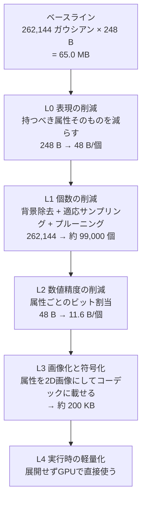

# 04. 軽量化・量子化設計

本設計書の中核。「量子化などの軽量化技術を深く」というご要望に対する回答。

## 4.1 全体戦略 — 4つの階層

軽量化は独立した4階層で行う。各層は前の層の結果に乗算的に効く。



| 層 | 手法 | 削減率 | 累積サイズ |
|---|---|---|---|
| — | ベースライン (vanilla 3DGS PLY, SH次数3) | — | 65.0 MB |
| L0 | 表現の削減 | **5.2×** | 12.6 MB |
| L1 | 個数の削減 | **2.6×** | 4.8 MB |
| L2 | 数値精度の削減 | **4.1×** | 1.16 MB |
| L3 | 画像化と符号化 | **5.8×** | **約 200 KB** |
| | **総合** | **約 320×** | |

L4 は保存サイズではなく実行時のVRAMと描画コストに効く。

> 対比: KISS-GS が報告する総合削減率は 85〜319×。本設計が同等以上に達するのは技術力ではなく、
> **単一画像由来という構造的な有利さ**による。次節以降でその理由を説明する。

## 4.2 L0 — 表現の削減

「量子化」より前に、**そもそも持つ必要のない属性を捨てる**のが最も効率が良い。

### ベースラインの内訳

INRIA の 3DGS 標準 PLY 形式は、ガウシアン1個あたり次を持つ。

| 属性 | 内容 | バイト |
|---|---|---|
| `x, y, z` | 位置 | 12 |
| `nx, ny, nz` | 法線（**常に0が入っている未使用フィールド**） | 12 |
| `f_dc_0..2` | SH DC成分（視点非依存の色） | 12 |
| `f_rest_0..44` | SH 1〜3次（視点依存の色） | 180 |
| `opacity` | 不透明度 | 4 |
| `scale_0..2` | スケール3軸 | 12 |
| `rot_0..3` | 回転クォータニオン | 16 |
| **計** | | **248** |

### 削減の内訳と根拠

| 施策 | 削減 | 残 | 根拠 |
|---|---|---|---|
| **SH 1〜3次を捨てて次数0に固定** | −180 B | 68 B | **単一画像からは視点依存の色を観測できない。** 学習する教師情報が原理的に存在しないため、SH高次を持たせても内容は無根拠な外挿にしかならない。持たないのが正しい |
| **未使用の法線フィールドを捨てる** | −12 B | 56 B | 標準PLY形式の遺物。値は常に0で情報を持たない |
| **回転クォータニオンを法線に置き換える** | −4 B | 52 B | 全ガウシアンをサーフェル（平たい楕円）にすると、姿勢は法線1本で決まる。接平面内の回転は等方なら不要 |
| **スケールを3軸から2軸へ** | −4 B | **48 B** | サーフェルは法線方向の厚みを持たない |

**5.2× の削減。しかも画質の損失がゼロである。** 捨てたのは、いずれも単一画像ケースでは情報を持たない属性だけ。

### サーフェル化についての注意

全ガウシアンを平たくすることは、一般の3DGSでは品質低下を招く（体積的なぼかしが表現できなくなる）。
しかし本設計では**ガウシアンは深度マップの各画素から生成される面素**であり、元から面である。
むしろ球状ガウシアンを使うと、深度が不連続な縁で「膨らんだ」アーティファクトが出る。

副次的な利点として、**法線を持つことで背面カリングが可能になる**（[06](./06-rendering.md#64-背面カリング)）。
通常の3DGSにはできない最適化で、描画負荷を実質半減させる。

## 4.3 L1 — 個数の削減

### 4.3.1 3段階の削減

```
512 × 512 グリッド                        262,144 画素
  ↓ ① 背景除去（被写体占有率 40% を想定）
前面シェル候補                             104,858
  ↓ ② 適応サンプリング（四分木統合、−40%）
前面シェル                                  62,915
  ↓ ③ 重要度プルーニング（−0%〜5%、後述）
前面シェル（確定）                          62,915
  + 背面シェル（前面画素の 1/4 密度）        26,214
  + スカート（深度エッジ由来）               10,000
                                        ─────────
合計                                    約 99,000 ガウシアン
```

### ① 背景除去 — 最も効く削減

被写体単体（D3）を対象とすることの最大の恩恵。画面の 60% が α=0 になり、そのまま消える。
これは「軽量化技術」ではなく要件から自然に導かれるものだが、**効果は 2.5× と最大級**である。

### ② 適応サンプリング

四分木でグリッドを分割し、各セル内の分散が小さければ1つのガウシアンに統合する（[03](./03-pipeline.md#371-適応サンプリング)）。

分割の判定式は次の通り。

```
split(cell) = (var_depth(cell) > θ_d)
            ∨ (var_color(cell) > θ_c)
            ∨ (α の境界を含む)
            ∨ (cellSize > 8)
停止:         cellSize == 1
```

**なぜこれが効くのか**: 写真の中で情報密度は一様でない。
無地の背景布、頬の平坦な部分、単色の商品の側面などは、1画素ごとにガウシアンを置く必要がない。
逆に、髪の毛、テクスチャのある布、物体の縁は密に必要である。

典型的なポートレートで **35〜45% の削減**、無地背景の物体写真では 55% に達することもある。
設計上は保守的に 40% を見込む。

**θ の決め方**: 「品質」プリセット（§4.7）で3段階に変える。
`θ_d` は深度レンジの 0.3%〜1.2%、`θ_c` は sRGB 距離で 2.0〜8.0 の範囲。

### ③ 重要度プルーニング

各ガウシアンの画面寄与度を計算し、下位を除去する。

```
importance(g) = opacity(g) × 投影面積(g) × 可視性(g)
```

**ただし本設計では、既定でこれをほぼ行わない。** 理由は2つ。

1. ①②の時点で低寄与ガウシアンはすでに除去されている。深度マップ由来のガウシアンは
   一般の3DGS最適化が生む「浮遊ゴミ」を含まないため、刈るべき対象が少ない
2. ガウシアンを個別に間引くと、**画像平面上に穴が開き L3 の画像圧縮効率が落ちる**。
   L1 で得た削減を L3 で失う可能性がある

そのため既定では `opacity < 4/255` のものだけを除去する（実質1%未満）。
「軽量」プリセットでのみ、下位10%を刈る設定にする。

> **設計判断の記録**: KISS-GS は Compaction で 15.7× のプリミティブ削減を得ているが、これは
> 一般の3DGS学習が大量の冗長プリミティブを生むためである。本設計のガウシアンは深度マップから
> 決定的に生成されるので冗長性が最初から少なく、同じ削減率は得られないし、必要でもない。
> **手法を目的から切り離して真似ない**、という判断。

## 4.4 L2 — 数値精度の削減（属性ごとのビット割当）

ここが狭義の「量子化」。属性を素の配列として持つ場合のビット割当を定義する。
（L3 の画像化を適用すると、このうち位置・法線・スケールは**そもそも保存不要**になる。§4.5）

### ビット割当表

前提: 被写体は原点中心の単位立方体 `[-0.5, 0.5]³` に正規化されている。被写体の実サイズを 1m と仮定して精度を評価する。

| 属性 | 元 | 量子化 | ビット | 精度 | 根拠 |
|---|---|---|---|---|---|
| **位置** x,y,z | 3×f32 (96 bit) | 一様量子化 | **3×11 = 33** | 0.49 mm | 512px で 1m を見るとき 1px ≈ 2.0mm。量子化幅はその 1/4 で、拡大しても段差が見えない |
| **法線** | 3×f32 (96 bit) | 八面体写像 (octahedral) | **2×8 = 16** | 角度誤差 < 0.9° | 単位球面を2Dに写す最も歪みの少ない写像。8bit×2 で球面をほぼ均一に 65,536 分割。拡散反射の陰影には十分 |
| **スケール** 2軸 | 2×f32 (64 bit) | 対数量子化 | **2×8 = 16** | 相対誤差 < 0.55% | スケールは対数正規分布に従う。`log(s)` を一様量子化すると**相対誤差が一定**になり、知覚的に均一。線形量子化では小さいサーフェルの精度が壊滅する |
| **不透明度** | f32 (32 bit) | logit 空間で一様量子化 | **8** | — | 素の α を量子化すると 0 付近と 1 付近が粗くなる。`logit(α)` を量子化すればブレンドの視覚差が均一になる |
| **色 (SH DC)** | 3×f32 (96 bit) | YCoCg + 非対称割当 | **8+6+6 = 20** | — | 人間の視覚は輝度に対し色差の感度が低い（クロマサブサンプリングの原理）。YCoCg は RGB からの変換が加減算とシフトのみで、GPU上で無損失かつ高速 |
| **計** | **384 bit (48 B)** | | **93 bit (11.6 B)** | | **4.1×** |

### なぜこのビット数なのか — 決め方の原則

各属性のビット数は、**「その属性の誤差が最終画像に何ピクセル分の誤差として現れるか」** を基準に決めている。
目標は全属性で「1画面ピクセル以下の誤差」に揃えること。ある属性だけ過剰に精度を上げても、
他がボトルネックになって画質は上がらず、サイズだけが増える。

具体的な検算:

- **位置 11bit**: 量子化幅 1/2048 = 0.49mm。被写体1mが512pxに写るとき、画面上 0.25 px の変位。→ 目標達成
- **法線 8bit×2**: 角度誤差 0.9°。ランバート反射で `cos(θ)` の変化は最大 1.6%。8bit色の1階調 (0.4%) の4倍。→ わずかに粗いが、法線は陰影にしか使わず（3DGSは基本的に自己発光的に色を持つ）、本設計では背面カリングとリム処理に使うのが主。許容
- **スケール 8bit（対数）**: 相対誤差 0.55%。サーフェル半径が 2px なら 0.011 px の誤差。→ 大幅に達成。**6bit (2.2%, 0.044px) まで落としてよい**。「軽量」プリセットで採用
- **不透明度 8bit**: α の1階調は 8bit 色の1階調と同じ視覚的影響。→ 目標達成。7bit 以下にすると、多数のガウシアンが重なる領域で縞が出る
- **色 Y=8bit**: 標準的な 8bit 画像と同等。Co/Cg=6bit は 4:2:0 相当の色差圧縮に近い情報量

### 検討したが採用しなかった手法

| 手法 | 内容 | 不採用の理由 |
|---|---|---|
| **ベクトル量子化 (コードブック)** | 属性ベクトルを k-means で 256〜4096 個の代表ベクトルに置き換える。KISS-GS の自己組織化2Dコードブックはこの発展形 | (1) コードブック学習に 1〜2 秒かかり10秒予算を圧迫する (2) 本設計の属性は既に**空間的に強く相関している**ため、後段の画像コーデックが同等の冗長性除去をコストゼロで行う (3) デコード時にインデックス参照が入り、GPU での直接展開（L4）が複雑になる。**冗長性を2回取りに行っても、2回目はほとんど残っていない** |
| **位置の差分符号化 (Morton順 + varint)** | 空間充填曲線で並べて隣接差分を可変長符号化 | L3 で位置を保存しなくなるため無意味になる。素の配列形式（`.spz` 書き出し時）では有効なので、そちらでのみ使う |
| **SH 1次だけ残す** | 視点依存の色をわずかに持たせる | §4.2 の通り、単一画像に視点依存の情報は無い。持たせても幻覚 |
| **混合精度 (重要ガウシアンだけ高精度)** | 寄与の大きいガウシアンに多くのビットを割く | 可変長になり L3 の画像格納と両立しない。画像は固定ビット深度が前提 |

## 4.5 L3 — 属性の2D画像化（本設計の核心）

### 4.5.1 考え方

KISS-GS の SOG-XT が示したのは、**3DGS の属性を2D画像として並べ、既存の画像コーデック
（PNG / WebP）で圧縮すると極めてよく効く**ということ。画像コーデックは数十年かけて
「空間的に相関のある2Dデータ」を圧縮するために最適化されてきたので、これを流用しない手はない。

ただしこれには前提がある。**隣接ピクセルに似た値のガウシアンが並んでいること。**
バラバラの順序で並べると、画像コーデックの空間予測は全く効かず、むしろ生データより大きくなる。

### 4.5.2 なぜ本設計では並べ替えが不要なのか

一般の3DGSでは、ガウシアンは3D空間に散らばった順不同の集合であり、
これを「隣接が似る」ように2Dグリッドへ並べ替えるのが最も難しく重い工程になる。

- KISS-GS / SOG は **PLAS (Parallel Linear Assignment Sorting)** を使う
- 数十万プリミティブに対して GPU で数秒〜数十秒かかる
- KISS-GS のパイプラインでも、圧縮全体の中で支配的なコストである

**本設計ではこの工程が丸ごと不要になる。**

> 深度マップから生成されたガウシアンは、**元から画像のピクセル格子の上に1対1で乗っている**。
> ピクセル `(u,v)` から作ったガウシアンを、そのまま `(u,v)` に置けばよい。
> しかもその並び順の空間的コヒーレンスは、**入力写真そのものが持つコヒーレンス**であり、
> 並べ替えアルゴリズムが達成しようとしている理想解に、定義上そのまま一致している。

これは本設計が単一画像・深度ベースであることから来る**構造的な優位**であり、
D4（生成速度が最優先KPI）に直接効く。数秒の工程がゼロになる。

### 4.5.3 位置・法線・スケールを保存しない

画像平面に乗ったことで、さらに強い削減が生まれる。

| 属性 | 保存するか | 復元方法 |
|---|---|---|
| **位置** | **不要** | ピクセル座標 `(u,v)` + 深度 + カメラ内部パラメータから逆投影。3成分12Bが**深度1成分に縮む** |
| **法線** | **不要** | 深度マップの局所平面フィットから導出（[03](./03-pipeline.md#361-④-前面シェル)と同一の計算） |
| **スケール（基準値）** | **不要** | `s = k·z/focalPx` で深度から決まる |
| **スケール（QAT補正）** | 必要 | 微調整で基準値からずれた分。残差を対数8bitで持つ |
| **不透明度** | 必要 | ただし α プレーンがそのまま兼ねる。追加コストなし |
| **色** | 必要 | RGBプレーン |
| **厚み（背面シェル）** | **不要** | α からの距離変換で決定的に求まる。パラメータ `T` のみ保存 |
| **背面の色** | **不要** | 前面色の水平反転＋減光で導出（[03](./03-pipeline.md#362-⑤-背面シェル--半球カバーの要)） |
| **スカート全体** | **不要** | 深度エッジ検出は `frontDepth` と `alpha` の決定的な関数。パラメータのみ保存 |

**背面シェルとスカートを一切保存しないでよい理由**は、それらが決定的な導出物であることに加えて、
**QAT微調整がそれらを変更しないことが保証されている**点にある。

> 微調整の損失は「入力画像のカメラ位置から描画した結果」と入力画像の差で定義される（[03](./03-pipeline.md#372-⑧-微調整--量子化を織り込んだ最適化)）。
> そのカメラから見て、背面シェルとスカートは**前面シェルに完全に遮蔽されている**。
> したがって勾配が届かず、最適化されない。ならば保存する必要もない。
>
> これは偶然ではなく、「単一視点の情報しか無いのだから、見えないものは最適化できないし、
> 決定的な規則で作るしかない」という一貫性の表れである。

### 4.5.4 保存するプレーンと符号化

`.pgs` 形式（[05](./05-data-formats.md)）が実際に保持するのは次の4プレーンのみ。

| プレーン | 内容 | 形式 | 典型サイズ |
|---|---|---|---|
| `depth` | 前面深度。12bitに量子化し**上位8bit / 下位4bit の2プレーンに分離** | PNG-8 × 2 | 70 KB |
| `color` | 前面色 RGB | WebP lossy q90 | 90 KB |
| `alpha` | 不透明度 兼 占有マスク | PNG-8 | 18 KB |
| `scaleAdj` | スケールのQAT補正（2ch） | PNG-8 (RG) | 22 KB |
| `manifest` | カメラ・深度レンジ・厚みT・スカートパラメータ・量子化設定 | JSON | 1 KB |
| **計** | | | **約 201 KB** |

#### 深度を12bitに落として2プレーンに分離する理由

これは非自明だが効果の大きい最適化。

- **16bit のまま保存してはいけない**: 深度の実効的な有効精度は12bit程度（§4.4）。
  16bit で持つと下位4bitは実質ノイズになり、**PNG の予測フィルタ後の残差がランダム化して圧縮率が壊滅する**。
  精度が要らないビットを持つことは、単に無駄なのではなく**有害**である。
- **上位/下位に分離する理由**: PNG のフィルタはバイト単位で動く。16bit グレースケールを1枚で持つと、
  滑らかな上位バイトと不規則な下位バイトが交互に並び、どちらの予測も当たらない。
  分離すれば、上位プレーンは非常に滑らかで高圧縮（実測見込み 15:1 以上）、
  下位プレーンは4bit分のエントロピーしか持たない。

この2点だけで、深度プレーンのサイズが素朴な実装の約 1/3 になる。

#### 色に lossy WebP を使うことについて

既定は WebP lossy q90。lossless に比べて約 40% 小さい。

**KISS-GS の「符号化を織り込んだ微調整」を完全には採用していない**点を明記しておく。

| 手法 | 採用 | 理由 |
|---|---|---|
| **量子化**を微調整ループに織り込む（STE） | **採用** | スカラー量子化は微分可能に扱える。1反復あたりのコストがほぼゼロ |
| **画像コーデック**を微調整ループに織り込む | **不採用** | WebP エンコード/デコードは微分不可能で、1反復あたり 30ms 以上かかる。400反復で +12秒となり10秒予算を完全に破壊する |

代替として、**最終反復の後に一度だけ実エンコード→デコードを行い、誤差を測定する**。
PSNR が閾値（38 dB）を下回った場合のみ q を 90→95 に上げて再エンコードする。
コストは 1〜2 回のエンコード（約 60ms）で済み、品質の下振れを実質的に防げる。

「高品質」プリセットでは WebP lossless を使い、この問題自体を回避する。

### 4.5.5 サイズの比較

同一の生成結果（約 99,000 ガウシアン）を各形式で保存した場合。

| 形式 | サイズ | 対 `.pgs` | 用途 |
|---|---|---|---|
| vanilla 3DGS PLY (SH次数3) | 24.6 MB | 122× | — （比較用の基準） |
| PLY (SH次数0) | 6.7 MB | 33× | 最大互換。他ツールに渡す |
| `.spz` (Niantic 圧縮形式) | 約 1.4 MB | 7.0× | 標準的な圧縮形式。SuperSplat / PlayCanvas / Spark で開ける |
| **`.pgs` (本設計)** | **約 201 KB** | **1.0×** | 本アプリでの再読込。最軽量 |

`.pgs` は `.spz` の **1/7**。`.spz` が汎用形式として「順不同のガウシアン集合」を前提に設計されている以上、
これは公平な比較ではなく、**本設計が単一画像という制約を活かして得た構造的な利得**である。

だからこそ、互換形式の書き出しも必ず提供する（D8）。詳細は [05](./05-data-formats.md)。

## 4.6 QAT の効果測定

「量子化を織り込んだ微調整」が本当に効いているかを、CI で継続的に測定する。

### 測定方法

golden セット（サンプル画像5枚 + 検証用12枚）について、次の4条件で入力視点からの再構成品質を測る。

| 条件 | 微調整 | 量子化 | 測るもの |
|---|---|---|---|
| A | なし | なし | 幾何構築だけの素の品質 |
| B | なし | あり | 量子化による純粋な劣化量 |
| C | あり（量子化なしで最適化） | あり | 「後から量子化」した場合 |
| D | **あり（量子化を織り込んで最適化）** | あり | **本設計** |

**期待される結果**: `PSNR(D) > PSNR(C) > PSNR(B)`、かつ `PSNR(D) ≈ PSNR(A)`。

- `D − C` が **QAT の正味の効果**。KISS-GS の報告から、0.5〜1.5 dB を期待する
- `D − C` が 0.2 dB 未満なら QAT は割に合っていないので、微調整から量子化を外して単純化する
- `A − D` が 1.0 dB 以上なら量子化が粗すぎるので、ビット割当を見直す

この判定基準を CI に組み込み、閾値を割ったら PR に警告コメントを出す（[07](./07-cicd.md)）。

### 効果の回収方法

KISS-GS は QAT の効果を「同じ品質でさらに 2.2× 小さく」という形で回収している。
本設計では **同じサイズで品質を上げる**形で回収する。理由は、既に 201 KB と十分小さく、
これ以上小さくしても体験は変わらないが、品質はまだ上げる余地があるため。

具体的には、QAT が `D − C = 1.0 dB` を出しているなら、その分だけ**スケール補正を 8bit → 6bit に落とし、
浮いたサイズを色プレーンの品質（q90 → q95）に回す**、といった再配分を行う。

## 4.7 品質プリセット

UI の「品質」選択（[03](./03-pipeline.md#39-ui-に出す調整パラメータ)）に対応する設定。

| | 軽量 | **標準（既定）** | 高品質 |
|---|---|---|---|
| 深度タイルパス | なし | 2×2 | 2×2 |
| 適応サンプリング `θ_d` | 深度レンジの 1.2% | 0.6% | 0.3% |
| 適応サンプリング `θ_c` | sRGB 距離 8.0 | 4.0 | 2.0 |
| 重要度プルーニング | 下位 10% | `α<4/255` のみ | `α<4/255` のみ |
| 背面シェル密度 | 1/9 | 1/4 | 1/4 |
| 深度ビット数 | 10 | 12 | 14 |
| スケール補正ビット数 | 6 | 8 | 8 |
| 色プレーン | WebP q80 | WebP q90 | **WebP lossless** |
| 微調整の反復数 | 150 | 400 | 700 |
| **ガウシアン数** | 約 52,000 | **約 99,000** | 約 148,000 |
| **`.pgs` サイズ** | 約 105 KB | **約 201 KB** | 約 430 KB |
| **生成時間（基準端末）** | 約 5.4 s | **約 7.6 s** | 約 9.4 s |

3つとも10秒SLO内に収まる。「高品質」でも余裕が 0.6 秒しかないため、
CI の性能バジェットは**「標準」プリセットに対して**設定する（[07](./07-cicd.md#75-性能バジェットの現実的な線引き)）。

## 4.8 L4 — 実行時の軽量化

保存サイズではなく、描画時の VRAM と GPU 負荷を減らす。

### 4.8.1 展開しない

素朴な実装は、読み込み時に全ガウシアンを `{position, normal, scale, color, opacity}` の
巨大な頂点バッファに展開する。本設計は**展開せず、プレーンをテクスチャのまま GPU に置く**。

| | 展開する場合 | 展開しない場合 |
|---|---|---|
| 前面シェル | 62,915 × 48 B = 3.02 MB | depth R8×2 + color RGBA8 + alpha R8 + scaleAdj RG8 = **2.25 MB** |
| 背面シェル | 26,214 × 48 B = 1.26 MB | **0 MB**（前面プレーンから頂点シェーダで導出） |
| スカート | 10,000 × 48 B = 0.48 MB | 0.16 MB（コンピュートパスで生成、圧縮形式のまま保持） |
| **計** | **4.76 MB** | **2.41 MB** |

VRAM は約 2× の削減。数値としては劇的ではないが、より重要なのは次の2点。

1. **展開パスそのものが不要になる**。99,000 要素の展開は 30〜50ms かかり、生成完了から
   初回描画までの遅延として体感される
2. **テクスチャキャッシュが効く**。頂点シェーダが隣接ガウシアンを処理するとき、
   プレーンからのフェッチは空間的に局所的なので、線形バッファより命中率が高い

### 4.8.2 その他の実行時最適化

[06](./06-rendering.md) で詳述するが、要点のみ。

- **GPU radix sort**: 毎フレームの深度ソート。99,000 要素で約 1.0 ms
- **背面カリング**: サーフェルなので法線が使える。典型的な視点で全体の 40〜50% を破棄でき、ソートとラスタライズの負荷が実質半減する（[06](./06-rendering.md#64-背面カリング)）
- **LOD**: 被写体が画面に小さく写るときは、Morton 順で 1/4 に間引く

## 4.9 まとめ — 数値の一覧

| 指標 | 値 |
|---|---|
| 作業グリッド | 512 × 512 |
| ガウシアン数（標準プリセット） | 約 99,000 |
| ガウシアン1個あたりの実効サイズ | **約 2.0 バイト** (201 KB ÷ 99,000) |
| vanilla 3DGS PLY (SH3) からの総合削減率 | **約 320×** |
| `.spz` からの削減率 | 約 7× |
| 実行時 VRAM | 約 2.4 MB |
| 生成時間（基準端末、キャッシュ済み） | 7.6 s |
| プレビュー表示までの時間 | 4.65 s |

「ガウシアン1個あたり2バイト」という数字が、本設計の軽量化の到達点を最も端的に表している。
これは位置・法線・スケール・厚み・背面色・スカートを一切保存せず、
残った4プレーンを画像コーデックに預けた結果である。
