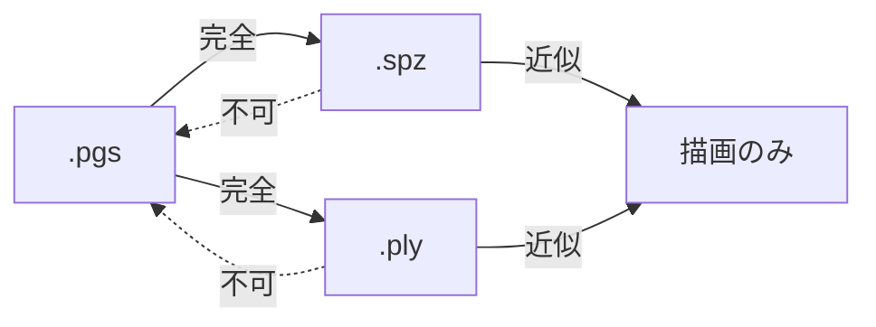

# 05. データ形式

D8「ファイルダウンロードのみ」に対応する3つの書き出し形式と、その使い分け。

## 5.1 3形式の位置づけ

| 形式 | サイズ | 他ツールで開けるか | 本アプリで再読込 | 用途 |
|---|---|---|---|---|
| **`.pgs`** | 約 201 KB | ✕ | ◎ 完全復元 | 本アプリでの保存・再編集。最軽量 |
| **`.spz`** | 約 1.4 MB | ◎ | △ 近似復元 | SuperSplat / PlayCanvas / Spark に持っていく |
| **`.ply`** | 6.7 MB | ◎ 最大互換 | △ 近似復元 | Blender / 各種研究ツール。最後の手段 |

UIでは既定を `.spz` にする。「立体を持ち帰る」という用途では、他のビューアで開けることが最も価値が高いため。
`.pgs` は「あとでこのアプリで続きをやる」という明示的な意図があるときに選ぶ。

## 5.2 `.pgs` — Photo Gaussian Splat（独自形式）

[04](./04-compression.md#45-l3--属性の2d画像化本設計の核心) で設計した4プレーンを1ファイルにまとめたもの。

### 5.2.1 コンテナ構造

ZIP や外部ライブラリを使わない、素朴な連結形式。パーサは50行程度で書ける。

```
オフセット  サイズ   内容
0          8       マジック "PGSPLAT\0"
8          2        メジャーバージョン (u16 LE)
10         2        マイナーバージョン (u16 LE)
12         4        マニフェスト長 M (u32 LE)
16         M       マニフェスト (UTF-8 JSON)
16+M       ...     チャンク列
```

各チャンクは次の形式。

```
4  チャンクID (ASCII 4文字)
4  ペイロード長 L (u32 LE)
L  ペイロード（PNG または WebP のバイト列をそのまま格納）
```

| チャンクID | 内容 | 形式 | 必須 |
|---|---|---|---|
| `DPTH` | 深度の上位8bit | PNG-8 グレースケール | ✓ |
| `DPTL` | 深度の下位4bit（上位ニブルに詰める） | PNG-8 グレースケール | ✓ |
| `COLR` | 前面色 RGB | WebP | ✓ |
| `ALFA` | 不透明度 兼 占有マスク | PNG-8 グレースケール | ✓ |
| `SCAJ` | スケールのQAT補正 2ch | PNG-8 RG（GA形式） | — |
| `THIK` | 厚みマップ（ユーザーが手で編集した場合のみ） | PNG-8 | — |
| `THMB` | サムネイル 256×256 | WebP | — |

ペイロードが**そのまま PNG / WebP のバイト列**であることが重要。
読み込み側は `createImageBitmap(new Blob([payload]))` に渡すだけでよく、
デコードはブラウザのネイティブ実装（多くの場合ハードウェア支援あり）が担う。自前のデコーダを一切書かない。

### 5.2.2 マニフェスト

```jsonc
{
  "version": 1,
  "grid": { "width": 512, "height": 512 },

  // 位置の復元に必須
  "camera": { "focalPx": 491.0, "cx": 256.0, "cy": 256.0 },
  "depthRange": { "nearZ": 0.6790, "farZ": 1.3210 },
  "depthBits": 12,

  // 背面シェルの復元パラメータ（厚みマップ本体は保存しない）
  "backShell": {
    "enabled": true,
    "thicknessT": 0.3210,      // 最大厚み
    "profile": "ellipsoid",    // sqrt(1-(1-r)^2)
    "density": 4,              // 前面の 1/4 密度
    "colorMode": "mirror-h",   // 水平反転
    "shadeBase": 0.45, "shadeRange": 0.25
  },

  // スカートの復元パラメータ（本体は保存しない）
  "skirt": {
    "enabled": true,
    "edgeThreshold": 0.018,    // 深度勾配の閾値（深度レンジ比）
    "lengthScale": 0.85,       // ギャップに対する帯の長さ
    "opacityFalloff": "linear"
  },

  // 属性の量子化設定（読み込み側が逆量子化に使う）
  "quantization": {
    "scaleAdj": { "bits": 8, "logRange": [-0.693, 0.693] },  // ±2倍
    "alpha":    { "bits": 8, "space": "logit" }
  },

  // 由来の記録
  "meta": {
    "createdAt": "2026-09-06T12:34:56Z",
    "app": "PhotoSplat 0.1.0",
    "preset": "standard",
    "subjectMode": "person",
    "models": { "depth": "depth-anything-v2-small@q4f16", "matte": "modnet@uint8" },
    "gaussianCount": { "front": 62915, "back": 26214, "skirt": 9840 }
  }
}
```

`meta.models` を記録するのは、モデルを差し替えた（D6）ときに古いファイルの再現性を追えるようにするため。

### 5.2.3 読み込み手順

```
1. マジックとバージョンを検証
2. マニフェストをパース
3. 各チャンクを createImageBitmap でデコード → GPUTexture へアップロード
4. 前面シェル: (u,v) と depth と camera から頂点シェーダで位置・法線・スケールを導出
5. 背面シェル: alpha プレーンから距離変換 → 厚み → コンピュートパスで生成
6. スカート:   depth と alpha からエッジ検出 → コンピュートパスで生成
```

手順5・6が決定的な再計算であるため、ファイルには含まれない。
再計算のコストは合計で約 0.2 秒。ファイルサイズを 1/3 にする対価としては十分に安い。

### 5.2.4 前方互換性

- 未知のチャンクIDは読み飛ばす
- メジャーバージョンが読み手より新しければ拒否、マイナーなら読み込みを試みる
- マニフェストの未知フィールドは無視する

## 5.3 `.spz` — 互換形式（既定の書き出し）

Niantic が策定した 3DGS の圧縮形式。2026年時点で SuperSplat / PlayCanvas / Spark.js / Three.js が対応しており、
実質的な標準になりつつある。

### 5.3.1 書き出し時の変換

`.pgs` の画像プレーンから、素のガウシアン配列に展開して書き出す。

| SPZ の属性 | 本設計からの変換 |
|---|---|
| 位置 (24bit 固定小数点 × 3) | `(u,v)` + 深度 + カメラから逆投影 |
| スケール (8bit × 3) | サーフェルの2軸 + 法線方向に極小値（`exp(-8)`）を入れる |
| 回転 (8bit × 3, クォータニオン圧縮) | 法線から構築。接平面内の回転は任意なので、`Y` 軸を基準に決める |
| 色 (8bit × 3) | 前面色をそのまま。背面シェルは導出した色 |
| 不透明度 (8bit) | α プレーン |
| SH | **次数0のみ**（[04](./04-compression.md#42-l0--表現の削減)） |

**背面シェルとスカートは展開して含める。** `.pgs` と違い、受け取り側は本アプリのルールを知らないため。
これが `.spz` が 1.4 MB になる主因（ガウシアン数が同じでも、導出で済ませられない）。

### 5.3.2 サーフェルを他ツールに渡すときの注意

法線方向のスケールをゼロにすると、ビューアによっては数値的に不安定になる（行列が特異になる）。
`exp(-8) ≈ 0.00034`（被写体サイズの 0.03%）を入れておく。視覚的には完全に平たいまま、計算は安定する。

### 5.3.3 読み込み

`.spz` の読み込みも実装する。ただし読み込んだものは「順不同のガウシアン集合」であり、
画像平面構造を持たないため、`PhotoSplatDocument` には格納できない。
描画専用の別経路（`LooseGaussians` として保持）で扱う。編集・再書き出しは `.ply` / `.spz` のみ可能。

## 5.4 `.ply` — 最大互換

INRIA の 3DGS 標準形式（binary_little_endian）。

```
ply
format binary_little_endian 1.0
element vertex 99129
property float x / y / z
property float nx / ny / nz          ← 本設計では実際の法線を書き込む（通常は0）
property float f_dc_0 / f_dc_1 / f_dc_2
property float opacity
property float scale_0 / scale_1 / scale_2
property float rot_0 / rot_1 / rot_2 / rot_3
end_header
```

`f_rest_*`（SH 1〜3次）は出力しない。次数0のみのファイルとして書き出す。
ほとんどのビューアは `f_rest_*` の欠如を許容する（次数0として扱う）。

**`nx, ny, nz` に実際の法線を書き込む**のは本設計の独自点。標準の 3DGS PLY ではここは常に0で、
情報を持たない無駄なフィールドになっている。本設計はサーフェル表現なので実際の法線を持っており、
書き込んでおけば法線を活用できるツール（Blender へのインポート、メッシュ化など）で役に立つ。
法線を無視するビューアには何の影響もない。

6.7 MB と大きいため、UIでは「他形式で開けない場合の最後の手段」として案内する。

## 5.5 形式間の変換可能性



`.spz` / `.ply` から `.pgs` への逆変換は**実装しない**。
画像平面構造（どのガウシアンがどのピクセル由来か、どれが前面でどれが背面か）は
展開の時点で失われており、復元するには [04](./04-compression.md#452-なぜ本設計では並べ替えが不要なのか) で
不要だと述べた並べ替え処理そのものが必要になってしまう。

代わりに、`.pgs` を保存しておけば同じことができる、と UI で案内する。

## 5.6 サイズ内訳の実測計画

上記の数値はすべて設計時の見積もりであり、実測で検証する必要がある。
CI の golden セット（17枚）に対して各プレーンの実サイズを記録し、`docs/measurements.md` に追記していく。

| 確認したいこと | 想定 | 外れた場合の対応 |
|---|---|---|
| `DPTH` 上位8bit が本当に 15:1 以上で圧縮されるか | 45 KB | 圧縮率が低ければ、深度を平滑化してから量子化する |
| `DPTL` 下位4bit のサイズ | 25 KB | 大きければ深度を11bitに落とす |
| `COLR` WebP q90 のサイズ | 90 KB | 被写体のテクスチャ次第で大きく振れる。q を動的に調整する |
| `SCAJ` が本当に必要か | 22 KB | QAT のスケール補正がほぼゼロなら、プレーンごと省略する |
