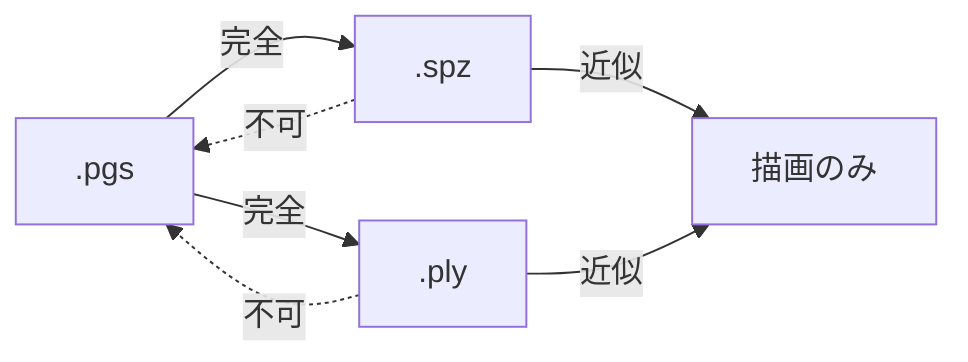

# 05. データ形式

D8「ファイルダウンロードのみ」に対応する3つの書き出し形式と、その使い分け。

## 5.1 3形式の位置づけ

| 形式 | サイズ | 他ツールで開けるか | 本アプリで再読込 | 用途 |
|---|---|---|---|---|
| **`.pgs`** | 約 750 KB | ✕ | ◎ 完全復元 | 本アプリでの保存・再編集。最軽量 |
| **`.spz`** | 約 5.9 MB | ◎ | △ 近似復元 | SuperSplat / PlayCanvas / Spark に持っていく |
| **`.ply`** | 28.8 MB | ◎ 最大互換 | △ 近似復元 | Blender / 各種研究ツール。最後の手段 |

（数値は標準プリセット・約 424,000 ガウシアン。v2 で 1024² 化したため v1 の約 3.7 倍）

UIでは既定を `.spz` にする。「立体を持ち帰る」という用途では、他のビューアで開けることが最も価値が高いため。
`.pgs` は「あとでこのアプリで続きをやる」という明示的な意図があるときに選ぶ。

## 5.2 `.pgs` — Photo Gaussian Splat（独自形式）

[04](./04-compression.md#45-l3--属性の2d画像化本設計の核心) で設計した6プレーンを1ファイルにまとめたもの。

### 5.2.1 コンテナ構造

ZIP や外部ライブラリを使わない、素朴な連結形式。パーサは50行程度で書ける。

```
オフセット  サイズ   内容
0          8       マジック "PGSPLAT\0"
8          2        メジャーバージョン (u16 LE)
10         2        マイナーバージョン (u16 LE)
12         4        マニフェスト長 M (u32 LE)
16         M       マニフェスト (UTF-8 JSON)
16+M       ...     チャンク列
```

各チャンクは次の形式。

```
4  チャンクID (ASCII 4文字)
4  ペイロード長 L (u32 LE)
L  ペイロード（PNG または WebP のバイト列をそのまま格納）
```

| チャンクID | 内容 | 形式 | 必須 |
|---|---|---|---|
| `DPTH` | 深度の上位8bit（1024²） | WebP lossless グレースケール | ✓ |
| `DPTL` | 深度の下位4bit（1024²） | **PNG 4bit グレースケール**（2px/byte） | ✓ |
| `COLR` | 前面色 RGB（1024²） | WebP | ✓ |
| `ALFA` | 不透明度 兼 占有マスク（1024²） | PNG-8 グレースケール | ✓ |
| `BCOL` | 背面色 RGB（512²）（v2） | WebP | ✓ |
| `INPT` | 遮蔽部の補完テクスチャ RGBA（512²）（v2） | WebP（α付き） | — （無ければ引き伸ばし色で代替） |
| `THIK` | 厚みマップ（ユーザーが手で編集した場合のみ） | PNG-8 | — |
| `THMB` | サムネイル 256×256 | WebP | — |

v1 にあった `SCAJ`（スケール補正）は、v2 の継ぎ目補正がスケールを更新しないため廃止。

ペイロードが**そのまま PNG / WebP のバイト列**であることが重要。
読み込み側は `createImageBitmap(new Blob([payload]))` に渡すだけでよく、
デコードはブラウザのネイティブ実装（多くの場合ハードウェア支援あり）が担う。自前のデコーダを一切書かない。

### 5.2.2 マニフェスト

```jsonc
{
  "version": 1,
  "grid": { "width": 1024, "height": 1024 },

  // 位置の復元に必須
  "camera": { "focalPx": 982.0, "cx": 512.0, "cy": 512.0, "focalSource": "da3" },  // da3 | exif | assumed
  "depthRange": { "nearZ": 0.6790, "farZ": 1.3210 },
  "depthBits": 12,

  // 背面シェルの復元パラメータ（厚みマップ本体は保存しない）
  "backShell": {
    "enabled": true,
    "thicknessT": 0.3210,      // 最大厚み
    "profile": "ellipsoid",    // sqrt(1-(1-r)^2)
    "density": 4,              // 前面の 1/4 密度
    "colorMode": "edge-extend", // v2: 人物 = edge-extend（縁色の行方向伸長）, 物体 = mirror-h。実体は BCOL に保存済み
    "shadeBase": 0.50, "shadeRange": 0.10
  },

  // スカートの復元パラメータ（本体は保存しない）
  "skirt": {
    "enabled": true,
    "edgeThreshold": 0.018,    // 深度勾配の閾値（深度レンジ比）
    "lengthScale": 0.85,       // ギャップに対する帯の長さ
    "opacityFalloff": "linear",
    "colorSource": "inpaint"   // v2: inpaint | stretch（INPT が無いときの代替）
  },

  // 適応サンプリング（v2: 読込時に決定的に再計算するためのパラメータ）
  "sampling": { "enabled": true, "thetaDepth": 0.006, "thetaColor": 4.0, "maxCell": 8 },

  // 属性の量子化設定（読み込み側が逆量子化に使う）
  "quantization": {
    "alpha": { "bits": 8, "space": "logit" }
  },

  // 由来の記録
  "meta": {
    "createdAt": "2026-09-06T12:34:56Z",
    "app": "PhotoSplat 0.1.0",
    "preset": "standard",
    "subjectMode": "person",
    "models": { "depth": "depth-anything-v3-small@q4f16", "matte": "modnet@uint8", "inpaint": "mi-gan@uint8" },
    "gaussianCount": { "front": 293600, "back": 104858, "skirt": 25000 }
  }
}
```

`meta.models` を記録するのは、モデルを差し替えた（D6）ときに古いファイルの再現性を追えるようにするため。

### 5.2.3 読み込み手順

```
1. マジックとバージョンを検証
2. マニフェストをパース
3. 各チャンクを createImageBitmap でデコード → GPUTexture へアップロード
4. 適応サンプリング: depth / color / alpha と manifest.sampling から四分木を再計算（GPU、約 40ms）
   → 各画素が属するセルの ID とサイズを持つ「セルマップ」を得る
5. 前面シェル: セルごとに1ガウシアン。位置・法線・スケールは depth と camera から頂点シェーダで導出
6. 背面シェル: alpha の距離変換 → 厚み → コンピュートパスで生成。色は BCOL から
7. スカート:   depth と alpha からエッジ検出 → コンピュートパスで生成。色は INPT から（無ければ引き伸ばし）
```

手順4〜7が決定的な再計算であるため、ファイルには幾何を含めない。合計で約 0.3 秒（1024²）。

**継ぎ目補正との整合（v2.2 で訂正）**: 継ぎ目補正は統合セル単位で色・不透明度を最適化するが、その結果はセル内の全画素に同じ値として `COLR` / `ALFA` に書き戻される。

v2 はここで「四分木の分割判定はセルの**分散**に基づくので、セル内が一様になった後も同じ分割が再現される（分散 0 ≤ θ）」と書いていた。**これは誤りである。** 実装時に反例を作って確かめた。

全分散は「群間分散 + 群内分散」に分かれる。統合はセル内を平均で塗り潰すので、読み直したときには群内分散が消えている。したがって**分割された親セル**については、書き出し時と読込時で判定材料が変わる。

| | 群内分散 | 群間分散 | 全分散 | 判定（θ = 1e−5） |
|---|---|---|---|---|
| 書き出し時 | 0.9 θ | 0.6 θ | 1.5 θ | **分割**する |
| 読み直し時（統合後） | 0 | 0.6 θ | 0.6 θ | **統合**する |

この 8×8 セルは、書き出し時は 4 セル（各 4×4）になるのに、読み込むと 1 セル（8×8）になる。実測で確認した（`tests/unit/sampling.test.ts`）。

**訂正後の分割判定**は、全分散ではなく次の2つで行う。

1. 子4つの平均どうしのばらつき（**群間分散**）が θ を超えるか
2. 子のどれかが分割されるか（再帰的に伝播する）

統合しても各ノードの平均は変わらない（葉の平均を画素数で重み付けした平均＝親の平均）ため、どの階層の判定も完全に再現される。細部を取りこぼす心配も要らない。市松模様のように群間分散が 0 でも細かい構造がある場合は、下の階層で群間分散が立ち、条件2で上へ伝わる。

乱数で作った 40 枚の画像で、書き出し→読み直しの分割（セル数・位置・大きさ）が完全に一致することを確かめている。

### 5.2.4 前方互換性

- 未知のチャンクIDは読み飛ばす
- メジャーバージョンが読み手より新しければ拒否、マイナーなら読み込みを試みる
- マニフェストの未知フィールドは無視する

## 5.3 互換形式の書き出し（`.spz` / `.ply` / `.splat`）

Niantic が策定した 3DGS の圧縮形式。2026年時点で SuperSplat / PlayCanvas / Spark.js / Three.js が対応しており、
実質的な標準になりつつある。

**書き出す形式は利用者が選ぶ（v2.2）。** 既定は `.spz`。

| 形式 | 1個あたり | 用途 |
|---|---|---|
| **`.spz`**（既定） | 約 6 B（gzip 後） | 最小。SuperSplat / PlayCanvas / Spark.js |
| `.ply` | 68 B（float32 × 17） | 3DGS の標準。ほぼどの実装でも読めるが大きい |
| `.splat` | 32 B | antimatter15 系のビューア |

実測（68,737 ガウシアン）: `.spz` 424 KB / `.ply` 4,565 KB / `.splat` 2,148 KB。

### 5.3.0 色空間 — DC 項はリニアではない（v2.2 で訂正）

3DGS の SH DC 項は**学習に使った画像の画素値**を表す。vanilla 3DGS はラスタライザの出力 `SH_C0·dc + 0.5` を、読み込んだ PNG/JPEG の値（sRGB を 255 で割っただけ）と直接比べて学習する。つまり `dc` が符号化しているのは **sRGB/255** であって、リニア輝度ではない。

実装では当初ここで sRGB→リニア変換を挟んでいた。**両端（0 と 255）は一致するので飽和の検査は通ってしまうが、中間調が大きくずれる。**

| 画素値 | 誤（リニア変換あり） | 正 |
|---|---|---|
| 0 | 0 | 0 |
| 128 | **55** | 128 |
| 255 | 255 | 255 |

他のビューアで開くと中間調が沈んで暗く見える、という形で出る。訂正後は 0 / 128 / 255 のいずれも往復する（`tests/unit/exportSplats.test.ts`）。

> なお [06 §6.9](./06-rendering.md) は「ガウシアンの色はリニア空間で保持する」と書いているが、実装は sRGB のまま保持して sRGB でブレンドしている。3DGS の慣行（学習が sRGB 空間）に合わせたためで、互換形式との往復もこちらが前提になる。

### 5.3.4 `.splat`（antimatter15 形式）

1個 32 バイト固定。仕様は参照実装（`antimatter15/splat` の `convert.py`）を取得して確認した。

| 位置 | 内容 |
|---|---|
| 0〜11 | 位置 `float32 × 3` |
| 12〜23 | スケール `float32 × 3`。**線形**（PLY の対数スケールを exp したもの） |
| 24〜27 | 色 `uint8 × 4`。`(0.5 + SH_C0·dc)·255` = 画素値そのもの。α は 0〜255 |
| 28〜31 | 回転 `uint8 × 4`。`(q/\|q\|)·128 + 128`、順序は PLY と同じ (w, x, y, z) |

参照実装は「大きくて不透明なものから先」に並べ替えてから書く。ビューアが先頭から順に読み込んで表示するので、その順だと形が早く見えてくる。同じ理由でこちらも並べ替える（描画結果は順序に依らない）。

### 5.3.1 書き出し時の変換

`.pgs` の画像プレーンから、素のガウシアン配列に展開して書き出す。

| SPZ の属性 | 本設計からの変換 |
|---|---|
| 位置 (24bit 固定小数点 × 3) | `(u,v)` + 深度 + カメラから逆投影（適応サンプリングのセル中心） |
| スケール (8bit × 3) | サーフェルの2軸 + 法線方向に極小値（`exp(-8)`）を入れる |
| 回転 (8bit × 3, クォータニオン圧縮) | 法線から構築。接平面内の回転は任意なので、`Y` 軸を基準に決める |
| 色 (8bit × 3) | 前面色。背面シェルは `BCOL`、スカートは `INPT` から |
| 不透明度 (8bit) | α プレーン |
| SH | **次数0のみ**（[04](./04-compression.md#42-l0--表現の削減)） |

**背面シェルとスカートは展開して含める。** `.pgs` と違い、受け取り側は本アプリのルールを知らないため。
これが `.spz` が約 5.9 MB になる主因（ガウシアン数が同じでも、導出で済ませられない）。

### 5.3.2 サーフェルを他ツールに渡すときの注意

法線方向のスケールをゼロにすると、ビューアによっては数値的に不安定になる（行列が特異になる）。
`exp(-8) ≈ 0.00034`（被写体サイズの 0.03%）を入れておく。視覚的には完全に平たいまま、計算は安定する。

### 5.3.3 読み込み

`.spz` の読み込みも実装する。ただし読み込んだものは「順不同のガウシアン集合」であり、
画像平面構造を持たないため、`PhotoSplatDocument` には格納できない。
描画専用の別経路（`LooseGaussians` として保持）で扱う。編集・再書き出しは `.ply` / `.spz` のみ可能。

## 5.4 `.ply` — 最大互換

INRIA の 3DGS 標準形式（binary_little_endian）。

```
ply
format binary_little_endian 1.0
element vertex 423458
property float x / y / z
property float nx / ny / nz          ← 本設計では実際の法線を書き込む（通常は0）
property float f_dc_0 / f_dc_1 / f_dc_2
property float opacity
property float scale_0 / scale_1 / scale_2
property float rot_0 / rot_1 / rot_2 / rot_3
end_header
```

`f_rest_*`（SH 1〜3次）は出力しない。次数0のみのファイルとして書き出す。
ほとんどのビューアは `f_rest_*` の欠如を許容する（次数0として扱う）。

**`nx, ny, nz` に実際の法線を書き込む**のは本設計の独自点。標準の 3DGS PLY ではここは常に0で、
情報を持たない無駄なフィールドになっている。本設計はサーフェル表現なので実際の法線を持っており、
書き込んでおけば法線を活用できるツール（Blender へのインポート、メッシュ化など）で役に立つ。
法線を無視するビューアには何の影響もない。

28.8 MB と大きいため、UIでは「他形式で開けない場合の最後の手段」として案内する。

## 5.5 形式間の変換可能性



`.spz` / `.ply` から `.pgs` への逆変換は**実装しない**。
画像平面構造（どのガウシアンがどのピクセル由来か、どれが前面でどれが背面か）は
展開の時点で失われており、復元するには [04](./04-compression.md#452-なぜ本設計では並べ替えが不要なのか) で
不要だと述べた並べ替え処理そのものが必要になってしまう。

代わりに、`.pgs` を保存しておけば同じことができる、と UI で案内する。

## 5.6 サイズ内訳の実測計画

上記の数値はすべて設計時の見積もりであり、実測で検証する必要がある。
CI の golden セット（17枚）に対して各プレーンの実サイズを記録し、`docs/measurements.md` に追記していく。

| 確認したいこと | 想定 (1024²) | 外れた場合の対応 |
|---|---|---|
| `DPTH` 上位8bit の圧縮率 | 140 KB | 圧縮率が低ければ、深度を平滑化してから量子化する |
| `DPTL` 下位4bit のサイズ（**最大の削減余地**） | 200 KB | 3bit 化（150KB）／lossy WebP q50（80KB）／512² 保存 + 色ガイド復元（70KB）を比較 |
| `COLR` WebP q90 のサイズ | 260 KB | 被写体のテクスチャ次第で大きく振れる。q を動的に調整する |
| `BCOL` の必要サイズ | 60 KB | 人物モードの無地陰影は極めて滑らかなので、256² で足りる可能性が高い |
| `INPT` のサイズ | 40 KB | バンド以外が透明なので小さいはず。大きければバンド幅の上限を 24px に |
