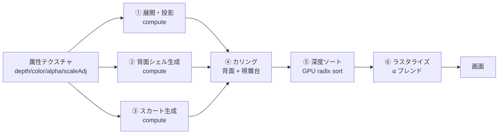

# 06. レンダリング

## 6.1 レンダラ選定と、その前提の問題

D9 で **Three.js のネイティブ WebGPU splat レンダラ (r186+)** を選んだ。
2026年8月に Three.js 本体へマージされた実装で、GPU カウンティングソートと
PLY / SPLAT / SPZ / KSPLAT ローダを内蔵しており、本設計の要求によく合う。

### ただし r186 はまだリリースされていない

調査時点（2026-09-06）の npm 最新版は **`three@0.185.1`** であり、
このバージョンには splat 関連モジュールが**一切含まれていない**（jsDelivr のファイル一覧で確認済み）。
splat レンダラは `dev` ブランチにマージ済みで r186 を待っている状態。

これは設計上のリスクであり、次の緩衝策をとる。

## 6.2 レンダラ抽象レイヤ

描画層の入口に薄いインタフェースを1枚挟み、バックエンドを差し替え可能にする。

```ts
/** 描画層の唯一の公開インタフェース。UIとパイプラインはこれしか知らない。 */
interface SplatRenderer {
  /** 描画対象を設定する。プレビュー→微調整完了時に差し替えられる。 */
  setDocument(doc: PhotoSplatDocument): void;
  /** 互換形式から読み込んだ順不同ガウシアンを描画する経路。 */
  setLooseGaussians(g: LooseGaussians): void;

  setCamera(view: ViewState): void;
  render(): void;
  resize(w: number, h: number): void;
  dispose(): void;

  /** 性能計測用。バジェット監視（[07]）が使う。 */
  readonly stats: { drawnGaussians: number; sortMs: number; rasterMs: number };
}
```

| バックエンド | 状態 | 使いどころ |
|---|---|---|
| `backends/wgsl.ts` | **最初に実装する** | 自前 WGSL 実装。r186 を待たずに開発を進められる。属性テクスチャからの直接展開（[04](./04-compression.md#481-展開しない)）を最も素直に書ける |
| `backends/three.ts` | r186 リリース後 | Three.js ネイティブ実装。エコシステムの恩恵（ローダ、LOD、将来の改善）を受けられる |

**実装順序を「自前 → Three.js」にする**理由は3つ。

1. r186 のリリース時期が不明で、それを待つとプロジェクト全体が止まる
2. 本設計の描画は「属性テクスチャから頂点シェーダで展開する」という特殊な形をしており、
   Three.js のローダ（順不同ガウシアン配列を前提）とは素直に噛み合わない可能性が高い。
   自前実装でこの部分を先に確立しておく必要がある
3. 自前実装があれば、Three.js 版は「互換形式を読み込んで描画するだけ」の用途に限定でき、リスクが下がる

r186 リリース後に両者を計測し、性能と保守性で採用を決める。**両方を維持し続けることはしない。**

## 6.3 描画パイプライン



②③は**ドキュメント設定時に1回だけ**実行し、結果をバッファにキャッシュする。
毎フレーム走るのは ④⑤⑥ のみ。

| パス | 毎フレーム | 424,000 ガウシアン（v2 標準）での時間（基準端末、見込み） |
|---|---|---|
| ① 展開・投影 | ✓ | 1.5 ms |
| ② 背面シェル生成 | — （1回） | 180 ms |
| ③ スカート生成 | — （1回） | 90 ms |
| ④ カリング（背面 + 視錐台） | ✓ | 0.6 ms → 描画対象 約 240k |
| ⑤ 深度ソート（240k） | ✓ | 2.5 ms |
| ⑥ ラスタライズ（240k） | ✓ | 8.5 ms |
| **毎フレーム計** | | **約 13 ms** → 60 fps に対し余裕 3.6 ms |

v1（99k、6.1 ms）に比べて余裕は薄い。**1024² 化（D17）の代償はここに集中する。** 次の手段で守る。

- 背面カリングで描画対象を実質半分にする（§6.4）。これ無しでは 60 fps は出ない
- 拡大時（オーバードロー増）はラスタライズが 12 ms を超えうる。フレーム時間を監視し、2 フレーム連続で 16 ms を超えたら LOD を 1 段下げる（§6.6）
- 高品質プリセット（549k）は 30 fps を目標とし、UI にその旨を表示する
- それでも守れない端末では標準プリセットを 768² に自動で落とす（起動時のベンチ 0.3 秒で判定）

### 6.3.1 GPU 上のスプラット配置と、実装で踏んだ2つの罠

スプラットは 24 バイト固定（pos 12 + nrm 4 + scale 4 + color 4、[04 §4.8.1](./04-compression.md)）。
この 24 バイトを両バックエンドでどう読むかで、実装中に2つ踏んだ。どちらもピクセルを
読み戻して初めて分かったので、記録しておく。

**罠1: WGSL の構造体は 24 バイトにならない。**
`struct Splat { pos: vec3<f32>, nrm: u32, scale: u32, color: u32 }` を
`array<Splat>` として持つと、`vec3<f32>` の整列規則で構造体の整列が 16 バイトになり、
配列のストライドが 24 ではなく **32 バイト**に切り上がる。CPU 側は 24 バイトで詰めて
いるので全部ずれる。しかも 32 と 24 の最小公倍数が 96 なので **3個に1個だけ**正しい
位置に当たる。結果として「球はちゃんと球に見えるが、画面全体に薄い靄と筋が乗る」という
気付きにくい壊れ方をした。フレーム時間も描画数も、それらしい値を返し続けていた。

対処: 配列を `array<u32>` として受け、`loadSplat(i)` で 6 ワードずつ手で切り出す
（`src/render/wgsl/common.wgsl`）。ストライドは 24 バイトのまま保たれる。

**罠2: `unpackUnorm4x8` は GLSL ES 3.00 に無い。**
WebGL2 のシェーダ言語は GLSL ES 3.00 で、`unpackHalf2x16` はあるが
`unpackUnorm4x8` は **ES 3.10 以降**にしかない。頂点シェーダのコンパイルが落ち、
WebGL2 バックエンドは1ピクセルも描けていなかった。型検査も単体テストも通っていたので、
実際に描かせるまで気付けなかった。対処: バイトを手で取り出す（`src/render/glsl/splat.vert`）。

**検証方法。** 以後この層は「描けたつもり」を許さない。`tests/e2e/render.spec.ts` が
キャンバスを読み戻し、(1) 色が乗った画素が十分あるか、(2) 重心が中央にあるか、
(3) 外接矩形が細長くないか、を見る。さらに **2つのバックエンドの結果を突き合わせる**。
独立に書いた2実装が同じ数字を出すことは、片側の見た目より強い証拠になる。
罠1 は片側だけ見ても通ってしまうが、突き合わせれば描画数と塗り面積の差として出る。
修正後は両バックエンドが描画数 7,257 / 点灯画素 47,420 で完全に一致した。

### 6.3.3 α のブレンド係数（実装で判明）

α のブレンドは **`one` / `one-minus-src-alpha`** でなければならない。色は `src-alpha` / `one-minus-src-alpha` である（フラグメントが返すのはストレート α なので、色を src-alpha で乗じて事前乗算にする。canvas は `alphaMode: 'premultiplied'`）。

実装では最初、α にも `src-alpha` を掛けていた。すると `a_dst = a·a + a_dst(1−a)` となり、α 0.77 のサーフェルが 0.59 しか積まれない。何枚重ねても 1 に届かず、**被写体が半透明のまま**になる。

| | 中心画素の α | 内側で α < 200 の割合 |
|---|---|---|
| `src-alpha`（誤り） | 177 / 255 | **98.1%** |
| `one`（正しい） | 253 / 255 | **1.6%** |

この不具合は「粒々に見える」「斜めから見ると櫛状の縞が出る」という形で現れていた。原因を未実装の工程（⑨ 継ぎ目補正・⑥ スカート）だと読み違えていたが、実際はこの1行だった。**見た目から原因を推測せず、α のヒストグラムを取って初めて分かった。**

`tests/e2e/pipeline.spec.ts` が内側の半透明率を毎回測る。10% を超えたら落ちる。

### 6.3.2 パイプラインと描画層の座標系（実装で確定）

ここは取り違えても「それらしい数」が出るので、変換を1箇所（`src/pipeline/6-splats.ts`）に閉じ込め、規約を明文化する。

| | パイプライン側（カメラ空間） | 描画側（ワールド空間） |
|---|---|---|
| 原点 | カメラ | 被写体の中心 |
| x | 右 | 右 |
| y | **下**（画像と同じ） | **下** |
| z | 奥に向かって正 | 奥に向かって正 |
| 手前を向く法線の z 成分 | **負** | **負** |

**変換は恒等（v2.6 で変更）。** 逆投影がそのまま返す COLMAP 系のカメラ座標（X 右・Y 下・Z 前）を、そのままワールドとして出す。位置も法線も向きを変えず、被写体の外接直方体で単位立方体に正規化するだけである。カメラは −Z 側に置き、上は −Y、右は +X。

3DGS の一般的な出力がこの向きで、他の実装の `.splat` と上下も前後も揃う（参照実装の z を測ると +0.845〜+1.044 と全部正だった）。v2.5 までは `(x, −y, −z)`（X 軸まわり 180°）で +Y を上にしていた。

> **軸を 1 つだけ反転してはいけない。** +Y 上から −Y 上へ移すのに `(x, y, −z)` としたくなるが、**行列式が −1 で鏡像**になり左右が入れ替わる。回転で移せるのは軸を偶数個反転するときだけで、ここでは何も反転しないのが正解である。実際に一度これをやり、**単体テストも既存の描画検査も全部通ってしまった**（被写体が左右対称に近いと絵が変わらない）。

**検算の方法。** 「描けた気がする」で通さないために2つ置いた。

1. **再投影**（`tests/unit/splatBuild.test.ts`）: 作った点を元の式で投影し直し、セル中心の (u, v) と深度に戻るか。実測で画素位置の誤差 < 0.01px、深度の誤差 < 1e−4。
   形を仮定した検算（「球面に乗るか」など）は当てにならない。最初に書いたその検算は、合成した半球が実際には楕円体（幅 0.316 / 奥行き 0.25）だったために落ちた。**落ちたのはコードではなくテストの前提だった。**
2. **正面からの背面シェル**（`tests/e2e/pipeline.spec.ts`）: 正面から見たとき、背面シェルは1個も描かれてはならない。y と z の反転を間違えるとここで出る。実測で描画数 9,690 = 前面シェル数ちょうど（背面 3,469 は全部カリング）。
3. **向きの実描画**（`tests/e2e/render.spec.ts` の「ワールドの向き」）: 非対称な目印を 4 つ置いて実際に描き、−Y が画面の上、**+X が画面の右**に出ることを両バックエンドで見る。3 つ目が鏡像の検査である。上の 1・2 はどちらも鏡像を通してしまうので、これが要る。

## 6.4 背面カリング

**本設計固有の最適化。** 一般の 3DGS では使えない。

通常の3DGSのガウシアンは向きを持つが「表裏」の概念がなく、どの方向から見ても同じように描画される。
本設計のガウシアンは**サーフェル（面素）であり法線を持つ**（[04](./04-compression.md#42-l0--表現の削減)）ため、
視線と法線の内積で表裏を判定できる。

```wgsl
// カリングパスの中核
let cosTheta = dot(normal, normalize(cameraPos - gaussianPos));
if (cosTheta < CULL_THRESHOLD) { return; }  // 破棄
```

`CULL_THRESHOLD` は 0 ではなく **−0.15** にする。完全に真横（cosθ=0）で切ると、
シルエット付近のサーフェルが消えて縁が欠ける。少し裏側まで残すことで滑らかに繋がる。

### 効果

前面シェルと背面シェルは、定義上ほぼ反対を向いている。
どの視点から見ても、そのどちらか一方が主に見え、他方は裏を向く。

| 視点 | 描画されるガウシアン（標準 424k） |
|---|---|
| 正面（生成時と同じ） | 前面シェルほぼ全部 + 背面シェルほぼゼロ → 約 57%（約 240k） |
| 斜め（±45°） | 前面の大半 + 背面の一部 → 約 55% |
| 真横（±60°、ハード上限） | 前面の 2/3 + 背面の 1/3 → 約 52% |

**平均して 40〜50% を破棄できる。** ソートとラスタライズの両方が対象なので、
毎フレームコストが実質的に半減する。表 6.3 の数値はこのカリング後のものである。

## 6.5 深度ソート

3DGS は α ブレンドを正しく行うため、毎フレーム視点からの距離でソートする必要がある。

- **GPU radix sort**（4パス × 8bit）を WGSL で実装
- キーは視点距離を 32bit 固定小数点に量子化したもの
- カリング後の約 240,000 要素で約 2.5 ms

### フレーム間の一貫性

カメラをゆっくり動かすとき、ソート順はほとんど変わらない。
毎フレーム完全ソートする代わりに、**カメラの回転角が閾値（3°）を超えたときだけ再ソートする**。
それ以外のフレームは前回の順序を再利用する。

これにより、静止時とゆっくりした操作時のソートコストが実質ゼロになる。
急激な回転時のみフルコストがかかるが、そのときは 1.0 ms を払えばよい。

## 6.6 LOD

被写体が画面に小さく写るとき（引きの視点）、全ガウシアンを描く必要はない。

```
画面上の被写体の対角ピクセル数 → 間引き率
  > 400 px  →  1/1 （全部）
  200-400   →  1/2
  100-200   →  1/4
  < 100 px  →  1/8
```

間引きは **Morton 順（Z オーダー曲線）で行う**。単純に「2個に1個」ではなく、
Morton 順の下位ビットで選ぶことで、間引き後も空間的に均一に分布する。
連番で間引くと、画像平面上で縦縞や横縞のパターンが残ってしまう。

間引いたぶんサーフェルのスケールを `sqrt(間引き率)` 倍して、覆う面積を保つ。

## 6.7 カメラ操作

半球カバー（D2）という性質上、**視点移動を制限する**のが正しい設計。
自由に回せると裏側の粗が見えてしまい、「壊れている」という印象を与える。

| 操作 | 快適範囲（v2） | ハード上限 | 挙動 |
|---|---|---|---|
| 水平回転 | **−45° 〜 +45°** | −60° 〜 +60° | 快適範囲を超えると抵抗が増し、上限でソフトに止まる（ラバーバンド） |
| 垂直回転 | **−25° 〜 +25°** | −35° 〜 +35° | 同上。**下へ引くとカメラが上がる**（v2.6 で反転。物を手前へ倒す感覚に合わせた。横方向とは符号が逆になる） |
| ズーム | 0.6× 〜 2.5× | | |
| パン | 被写体サイズの ±30% | | |

v1 は ±60° を一律の範囲としていたが、2.5D 表現で破綻なく見えるのは実際には ±45° 程度まで。v2 では「快適範囲」と「ハード上限」を分け、
**快適範囲の外では回転の抵抗を強め、ビネットを 35° から始める**。インペイント（D16）で ±45° までの品質は上がるが、それでも 60° 付近では背面シェルの粗が見える。

**「ラバーバンドで止める」ことが重要。** 硬い壁で止めると操作が引っかかった感じになり、
制限なく回せると破綻が見える。境界に近づくにつれ抵抗が増し、指を離すと少し戻る挙動にする。

さらに、**快適範囲を超えるにつれて画面の周辺を軽く暗く（ビネット）する**。
「これ以上は見せられる状態ではない」ことを、エラーではなく演出として伝える。

### 初期アニメーション

生成完了時に、視点を自動で ±25° ほど往復させる短いアニメーション（約1.8秒）を入れる。
静止画に見えてしまうのを防ぎ、立体であることを一目で伝えるため。
ユーザーが画面に触れた時点で即座に中断する。

### 6.7.1 ドラッグは起点からの絶対量で測る（v2.3、実機で判明）

実機で「プレビューが指でもマウスでも動かない」という報告が出た。原因は角度の計算ではなく、そこへ値を渡すまでの繋ぎだった。

1 イベント分の差分を、**掴んだ瞬間の角度**に足していた。

```
view = startYaw − (1イベント分の移動量 / 幅) × …   // startYaw は掴んだ時のまま
```

`startYaw` はドラッグ中ずっと固定なので、どれだけ指を動かしても「掴んだ角度 ± 直前の 1 イベント分」から離れない。100→300px を 5px 刻みで引いても **2.25° しか回らず**、指を止めると起点付近へ戻る。掴んでも動かないように見える。

差分で積むなら基準の角度も一緒に進めなければならない。**起点からの絶対量**で測るほうが素直で、丸め誤差も溜まらない。

```
view = anchorYaw − ((いまの位置 − 起点) / 幅) × …
```

指の出入りは `GestureTracker` に切り出した。DOM から離してあるのは、ここが一番間違えやすいからである。起点は次のときに取り直す。

| いつ | なぜ |
|---|---|
| 指を置いたとき | 当然 |
| 2 本目を置いたとき | 取り直さないと、置いた瞬間に 1 本目との差だけ視点が飛ぶ |
| 1 本離して 1 本残ったとき | 残った指で測り直さないと、離した瞬間に飛ぶ |

**検査。** `tests/unit/viewer.test.ts` が指の出入りの筋書き（少しずつ動かす／刻み方を変える／掴み直す／ピンチから 1 本離す）を通す。加えて `tests/e2e/viewerInput.spec.ts` が実ブラウザで本物のポインタイベントを流す。角度の式だけを単体で見ても、今回の壊れ方は捕まえられない（式は正しかった）。実際、旧実装に戻すと E2E は 4 件とも落ちる。

## 6.8 デバイス機能の検出とフォールバック

D5 で WebGPU 必須としたが、起動時に段階的に判定する。

```
1. navigator.gpu が存在するか
   なし → 「お使いのブラウザは未対応です」画面。対応ブラウザの案内のみ
2. requestAdapter() が成功するか
   失敗 → 同上
3. アダプタの limits を確認
   maxStorageBufferBindingSize < 128 MB → 作業グリッドを 768×768 に落として続行
   maxTextureDimension2D < 2048        → 同上
4. ORT の WebGPU EP でセッションが作れるか
   失敗 → 推論のみ WASM にフォールバック（[08](./08-risks.md#r1)）。描画は WebGPU のまま
```

手順3が実際に効く場面がある。iOS Safari の WebGPU は
`maxStorageBufferBindingSize` の既定値が控えめで、端末によっては 128 MB になる。
v2 の最大バッファは 1024² のソートキー／インデックス（424k × 8 B ≈ 3.4 MB）と継ぎ目補正の勾配バッファ（256² 描画なので約 20 MB）で、
v1 の 96 MB より小さい。**QAT を外したことで、この制約に対する余裕はむしろ増えた。**
768² への縮退はテクスチャサイズ制約のための保険として残す。

## 6.9 色管理

- 入力画像は sRGB として扱う（Display P3 は変換）
- ガウシアンの色は**リニア空間で保持**する。α ブレンドは物理的にリニア空間で行うのが正しく、
  sRGB 空間でブレンドすると重なった部分が暗くなる
- 出力時に sRGB へ戻す
- canvas は `format: 'bgra8unorm'`、`colorSpace: 'srgb'`、`alphaMode: 'premultiplied'`

`.pgs` の色プレーンは **sRGB で保存する**（リニアで保存すると 8bit では暗部が破綻する）。
読み込み時にリニアへ変換する。この変換はシェーダ内で行い、CPU では触らない。

## 6.10 アンチエイリアス（v2 で追加）

1024² で約 42 万のサーフェルを持つため、被写体を縮小して見たときに**エイリアシング**（きらつき、モアレ）が v1 より目立つ。
サーフェルの画面上の大きさが 1 ピクセルを下回ると、どの画素にどのサーフェルが乗るかがフレームごとに変わり、点滅として見える。

Mip-Splatting（Yu et al., CVPR 2024）の考え方を、実装コストの低い2つに絞って採り入れる。

| 手段 | 内容 | 効果 |
|---|---|---|
| **2D 低域フィルタ** | 投影後の 2D 共分散に、画素サイズ相当の分散（0.3 px²、原論文と同じ）を加える | 1 px 未満のサーフェルが最低でも 1 px 程度の広がりを持ち、点滅が消える |
| **3D スケール下限** | サーフェルの 3D スケールを「その距離で 1 画面ピクセルが覆う実寸の 0.5 倍」以上にクランプする | 縮小時にサーフェル間の隙間が開かない |

いずれも頂点シェーダの数行で済み、毎フレームのコストは無視できる。LOD の間引き（§6.6）と併用すると、縮小時の品質が安定する。

## 6.11 サーフェルの厚み（v2.6.3、実写で判明）

**サーフェルの厚みを 0 にしてはいけない。** v2.6.2 まで、シェーダは接平面の 2 軸だけを画面へ射影してクアッドの軸に使っていた（`e1w`, `e2w`）。法線方向の広がりが入っていないので、**視線に対して寝たサーフェルは画面上で線に潰れる**。顔や体に並ぶ斜めの縞の正体がこれである（docs/09 §V15）。

法線が寝ること自体は避けられない。深度は画素ごとに揺れるので、実写で隣接画素の深度差の中央値は 0.51mm、45°の傾きに当たる値が 0.46mm だった。半分の画素で法線が 45°より寝ている。

参照実装（SHARP、arXiv 2512.10685）の出力を実測すると、**大きさ帯によらず 小軸 ÷ 大軸 が 0.33〜0.45** で一定だった。平たいが 0 ではない。

`SURFEL_FLATNESS = 0.35`（`src/render/SplatRenderer.ts`）。

### 画面上の楕円は共分散から出す

3 軸目を足すと、射影した 3 本の軸は画面上で直交しない。軸をそのままクアッドに使うと形が歪むので、**2×2 の共分散を組んでから固有分解**する。

```
b_k = 射影(pos + e_k) − 射影(pos)     （k = 1,2,3）
C   = Σ_k b_k b_kᵀ                   （2×2 対称）
λ1,λ2, v1,v2 = C の固有値・固有ベクトル（閉形式）
a1 = v1·√λ1,  a2 = v2·√λ2
```

固有ベクトルは `(λ−cyy, cxy)` と `(cxy, λ−cxx)` の 2 通りの作り方があり、`cxy = 0` のとき片方が退化する。長いほうを採り、両方 0（等方）なら任意の向きでよいので `(1,0)` にする。

この後に `filter2d` の下限（§6.10）を掛ける順序は変えない。

### 厚みは面内の半径に比例させる

定数にすると大きいスプラットだけが極端に平たくなる。書き出しは `exp(-8) = 3.35e-4` の定数を入れていて、半径 0.005 のスプラットで比 0.067 になっていた。

射影後の細長さ（長軸σ ÷ 短軸σ、`filter2d` 適用後、実写・全身）:

| | yaw 0° 50% | 90% | 99% |
|---|---|---|---|
| 厚み 0 | 1.62 | 3.61 | 6.89 |
| 厚み定数 | 1.56 | 3.37 | 6.38 |
| **厚み = 半径 × 0.35** | 1.55 | **2.59** | **3.13** |

### 3 か所を機械的に照合する

この比は WGSL・GLSL・書き出しの 3 か所に現れる。ずれると自前ビューアと外部ビューアで形が変わり、しかもどちらも「それらしく」見えるので気づけない。`tests/unit/exportSplats.test.ts` が定義を正規表現で読み出して一致を確かめ、シェーダが実際に 3 軸目を使っていることも見る。
