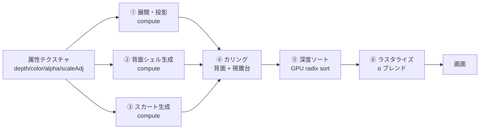

# 06. レンダリング

## 6.1 レンダラ選定と、その前提の問題

D9 で **Three.js のネイティブ WebGPU splat レンダラ (r186+)** を選んだ。
2026年8月に Three.js 本体へマージされた実装で、GPU カウンティングソートと
PLY / SPLAT / SPZ / KSPLAT ローダを内蔵しており、本設計の要求によく合う。

### ただし r186 はまだリリースされていない

調査時点（2026-09-06）の npm 最新版は **`three@0.185.1`** であり、
このバージョンには splat 関連モジュールが**一切含まれていない**（jsDelivr のファイル一覧で確認済み）。
splat レンダラは `dev` ブランチにマージ済みで r186 を待っている状態。

これは設計上のリスクであり、次の緩衝策をとる。

## 6.2 レンダラ抽象レイヤ

描画層の入口に薄いインタフェースを1枚挟み、バックエンドを差し替え可能にする。

```ts
/** 描画層の唯一の公開インタフェース。UIとパイプラインはこれしか知らない。 */
interface SplatRenderer {
  /** 描画対象を設定する。プレビュー→微調整完了時に差し替えられる。 */
  setDocument(doc: PhotoSplatDocument): void;
  /** 互換形式から読み込んだ順不同ガウシアンを描画する経路。 */
  setLooseGaussians(g: LooseGaussians): void;

  setCamera(view: ViewState): void;
  render(): void;
  resize(w: number, h: number): void;
  dispose(): void;

  /** 性能計測用。バジェット監視（[07]）が使う。 */
  readonly stats: { drawnGaussians: number; sortMs: number; rasterMs: number };
}
```

| バックエンド | 状態 | 使いどころ |
|---|---|---|
| `backends/wgsl.ts` | **最初に実装する** | 自前 WGSL 実装。r186 を待たずに開発を進められる。属性テクスチャからの直接展開（[04](./04-compression.md#481-展開しない)）を最も素直に書ける |
| `backends/three.ts` | r186 リリース後 | Three.js ネイティブ実装。エコシステムの恩恵（ローダ、LOD、将来の改善）を受けられる |

**実装順序を「自前 → Three.js」にする**理由は3つ。

1. r186 のリリース時期が不明で、それを待つとプロジェクト全体が止まる
2. 本設計の描画は「属性テクスチャから頂点シェーダで展開する」という特殊な形をしており、
   Three.js のローダ（順不同ガウシアン配列を前提）とは素直に噛み合わない可能性が高い。
   自前実装でこの部分を先に確立しておく必要がある
3. 自前実装があれば、Three.js 版は「互換形式を読み込んで描画するだけ」の用途に限定でき、リスクが下がる

r186 リリース後に両者を計測し、性能と保守性で採用を決める。**両方を維持し続けることはしない。**

## 6.3 描画パイプライン



②③は**ドキュメント設定時に1回だけ**実行し、結果をバッファにキャッシュする。
毎フレーム走るのは ④⑤⑥ のみ。

| パス | 毎フレーム | 99,000 ガウシアンでの時間（基準端末） |
|---|---|---|
| ① 展開・投影 | ✓ | 0.4 ms |
| ② 背面シェル生成 | — （1回） | 90 ms |
| ③ スカート生成 | — （1回） | 60 ms |
| ④ カリング | ✓ | 0.2 ms |
| ⑤ 深度ソート | ✓ | 1.0 ms |
| ⑥ ラスタライズ | ✓ | 4.5 ms |
| **毎フレーム計** | | **6.1 ms** → 約 160 fps の余裕 |

60 fps（16.6 ms）に対して十分な余裕がある。この余裕は、
被写体が画面いっぱいに拡大されたとき（ラスタライズのオーバードローが増える）のために取ってある。

## 6.4 背面カリング

**本設計固有の最適化。** 一般の 3DGS では使えない。

通常の3DGSのガウシアンは向きを持つが「表裏」の概念がなく、どの方向から見ても同じように描画される。
本設計のガウシアンは**サーフェル（面素）であり法線を持つ**（[04](./04-compression.md#42-l0--表現の削減)）ため、
視線と法線の内積で表裏を判定できる。

```wgsl
// カリングパスの中核
let cosTheta = dot(normal, normalize(cameraPos - gaussianPos));
if (cosTheta < CULL_THRESHOLD) { return; }  // 破棄
```

`CULL_THRESHOLD` は 0 ではなく **−0.15** にする。完全に真横（cosθ=0）で切ると、
シルエット付近のサーフェルが消えて縁が欠ける。少し裏側まで残すことで滑らかに繋がる。

### 効果

前面シェルと背面シェルは、定義上ほぼ反対を向いている。
どの視点から見ても、そのどちらか一方が主に見え、他方は裏を向く。

| 視点 | 描画されるガウシアン |
|---|---|
| 正面（生成時と同じ） | 前面シェルほぼ全部 + 背面シェルほぼゼロ → 約 55% |
| 真横（±90°） | 前面の半分 + 背面の半分 → 約 55% |
| 真後ろ | 背面シェルほぼ全部 → 約 30% |

**平均して 40〜50% を破棄できる。** ソートとラスタライズの両方が対象なので、
毎フレームコストが実質的に半減する。表 6.3 の数値はこのカリング後のものである。

## 6.5 深度ソート

3DGS は α ブレンドを正しく行うため、毎フレーム視点からの距離でソートする必要がある。

- **GPU radix sort**（4パス × 8bit）を WGSL で実装
- キーは視点距離を 32bit 固定小数点に量子化したもの
- 99,000 要素で約 1.0 ms

### フレーム間の一貫性

カメラをゆっくり動かすとき、ソート順はほとんど変わらない。
毎フレーム完全ソートする代わりに、**カメラの回転角が閾値（3°）を超えたときだけ再ソートする**。
それ以外のフレームは前回の順序を再利用する。

これにより、静止時とゆっくりした操作時のソートコストが実質ゼロになる。
急激な回転時のみフルコストがかかるが、そのときは 1.0 ms を払えばよい。

## 6.6 LOD

被写体が画面に小さく写るとき（引きの視点）、全ガウシアンを描く必要はない。

```
画面上の被写体の対角ピクセル数 → 間引き率
  > 400 px  →  1/1 （全部）
  200-400   →  1/2
  100-200   →  1/4
  < 100 px  →  1/8
```

間引きは **Morton 順（Z オーダー曲線）で行う**。単純に「2個に1個」ではなく、
Morton 順の下位ビットで選ぶことで、間引き後も空間的に均一に分布する。
連番で間引くと、画像平面上で縦縞や横縞のパターンが残ってしまう。

間引いたぶんサーフェルのスケールを `sqrt(間引き率)` 倍して、覆う面積を保つ。

## 6.7 カメラ操作

半球カバー（D2）という性質上、**視点移動を制限する**のが正しい設計。
自由に回せると裏側の粗が見えてしまい、「壊れている」という印象を与える。

| 操作 | 範囲 | 挙動 |
|---|---|---|
| 水平回転 | **−60° 〜 +60°** | 端でソフトに止まる（ラバーバンド） |
| 垂直回転 | **−35° 〜 +35°** | 同上 |
| ズーム | 0.6× 〜 2.5× | |
| パン | 被写体サイズの ±30% | |

**「ラバーバンドで止める」ことが重要。** 硬い壁で止めると操作が引っかかった感じになり、
制限なく回せると破綻が見える。境界に近づくにつれ抵抗が増し、指を離すと少し戻る挙動にする。

さらに、**境界に近づくにつれて画面の周辺を軽く暗く（ビネット）する**。
「これ以上は見せられる状態ではない」ことを、エラーではなく演出として伝える。

### 初期アニメーション

生成完了時に、視点を自動で ±25° ほど往復させる短いアニメーション（約1.8秒）を入れる。
静止画に見えてしまうのを防ぎ、立体であることを一目で伝えるため。
ユーザーが画面に触れた時点で即座に中断する。

## 6.8 デバイス機能の検出とフォールバック

D5 で WebGPU 必須としたが、起動時に段階的に判定する。

```
1. navigator.gpu が存在するか
   なし → 「お使いのブラウザは未対応です」画面。対応ブラウザの案内のみ
2. requestAdapter() が成功するか
   失敗 → 同上
3. アダプタの limits を確認
   maxStorageBufferBindingSize < 128 MB → 作業グリッドを 384×384 に落として続行
   maxTextureDimension2D < 2048        → 同上
4. ORT の WebGPU EP でセッションが作れるか
   失敗 → 推論のみ WASM にフォールバック（[08](./08-risks.md#r1)）。描画は WebGPU のまま
```

手順3が実際に効く場面がある。iOS Safari の WebGPU は
`maxStorageBufferBindingSize` の既定値が控えめで、端末によっては 128 MB になる。
本設計の最大バッファ（微調整の勾配累積）は 512×512 で約 96 MB なので通るが、余裕は大きくない。
384×384 に落とせば 54 MB になり、確実に収まる。

## 6.9 色管理

- 入力画像は sRGB として扱う（Display P3 は変換）
- ガウシアンの色は**リニア空間で保持**する。α ブレンドは物理的にリニア空間で行うのが正しく、
  sRGB 空間でブレンドすると重なった部分が暗くなる
- 出力時に sRGB へ戻す
- canvas は `format: 'bgra8unorm'`、`colorSpace: 'srgb'`、`alphaMode: 'premultiplied'`

`.pgs` の色プレーンは **sRGB で保存する**（リニアで保存すると 8bit では暗部が破綻する）。
読み込み時にリニアへ変換する。この変換はシェーダ内で行い、CPU では触らない。
