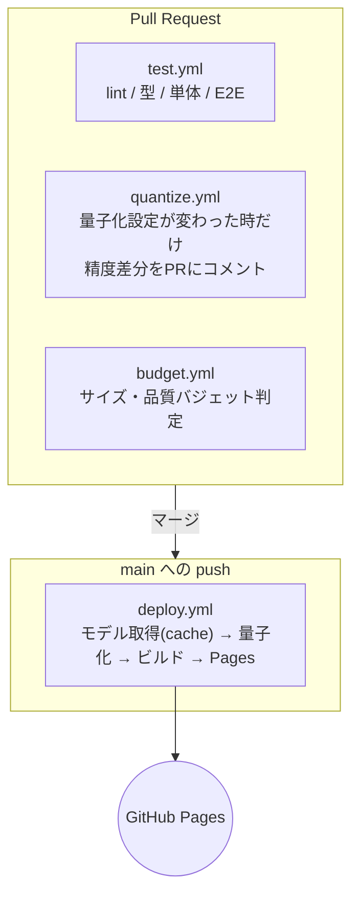

# 07. CI/CD と性能バジェット

D10 で確定した4つの責務すべてを実装する。GitHub Actions のみを使い、外部サービスに依存しない。

## 7.1 ワークフロー構成



| ファイル | 起動条件 | 所要時間（キャッシュ命中時） |
|---|---|---|
| `test.yml` | PR、`main` への push | 約 4 分 |
| `quantize.yml` | `models/registry.json` または `scripts/quantize.py` が変わった PR | 約 12 分 |
| `budget.yml` | PR | 約 3 分 |
| `deploy.yml` | `main` への push、手動 | 約 3 分（キャッシュ外れ時 15 分） |

## 7.2 deploy.yml — ビルドと Pages デプロイ

```yaml
name: deploy
on:
  push: { branches: [main] }
  workflow_dispatch:

permissions:
  contents: read
  pages: write
  id-token: write

concurrency:
  group: pages
  cancel-in-progress: true

jobs:
  models:
    name: モデルの取得と量子化
    runs-on: ubuntu-latest
    outputs:
      cache-key: ${{ steps.key.outputs.value }}
    steps:
      - uses: actions/checkout@v4

      # 量子化結果は「レジストリ + 量子化スクリプト + 較正データ」だけで決まる。
      # このハッシュが変わらなければ再量子化は不要。
      - id: key
        run: |
          H=$(cat models/registry.json scripts/quantize.py models/calibration/* \
              | sha256sum | cut -c1-16)
          echo "value=models-$H" >> "$GITHUB_OUTPUT"

      - id: cache
        uses: actions/cache@v4
        with:
          path: build/models
          key: ${{ steps.key.outputs.value }}

      - if: steps.cache.outputs.cache-hit != 'true'
        run: |
          pip install -r scripts/requirements.txt
          python scripts/fetch_models.py --out build/raw
          python scripts/quantize.py  --in build/raw --out build/models
          python scripts/calibrate.py --models build/models --fail-under-threshold

      - uses: actions/upload-artifact@v4
        with: { name: models, path: build/models }

  build:
    needs: models
    runs-on: ubuntu-latest
    steps:
      - uses: actions/checkout@v4
      - uses: actions/setup-node@v4
        with: { node-version: 22, cache: npm }
      - run: npm ci
      - uses: actions/download-artifact@v4
        with: { name: models, path: public/models }
      - run: npm run build            # Vite。base は repo 名に合わせる
      - run: node scripts/budget_check.mjs --dist dist --fail
      - uses: actions/upload-pages-artifact@v3
        with: { path: dist }

  deploy:
    needs: build
    runs-on: ubuntu-latest
    environment:
      name: github-pages
      url: ${{ steps.d.outputs.page_url }}
    steps:
      - id: d
        uses: actions/deploy-pages@v4
```

### 押さえておくべき点

- **`base` の設定**: `https://<user>.github.io/cc_create3dgs/` に配信されるため、
  Vite の `base: '/cc_create3dgs/'` が必要。モデルの fetch パスもこれに従う
- **モデルは `public/models/` に置く**: Vite がそのまま `dist/models/` にコピーする。
  リポジトリの `.gitignore` で `public/models/` を除外しておく（D7）
- **`concurrency` で Pages を直列化**: 連続 push でデプロイが競合するのを防ぐ
- **カスタム workflow なので「1時間10ビルド」制限は適用されない**（この制限は Jekyll の自動ビルドのみ）

## 7.3 quantize.yml — 量子化の精度差分レポート

D10 の「モデル量子化を CI で」の中で、最も価値のある部分。

量子化設定を変えた PR に対して、**精度がどう変わったかを自動でコメントする**。
これがないと、「int8 にしたら深度が壊れた」ことに実機で気づくことになる。

```yaml
name: quantize
on:
  pull_request:
    paths: ['models/registry.json', 'scripts/quantize.py', 'models/calibration/**']

jobs:
  diff:
    runs-on: ubuntu-latest
    steps:
      - uses: actions/checkout@v4
        with: { fetch-depth: 0 }
      - run: pip install -r scripts/requirements.txt

      # base 側と head 側の両方で量子化して比較する
      - run: |
          git worktree add /tmp/base ${{ github.event.pull_request.base.sha }}
          python scripts/fetch_models.py --out /tmp/raw
          python /tmp/base/scripts/quantize.py --in /tmp/raw --out /tmp/out-base \
                 --registry /tmp/base/models/registry.json
          python scripts/quantize.py         --in /tmp/raw --out /tmp/out-head
          python scripts/calibrate.py --compare /tmp/out-base /tmp/out-head \
                 --report /tmp/report.md

      - uses: actions/github-script@v7
        with:
          script: |
            const body = require('fs').readFileSync('/tmp/report.md', 'utf8');
            github.rest.issues.createComment({
              issue_number: context.issue.number,
              owner: context.repo.owner, repo: context.repo.repo, body });
```

### 較正と精度測定 (`calibrate.py`)

較正データは `models/calibration/` に置いた **12枚の画像**（人物6・物体6、多様な照明と背景）。
1枚あたり約 100 KB、合計 1.2 MB なのでリポジトリに直接コミットして問題ない。

| モデル | 測定指標 | 合格閾値 |
|---|---|---|
| 深度推定 | fp32 出力との **AbsRel**（相対絶対誤差） | < 2.0% |
| 深度推定 | fp32 出力との **δ<1.05 精度** | > 97% |
| 深度推定（v2） | DA3-S と V2-S の比較: **DA3-Large fp32 を擬似正解**とした AbsRel（Large は CC-BY-NC だが評価のみの利用で配布しない） | 報告のみ（PoC-2 の判断材料） |
| インペイント（v2） | fp32 出力との **PSNR**（バンド領域） | > 32 dB |
| セグメンテーション | fp32 出力との **IoU** | > 0.985 |
| セグメンテーション | 境界 5px 帯の **MAE** | < 4/255 |

深度は **AbsRel と δ 精度の両方**を見る。AbsRel だけだと、被写体の一部だけが大きく壊れる
（顔の中央がへこむ、など）ケースを見逃す。δ 精度は「何割の画素が許容誤差内か」を見るので、
局所的な破綻を検出できる。

閾値を割ったら CI を失敗させる（`--fail-under-threshold`）。

### 量子化の設定（`registry.json` の `quantization`）

```jsonc
"quantization": {
  "mode": "q4f16",
  // 量子化から除外する演算。深度推定では LayerNorm と Softmax の精度が支配的で、
  // ここを量子化すると AbsRel が跳ね上がる。
  "excludeOpTypes": ["LayerNormalization", "Softmax"],
  // per-channel 量子化。畳み込みのチャネルごとにスケールを持つ。
  // 精度が上がる代わりにファイルがわずかに大きくなる。
  "perChannel": true,
  // 較正方式。MinMax は外れ値に弱いので Entropy を使う。
  "calibrationMethod": "Entropy"
}
```

`excludeOpTypes` の中身こそが、**CI で量子化を回すことの本当の価値**である。
どの演算を除外すると精度が保てるかは事前には分からず、試して測るしかない。
CI に載っていれば、「除外リストを1行変えた PR」に対して自動で精度差分が出るので、
数値を見ながら詰められる。手元で手作業でやると、この探索は現実的に回らない。

## 7.4 test.yml — 自動テスト

| 種別 | 対象 | ツール |
|---|---|---|
| 単体 | コーデックの往復（量子化→逆量子化の誤差）、`.pgs` のパース、四分木分割、八面体写像 | Vitest |
| 単体 | マニフェストのスキーマ検証 | Vitest + ajv |
| 結合 | `.pgs` → `.spz` → 読み戻し のガウシアン数と位置の一致 | Vitest |
| E2E | サンプル画像から実際に3DGSを生成し、結果を検証 | Playwright |

### E2E での WebGPU

GitHub ランナーには GPU がないため、Chrome を **SwiftShader（ソフトウェア実装）** で起動する。

```yaml
- run: npx playwright test --project=chromium
  env:
    PW_CHROMIUM_ARGS: >-
      --enable-unsafe-webgpu
      --use-angle=swiftshader
      --enable-features=Vulkan,UseSkiaRenderer
```

**ソフトウェア実装は極端に遅い**（実機の20〜50倍）。したがって E2E で検証するのは
**結果の正しさだけで、速度は一切見ない**。

> **実装時の訂正（2026-09-07）**: 開発コンテナの headless Chromium 141 では、
> `--enable-unsafe-webgpu` / `--use-angle=swiftshader` / `--use-vulkan=swiftshader` を
> 同梱の SwiftShader ICD（`vk_swiftshader_icd.json`）と併せて指定しても、
> **`navigator.gpu` 自体が露出しなかった**。GitHub ランナーで動くかは未確認である。
>
> したがって E2E は**能力検出で分岐する**設計にした。WebGPU が使えれば生成まで検証し、
> 使えなければ WebGPU に依存しない部分（モジュール読み込み、コーデックの往復、
> WASM 推論）だけを実行して、**「WebGPU 未検証」を結果に明記する**。
> 黙って通過させない。
>
> ここが埋まらない場合、生成結果の自動回帰検知は実機の手動確認に頼ることになる。
> その場合は PoC-1 のハーネス（`poc.html`）をリリース前チェックリストに組み込む。

| 検証項目 | 判定 |
|---|---|
| 生成が例外なく完了するか | 必須 |
| ガウシアン数が想定範囲内か | 標準プリセットで 300,000 〜 500,000 |
| `.pgs` のサイズ | < 1.0 MB（標準） |
| 生成画像と入力画像の **SSIM**（入力視点から描画） | > 0.92 |
| ±45° 回転時に穴（α=0 の画素）が被写体領域の何%か | < 2% |
| ±45° 回転時の深度エッジ帯の**縞指標**（[04 §4.6](./04-compression.md#46-継ぎ目補正の効果測定v2-で-qat-測定を置き換え)） | インペイント無し比で +0.3 nat 以上 |
| 各形式で書き出したファイルが再読込できるか | 必須 |

タイムアウトは 1 テストあたり 10 分と長めに設定する。

**±40° 回転時の穴の割合**は、D2（半球カバー）が実際に機能しているかを測る唯一の自動指標である。
背面シェルやスカートの生成を壊す変更を、これで検出できる。

## 7.5 性能バジェットの現実的な線引き

D10 の「性能バジェット監視」について。**ここで正直に線を引いておく必要がある。**

### CI で測れるもの / 測れないもの

| 指標 | CI で測れるか | 理由 |
|---|---|---|
| JS バンドルサイズ | ✅ | 静的に決まる |
| モデル合計サイズ | ✅ | 同上 |
| `.pgs` 出力サイズ | ✅ | SwiftShader でも同じ結果が出る |
| ガウシアン数 | ✅ | 同上 |
| 再構成品質 (SSIM / PSNR) | ✅ | 同上 |
| 量子化前後の精度差 | ✅ | Python で完結 |
| **生成時間** | ❌ | **GPU がないため無意味な数字しか出ない** |
| **描画 FPS** | ❌ | 同上 |

**時間に関する SLO（[01](./01-requirements.md#14-性能slo) の 10 秒）は CI で強制できない。**
SwiftShader で 300 秒かかったとして、それは実機の性能について何も語らない。

### 対応方針

1. **CI が強制するのはサイズと品質のみ。** 閾値を割ったら PR を落とす
2. **時間は実機で手動計測し、記録を残す。** アプリ内に計測モードを持たせる（`?bench=1`）。
   段階ごとの経過時間を表示し、コピーできるようにする
3. 計測結果を `docs/measurements.md` に端末名・日付とともに追記していく。
   リリース前に基準端末（iPhone 14 / Pixel 7）で必ず1回測る

これは妥協だが、GPU 付きランナーを使わない限り他に方法がない。
「CI が通ったから速い」と誤認するより、**測れないことを明示しておくほうが安全**である。

### バジェット定義

`scripts/budget_check.mjs` が判定する。すべて **標準プリセット** に対する値。

```jsonc
// budget.json
{
  "bundle": {
    "js.gzip":  { "warn": 280000, "fail": 400000 },
    "css.gzip": { "warn":  15000, "fail":  25000 }
  },
  "models": {
    "初回必須 (深度 + 人物マット + インペイント)": { "warn": 36600000, "fail": 40000000 },
    "物体モード追加分":                          { "warn": 44100000, "fail": 50000000 },
    "合計":                                     { "warn": 85000000, "fail": 100000000 }
  },
  "output": {
    "pgs.bytes":      { "warn": 800000, "fail": 1000000 },
    "gaussianCount":  { "warn": [300000, 500000], "fail": [250000, 600000] }
  },
  "quality": {
    "ssim.inputView":    { "warn": 0.93, "fail": 0.92 },
    "holeRatio.45deg":   { "warn": 0.01, "fail": 0.02 },
    "stripeGain.45deg":  { "warn": 0.4,  "fail": 0.3 }
  },
  "pages": {
    "総サイズ": { "warn": 120000000, "fail": 200000000 }   // Pages の 1GB 制限に対し十分な余裕
  }
}
```

`warn` は PR にコメントするだけ、`fail` は CI を落とす。
2段構えにするのは、じわじわ増えていくのを早めに気づけるようにするため。

## 7.6 GitHub Pages 固有の制約

調査で確認した制約と、本設計での対処。

| 制約 | 値 | 本設計での状況 |
|---|---|---|
| 公開サイトの最大サイズ | 1 GB（ソフト） | 約 100 MB。余裕あり |
| リポジトリ推奨サイズ | 1 GB | モデルをコミットしないため約 20 MB |
| 帯域 | 100 GB / 月（ソフト） | モデル 80.6 MB × 訪問者。**月1,240人で上限**。→ §7.7 |
| ビルド回数 | 10回/時（ソフト） | **カスタム workflow には適用されない** |
| デプロイのタイムアウト | 10 分 | ビルド 3 分。余裕あり |
| **カスタム HTTP ヘッダ** | **設定不可** | **COOP/COEP を返せない → `SharedArrayBuffer` 不可 → WASM シングルスレッド。**[02](./02-architecture.md#23-実行モデル--メインスレッドとworker) の通り、WebGPU 必須（D5）の根拠 |

### COOP/COEP について

`coi-serviceworker` という Service Worker でヘッダを偽装する回避策が知られているが、**採用しない**。

- D11 で PWA・Service Worker を実装しない方針
- WebGPU があれば WASM マルチスレッドは不要
- Service Worker はキャッシュ絡みのデバッグを著しく困難にする

WASM フォールバック（[08](./08-risks.md#r1)）はシングルスレッドで動くことを前提に設計する。

## 7.7 帯域の見積もりと対策

**最も現実的なリスク。** モデル 80.6 MB を毎回配信すると、月100 GB は約1,240訪問で尽きる。

| 対策 | 効果 |
|---|---|
| `Cache API` にモデルを保存し、リピート訪問では再取得しない | 実質的に初回のみ。ただし GitHub Pages のキャッシュヘッダは制御できないため、`Cache API` に明示的に入れる実装が必須 |
| 物体モードのモデル（44 MB）を**遅延ロード**する | 人物モードのみの訪問者は 36.6 MB で済む。初回訪問の帯域を半分以下に |
| ファイル名にハッシュを含め、`Cache API` のキーにする | モデル更新時のみ再取得 |
| バジェットでモデル合計を 100 MB に制限 | 際限なく増えるのを防ぐ |

これらを適用しても、**月あたり約 2,700 訪問で上限に達する**（初回訪問の平均を 36.6 MB と仮定）。

超えた場合は Pages が throttle されるだけで課金は発生しないが、体験は劣化する。
**その時点で、モデルのみ jsDelivr（GitHub リポジトリを CDN 配信するサービス）に逃がす**のが移行先になる。
D7 の「同一オリジン」という利点は失うが、CORS を許可すれば動く。
今回は実装せず、`registry.json` に `cdnBase` フィールドだけ予約しておく。
