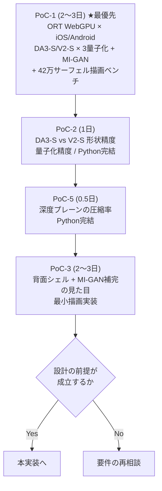

# 08. リスクと検証計画

## 8.1 リスク一覧

影響度と発生確率で並べた。上ほど先に潰すべきもの。

| ID | リスク | 影響 | 確率 | 対策 |
|---|---|---|---|---|
| **R1** | ONNX Runtime Web の WebGPU EP が iOS Safari で正しく動かない | **致命的**（アプリが成立しない） | 中 | §8.2 |
| **R2** | Depth Anything V2 Small の q4f16 量子化で深度が破綻する | 大（品質が要件を満たさない） | 中 | §8.3 |
| **R3** | 背面シェルの見た目が許容できない | 大（D2 が満たせない） | 中 | §8.4 |
| **R4** | Three.js r186 が長期間リリースされない | 中（自前実装で回避可能） | 中 | [06](./06-rendering.md#62-レンダラ抽象レイヤ) |
| **R5** | 深度プレーンの圧縮率が想定に届かず `.pgs` が大きくなる | 中 | 中 | §8.5 |
| **R6** | iOS Safari のメモリ上限でタブが落ちる | 大 | 低 | §8.6 |
| **R7** | 10 秒 SLO に収まらない | 中 | 中 | §8.7 |
| **R8** | GitHub Pages の帯域上限に達する | 小（劣化のみ） | 低 | [07](./07-cicd.md#77-帯域の見積もりと対策) |
| ~~R9~~ | ~~微調整の QAT が効果を出さない~~ | — | — | v2 で QAT を廃止したため消滅 |
| **R10** (v2) | DA3-Small が ORT WebGPU で動かない／ONNX に内部パラメータ出力が無い | 中 | 中 | §8.8 |
| **R11** (v2) | MI-GAN の補完品質が物体の模様で不足する | 中 | 中 | §8.9 |
| **R12** (v2) | 1024²・42万ガウシアンで中位端末が 60 fps を割る | 中 | **高** | §8.10 |

## 8.2 R1 — ORT WebGPU EP の iOS Safari 対応

**最大のリスク。** これが動かなければ設計の前提が崩れる。

WebGPU 自体は iOS 26 / Safari で利用可能になっているが、
**ONNX Runtime Web の WebGPU EP が iOS 上で安定して動作するかは別問題**である。
ORT の WebGPU EP は Chrome/Desktop での検証が中心で、Safari 特有の実装差
（シェーダコンパイル、バッファ制限、非同期の扱い）で失敗する可能性がある。

さらに本設計は q4f16 量子化（`MatMulNBits` 演算）を使う。この演算子の WebGPU 実装は比較的新しく、
Safari で動く保証がない。

### 対策 — 3段の縮退（深度モデルは DA3-S / V2-S のどちらにも適用）

```
1. WebGPU EP + q4f16               … 目標構成 (DA3-S 約22 MB / V2-S 19 MB, 0.8 s)
     ↓ セッション作成またはウォームアップ推論に失敗
2. WebGPU EP + fp16                … 精度同等、サイズ増 (約50 MB, 1.0 s)
     ↓ 同上
3. WASM (SIMD, シングルスレッド) + uint8 … 動くが遅い (約27 MB, 6〜9 s)
```

v2 では DA3-S → V2-S のモデル間フォールバックがこの上に重なる（§8.8）。

3段目まで落ちると10秒 SLO は満たせないが、**動かないよりはるかにまし**。
その場合は UI に「この端末では処理に時間がかかります」と明示し、
自動的に「軽量」プリセット（[04](./04-compression.md#47-品質プリセット)）に切り替える。

判定は起動時に一度だけ行い、結果を `localStorage` に保存する。毎回試すのは無駄。

### 検証（PoC-1、最優先）

**他の何よりも先に、これだけを検証する最小の HTML を作る。**

```
1ファイルの HTML に:
  - ORT-Web を CDN から読み込む
  - Depth Anything V2 Small (q4f16 / fp16 / uint8 の3種) をロード
  - サンプル画像1枚を推論
  - 各構成の 成否 / 所要時間 / 出力の妥当性 を画面に表示
```

これを GitHub Pages にデプロイし、**実機の iPhone と Android で開く**。
所要 1〜2 日。この結果が出るまで本実装に入らない。

**もし3段すべて失敗したら**、設計を根本から見直す必要がある。
その場合の選択肢は「D1（完全オンデバイス）を諦めて外部 API を使う」しかなく、
それは要件の変更なので、ご相談することになる。

## 8.3 R2 — 深度の量子化破綻

q4f16 は 4bit 重み量子化であり、深度推定のような**連続値を高精度で出す回帰タスク**には
分類タスクほど寛容でない可能性がある。

### 兆候

- 平坦な面に階段状の段差が出る（バンディング）
- 被写体の一部だけ深度が大きくずれる
- 深度の相対順序が入れ替わる（手前のものが奥に）

### 対策

1. **`excludeOpTypes` の調整。** LayerNorm と Softmax を量子化から除外する（[07](./07-cicd.md#量子化の設定registryjson-の-quantization)）。
   これは既定で入れる
2. **DPT ヘッド（デコーダ）を量子化しない。** エンコーダ（ViT）だけ 4bit にする。
   深度の数値精度を最終的に決めるのはヘッドなので、ここを fp16 で残す効果が大きい。
   サイズは 19 MB → 約 26 MB になるが、許容範囲
3. **fp16 への縮退**（49.6 MB）。品質が最優先なら最終手段としてこれ

CI の較正（AbsRel < 2%, δ<1.05 > 97%）でこれらを定量的に比較できる。

### 検証（PoC-2）

PoC-1 と同時に、各量子化構成の深度出力を較正データ12枚で比較する。
Python で完結するので CI に載せられる。所要 0.5 日。

## 8.4 R3 — 背面シェルの見た目

「厚み = 楕円プロファイル、色 = 水平反転 + 減光」というヒューリスティックが、
実際にどう見えるかは作ってみないと分からない。

### 想定される失敗

- 人物の後頭部が「顔の鏡像」に見えて不気味になる
- 非対称な物体（取っ手付きのカップなど）で裏側が明らかにおかしい
- 厚みが均一すぎて風船のように見える

### 対策の順序

1. **まず作って見る。** これは机上で判断できない
2. 不気味なら **減光を強める**。`shadeBase` を 0.45 → 0.25 に下げると、
   裏側がほぼシルエットになり「見えない」ことが自然に伝わる
3. それでもだめなら **裏側を単色（被写体の平均色 × 0.3）にする**。
   情報を出さないほうがましという判断
4. UI の「厚み」スライダを 0 にすれば前面のみになる。逃げ道は常にある

**カメラの回転制限（±60°）とビネット**（[06](./06-rendering.md#67-カメラ操作)）が、
このリスクに対する最も効く保険である。そもそも裏側をよく見せない。

### 検証（PoC-3）

深度推定の出力（PoC-1 の成果物）を使い、背面シェル生成と描画だけの最小実装を作る。
サンプル10枚で ±60° まで回して目視評価する。所要 2〜3 日。

## 8.5 R5 — 深度プレーンの圧縮率

「上位8bit プレーンが 15:1 以上で圧縮される」という見積もり（[04](./04-compression.md#深度を12bitに落として2プレーンに分離する理由)）が
外れると、`.pgs` が想定の 750 KB を大きく超える。特に下位 4bit プレーン（`DPTL`, 見込み 200 KB）は最大の不確実要素（[04 §4.5.4](./04-compression.md#454-保存するプレーンと符号化v2-1024-標準)）。

### 検証方法

これは**実装前に検証できる**。既存の深度推定結果（PoC-1 の出力）を使い、
Python で各エンコード方式のサイズを比較するだけ。

| 方式 | 測る |
|---|---|
| 16bit PNG そのまま | 基準 |
| 12bit に量子化 → 16bit PNG | 量子化の効果 |
| 12bit → 上位8bit + 下位4bit の2プレーン | **本設計** |
| 10bit → 単一 PNG-8 | 「軽量」プリセット相当 |
| WebP lossless | PNG より小さくなる可能性 |

所要 0.5 日。**PoC-1 の直後に実施する。**サイズ見積もりの根幹なので、早く数字を確定させたい。

### 外れた場合

- 深度を 10bit に落とす（精度 0.5mm → 2.0mm。それでも画面上 1px 以下）
- 深度マップに軽い平滑化をかけてから量子化する（高周波ノイズを落とすと圧縮が効く）
- 色プレーンの q を下げてサイズを融通する

## 8.6 R6 — iOS のメモリ上限

iOS Safari はタブのメモリ使用量が概ね 1〜1.5 GB を超えると強制終了する（Jetsam）。

### 本設計のピーク使用量の見積もり

| 項目 | サイズ |
|---|---|
| ONNX セッション（深度 q4f16 + 物体マット uint8） | 約 130 MB（重みの2〜2.5倍） |
| 推論の中間テンソル（ISNet 1024²） | 約 180 MB |
| 深度タイルパスの中間結果 | 約 40 MB |
| 継ぎ目補正の勾配バッファ（256² 描画） | 約 20 MB |
| MI-GAN セッション + 中間テンソル（512²） | 約 60 MB |
| 属性テクスチャと描画バッファ（1024²） | 約 45 MB |
| ブラウザ・JS ヒープ | 約 150 MB |
| **ピーク合計** | **約 620 MB** |

余裕はあるが、**セグメンテーション・深度推定・インペイントのセッションを同時に保持しない**ことが重要。
各段が終わったら明示的に `release()` する。3つ同時に保持すると +190 MB になる。

### 検証

PoC-1 で実機の Safari を Web Inspector に繋いでメモリを実測する。

## 8.7 R7 — 10 秒 SLO

時間予算表（[03](./03-pipeline.md#38-時間予算)）は見積もりであり、実測ではない。
特に不確実なのは次の3つ。

| 項目 | 見積もり | 不確実性 |
|---|---|---|
| ISNet uint8 @ 1024² の推論時間 | 1.50 s | **高**。1024² は重い。倍かかる可能性 |
| 継ぎ目補正 1反復の時間（256²） | 10 ms | 中。v1 の「6 ms @512²・400反復」は非現実的だったため、v2 で 256²・60反復に縮小済み |
| MI-GAN 512² uint8 の推論時間 | 0.9 s | 中。モバイル向け設計だが WebGPU 上の実測は無い |
| WebP エンコード | 0.3 s | 中 |

### 対策 — 削るのではなく、待たせない

[01](./01-requirements.md#d4-と-d13-の関係について) のルール2に従い、超過分は**プレビュー後のバックグラウンド処理に回す**。

```
優先度1（プレビューまでに必須）: 被写体抽出、深度全体パス、幾何構築、適応サンプリング
優先度2（プレビュー後に差し替え）: 深度タイルパス、インペイント、継ぎ目補正
優先度3（書き出し時に初めて実行）: 量子化、画像エンコード
```

優先度3を書き出し時まで遅延させるのは有効。
**閲覧だけして書き出さないユーザーには、量子化のコストを一切払わせない。**
これで 0.80 秒が生成パスから消える。

さらに、優先度2は**中断可能**にする。ユーザーがスライダを動かしたり別の画像を読み込んだら、
進行中のインペイントや継ぎ目補正を捨てる。

### 検証

PoC-1〜3 の結果が揃った時点で、実機での段階別計測を行う。
`?bench=1` モードを最初から実装しておく。

## 8.8 R10 — DA3-Small の ORT WebGPU 対応（v2）

DA3-S は 2025 年 11 月公開で、ONNX 変換（`onnx-community`）はあるが ORT WebGPU 上での動作報告はまだ少ない。
また ONNX 出力に**カメラ内部パラメータのヘッドが含まれていない**可能性がある（変換時に深度ヘッドのみ出力するのが通例）。

| 状況 | 対応 |
|---|---|
| DA3-S が WebGPU で動き、内部パラメータも出る | 目標構成。焦点距離推定を使う |
| DA3-S は動くが内部パラメータが無い | 深度のみ使い、焦点距離は EXIF → 55° 仮定。それでもシフト不定性の解消だけで価値がある |
| DA3-S が WebGPU で動かない | **V2-S に切り替え**（§3.5.2 のシフト推定を有効化）。`registry.json` の `depthFallback` |
| 両方動かない | R1 の WASM 縮退 |

PoC-1 で 2 モデル × 3 量子化構成を同時に検証する。PoC-2 で DA3-Large fp32 を擬似正解として両者の形状精度を比較し、実機速度と合わせて最終決定する。

## 8.9 R11 — MI-GAN の補完品質（v2）

MI-GAN は Places2（風景・室内）と FFHQ（顔）で学習されている。人物の髪・服・顔の遮蔽補完には向くが、**物体の規則的な模様**（格子、文字、ロゴ）の補完は不得手。

| 対応 | 内容 |
|---|---|
| バンド幅の上限 | 32px（512² 上）。狭い帯なら「それらしいテクスチャの連続」で足りる |
| 失敗検知 | 補完結果とバンド外周の色差が閾値を超えたら、その帯だけ v1 方式（引き伸ばし）に戻す |
| 縞指標での監視 | CI の golden セットで、インペイント有無の縞指標差が +0.3 nat を割ったらマスク設計を見直す |

PoC-3（背面シェルの目視評価）に MI-GAN の補完も含め、人物 5 枚・物体 5 枚で目視する。

## 8.10 R12 — 1024² での描画性能（v2）

D17 の最大の代償。42 万ガウシアンは中位端末で 60 fps がぎりぎり（[06 §6.3](./06-rendering.md#63-描画パイプライン)）。

| 対策 | 内容 |
|---|---|
| 背面カリング | 必須。これ無しでは成立しない |
| 起動時ベンチ | 0.3 秒の描画ベンチで端末を 3 段階に分類し、標準プリセットの解像度を 1024² / 768² / 512² から自動選択 |
| 動的 LOD | 2 フレーム連続で 16 ms 超なら間引きを 1 段上げる |
| 高品質プリセット | 30 fps を目標と明示 |

PoC-1 に「42 万サーフェルの描画ベンチ」を追加する。ソートとラスタライズだけの最小実装で、実機の fps を測る。

## 8.11 PoC の実施順序

本実装に入る前に、次の順で検証する。**合計 6〜8 日**（v2 で DA3-S と MI-GAN の検証が加わった）。



| PoC | 検証すること | 失敗時の意味 |
|---|---|---|
| **PoC-1** | ORT WebGPU EP が実機で動くか（DA3-S / V2-S / MI-GAN）、42 万サーフェルの fps | **設計の前提が崩れる。**D1（完全オンデバイス）の再検討。fps 不足なら D17 の既定を 768² に |
| **PoC-2** | DA3-S と V2-S の形状精度差、量子化で深度が保てるか | D15 の確定。サイズが増える可能性（22 → 50 MB）。設計は維持 |
| **PoC-5** | 深度プレーンの圧縮率（特に `DPTL`） | `.pgs` サイズの見積もり修正。設計は維持 |
| **PoC-3** | 背面シェルと MI-GAN 補完が見られるものか | D2（半球カバー）の実現方法を再検討。D16 の縮退（引き伸ばしに戻す）の可能性 |

PoC-1 だけは性質が違う。**これが失敗すると設計全体が成立しない**ため、
他の作業に着手する前に、単独で最優先に実施する。

## 8.12 未解決の設計上の問い

現時点で答えを出していない、実装しながら決める事項。

| # | 問い | 判断のタイミング |
|---|---|---|
| Q1 | 適応サンプリングの閾値 `θ_d`, `θ_c` の具体値 | golden セットでサイズと SSIM のトレードオフを測って決める |
| Q2 | 微調整の反復数 400 は妥当か | 損失曲線を見て、収束が止まる反復数を測る |
| Q3 | 背面シェルの密度 1/4 は妥当か | PoC-3 で 1/1, 1/4, 1/9 を比較 |
| Q4 | 深度較正の「奥行き ≈ 短辺の 0.65 倍」の既定値 | 被写体カテゴリごとに変えるべきかを含めて、目視で決める |
| Q5 (v2) | `BCOL` を 256² に落とせるか | 人物モードの無地陰影の周波数を見て決める |
| Q7 (v2) | MI-GAN のバンド幅上限（32px）は妥当か | PoC-3 で 16 / 32 / 48 を比較 |
| Q8 (v2) | 人物モードの「精密マット（ISNet）」を標準の既定にすべきか | 髪の抜けの目視と +1.1 秒のトレードオフ |
| Q6 | 物体モードで ISNet 1024² は過剰か（768² で足りるか） | IoU と時間のトレードオフを測る |
