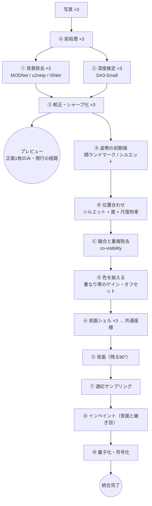

# 12. 3枚の写真から作る（設計案・実装前）

同一人物を3方向から撮った写真を素材に、背景を除いたうえで 3DGS を作る。
**これは案であり、まだ実装していない。** 着手条件と中止条件を §12.15 に書く。

参考実装は [InstantSplat++](https://github.com/phai-lab/InstantSplatPP)（[InstantSplat](https://github.com/NVlabs/InstantSplat) / arXiv 2403.20309 の拡張）。
実測して何を採り何を外したかは §12.3 に記録する。

## 12.0 この文書の位置づけ

既存の設計書（01〜11）は**出荷済みの単一画像パイプライン**を書いたものである。
この文書だけが未実装の提案を含む。決定は「決定案 D24〜D31」として §12.4 にまとめ、
承認されるまで docs/01 の決定表には移さない。

**基本のルールは変えない。** 完全オンデバイス（D1）、写真を端末外に出さない、
同一オリジン配信（D7）、GitHub Pages と CI の構成（D10）、日本語 UI（D11）、
「予算を超える処理は削るのではなく、プレビューの後ろへ回す」（D4 の解釈）。
この文書の提案はすべてこの枠の内側に収まっている。

## 12.1 単一画像との、いちばん大きな違い

単一画像モードで難しかったのは **「見えていない部分を、もっともらしく作ること」** だった。
docs/09 の破綻の型 V1〜V25 も、docs/11 の品質差も、ほぼ全部そこから出ている。

3枚になると、その困りごとの半分以上が**素材として手に入る**。横から撮った写真は、
単一画像モードが最後まで解けなかった「奥行きの幅」（docs/11 §11.1、docs/03 §3.5.7）の
**真値そのもの**である。

代わりに、単一画像には存在しなかった困りごとが1つ出てくる。

> **3枚がどういう位置関係で撮られたのかは、写真には書いていない。**

これがこの機能のほぼ全部である。以降の設計は、この一点をどう安く確実に解くかに費やす。

## 12.2 素材の3枚から読み取れること（**実測で確かめた**）

素材が `tests/` に置かれたので、案を書いた時点の観察を**実ファイルで測り直した**。
1つ訂正が出て、2つ新しく分かった。

### 置かれたファイル

| 役 | ファイル | 寸法 |
|---|---|---|
| 正面 | `tests/test29.jpeg` | 1536×2752 |
| 右向き（画面の右を向いている） | `tests/test29_right.jpeg` | 1536×2752 |
| 左向き（画面の左を向いている） | `tests/test29_left.jpeg` | 1536×2752 |

**呼び方は取り決めどおりだった。** 「右向き」＝写真の中で被写体が画面の右を向いている、
「左向き」＝画面の左を向いている。ファイル名と中身が一致していることを目視で確認した。
ヨー θ の符号は「画面の右を向いている = θ > 0」と決め、コードのコメントに残す。

> **同名で別の写真があることに注意。** リポジトリ直下の `test29.jpeg` は
> **単一画像モードの既存の素材で、`tests/test29.jpeg` とは別の写真である**
> （服も採光も違う。平均絶対差 31.4 / 255）。docs/09・docs/11 の数値は直下のほうで
> 測ったものなので、M8（単一画像モードとの比較、§12.13）は
> **`tests/test29.jpeg` で単一画像モードを測り直してから**比べること。

### 観察

| # | 観察 | 確かめ方と実測値 | 設計への効き方 |
|---|---|---|---|
| **O1** | **カメラは1画素も動いていない** | 背景だけが写る右の帯（x 0.78〜0.97、y 0.28〜0.72）で正規化相互相関。**front→left 0.974 / front→right 0.973、いずれも最良のずれが (0,0)**（±40画素を探索） | **ターンテーブル（鉛直軸まわり）の当て方が正しいと裏づけられた。** 一般の6自由度を解く必要がない。§12.7 の未知数の置き方はこれに乗っている |
| O2 | 背景から相対姿勢は取れない | 同上。背景が動いていないのだから、被写体の回転について何も語らない | 「背景で SfM を回す」近道は**無い** |
| O3 | 2枚の横向きは逆向き | 目視。腰のリボンが左向きにだけ見える | 正面・右向き・左向きで水平約 270° |
| **O4** | **訂正。3枚とも 1536×2752 で同じだった** | PIL で寸法を読んだ。案の段階で「縦横比も写る大きさも違う」と書いたのは、**会話に貼られた縮小版を見て言ったもので、誤りだった** | **焦点距離を3枚で共有してよい。** InstantSplat の `--focal_avg` が仮定ではなく事実として成り立つ。view ごとの未知数が1つ減る |
| **O5** | 腕の位置が3枚で違う | 目視。正面は両手を背中に回し、横向きは腕を体側に下ろして手が腿の横に見えている | D33（腕は正面 view のものだけ）の根拠。**上腕は3枚で近く、前腕から先が違う** |
| O6 | スカートの生成り色と壁の色が近い | 素朴なしきい値で背景を切ろうとして**失敗した**（右端のドア枠が暗く、左に影があるため、明るさだけでは分けられない） | マットは①に任せるしかない。**背景除去の難所として良い素材**。合格判定はこれで行う |
| O7 | 壁に影が落ちている | 目視 | 影を被写体に含めないこと（docs/09 §V7 の型） |
| **O8** | **新。脚が3枚とも太ももで切れている**（足が写っていない） | 目視、および下端の画素が壁として一様でないこと | **`statureFix` の「立ち姿の身長 1.65 m」（docs/09 §V25）が使えない。** 尺度の拘束を差し替える（§12.7） |
| **O9** | **新。露出とホワイトバランスがほぼ揃っている** | 背景帯の RGB 平均比 front→left = **[1.008, 1.004, 1.002]**、front→right = **[1.027, 1.023, 1.023]** | Ⓓ 色合わせ（§12.9）の仕事は小さい。**保険として残すが、ここが品質を決めることはない** |

O1 と O5 は逆方向を向いている。O1 は「回転だけ解けばよい」と言い、O5 は「その回転では
説明できない差がある」と言う。**両方を同時に扱えることが、設計の条件になる**（§12.7、§12.8）。

**O1 がこの機能でいちばん幸運な事実である。** カメラが動いていないので、
位置合わせは「被写体が何度回ったか」を解く問題に縮む。一般の複数枚再構成が
苦労するところを、素材の性質が肩代わりしてくれている。
ただし**これは撮り方の性質であって、保証ではない**。カメラが動いた3枚を入れられたら
未知数は増える（§12.7 は 6〜7 自由度まで許す置き方にしてある）。

## 12.3 参考実装 InstantSplat++ の実測と、取り込みの判断

InstantSplat++ の構造は3段である。

1. **Co-visible Global Geometry Initialization** — 学習済みのステレオ基盤モデル（MASt3R / VGGT / MapAnything）で
   view ごとの密な pointmap を出し、global alignment で内部・外部パラメータと初期点群にする。
   `--conf_aware_ranking`（信頼度で view を順位づけ）と `--co_vis_dsp`（複数 view で共視される点だけ残す）で冗長を落とす。
2. **Joint optimization** — 3DGS を 1000 反復学習しながら、**カメラ姿勢も同時に**最適化する（`--optim_pose`）。
   適応的な密度制御は使わない（初期点数のまま）。
3. **Render**。

### 採れないもの（規模）

重みを実測した。

| モデル | 実測サイズ | 出典 |
|---|---|---|
| MASt3R ViT-L (512, metric) | **2,754,910,614 B ≒ 2.75 GB** | naverlabs の配布 URL に HEAD |
| VGGT-1B `model.safetensors` | **5,026,367,224 B ≒ 5.03 GB** | HF API |
| MapAnything `model.safetensors` | **4,914,062,480 B ≒ 4.91 GB** | HF API |

いちばん小さい MASt3R でも 2.75 GB で、docs/01 §1.3 で TripoSplat（4.46 GB）を外したのと
**同じ理由でそのまま外れる**。int4 まで落としても 700 MB 級で、初回訪問 50 MB のバジェット
（docs/07 §7.5）とは2桁違う。

Joint optimization も採れない。docs/01 §1.9 の改訂 #1 で QAT を落としたときの実測どおり、
微分可能ラスタライズの forward+backward は**デスクトップ GPU でも 10〜20 ms/反復**である。
1000 反復は端末で分の単位になる。同じ理由で外す。

### 採るもの（構造）

規模を外しても、InstantSplat++ の**考え方は3つそのまま使える**。しかも、うち2つは
すでに私たちが持っている部品で置き換えられる。

| 参考実装 | 役割 | 本設計での置き換え |
|---|---|---|
| MASt3R の pointmap | view ごとの密な3D | **DA3-Small の metric 深度 + `intrinsics`**（22 MB、既に載っている）。役割は同じ |
| `--focal_avg` | 焦点距離を view 間で揃える | DA3 の `intrinsics` を3枚ぶん出して、外れ値を弾いて共有する |
| `--conf_aware_ranking` + `--co_vis_dsp` | 冗長な点を落とす | **重複除去の芯**。正面を第1位として、既に表現されている面は下位 view から落とす（§12.8） |
| Gaussian bundle adjustment | 姿勢とシーンを同時に最適化 | **姿勢だけを、低自由度・非微分可能ラスタライズで解く**（§12.7） |
| 適応的密度制御を使わない | 点数を初期のまま固定 | 同じ。私たちも元から使っていない |

要するに、**「SfM を使わず、密な事前分布から初期化して、短く整える」という骨格を採り、
その事前分布を 2.75 GB のモデルから 22 MB のモデルに置き換える**。
基線が 90° 近くあるので特徴点マッチング（COLMAP 系）は元から効かない。
参考実装が SfM を捨てた理由は私たちにも当てはまる。

## 12.4 決定案

| # | 項目 | 決定案 | 影響 |
|---|---|---|---|
| **D24** | 入力枚数と入れ方 | **1枚・2枚・3枚**。UI に「正面」「右向き」「左向き」の**枠を3つ**置き、どれに何を入れるかは**利用者が手で指定する**。自動判別はしない。4枚以上は非スコープ | 入力 UI、パイプラインの分岐 |
| **D25** | 立体の被覆 | **枚数で決まる。** 1枚=半球（D2 のまま）／2枚=水平 約180°／3枚=水平 約270°。D2 を複数枚モードについて差し替え | ビューアのカメラ範囲、背面シェルの役割 |
| **D26** | 位置合わせの手段 | **ステレオ基盤モデルを使わない。** シルエット・深度・尺度拘束による低自由度の剛体位置合わせを自前で書く | §12.7。モデル DL は増えない |
| **D27** | 最適化 | **微分可能ラスタライズによる joint optimization は使わない。** 姿勢のみを解く | 端末時間。D18（QAT 廃止）と同じ理由 |
| **D28** | 融合の方式 | **視体積の交差（visual hull）は使わない。** view ごとの面を共通座標に置き、co-visibility で重複を落とす | §12.8。O5（非剛体）への備え |
| **D29** | データ形式 | `.pgs` **v2**：view プレーンの配列 + 位置合わせブロック。単一 view は「長さ1の配列」として読める | docs/05 の改訂 |
| **D30** | 3枚モードの SLO | **別立て。** プレビューは正面1枚で現行どおり（4.8 s）。3枚の統合完了は **目標 14 s / 上限 20 s**（WebGPU）。WASM 経路は PoC-3D の実測後に決める | docs/01 §1.4 に行を足す |
| **D31** | 非スコープの精密化 | docs/01 §1.6 の「複数枚からの再構成（SfM / 一般の 3DGS 学習）」は**非スコープのまま**。ここで作るのは SfM でも 3DGS 学習でもなく、低自由度の剛体位置合わせと深度の融合である | 記述を書き換えるのではなく、注釈を足す |

| **D32** | 背面シェル | **既定オフ。UI と書き出しでオンにできる。** 3枚で背面の幅と奥行きが実測で決まるので、オンにしたときの質は単一画像モードより高い | §12.10 |
| **D33** | 腕・脚の扱い | **最上位 view（正面）のものだけを使い、横向き view の腕は落とす。** 横から見ると腕は消える。この割り切りを取る | §12.8。O5（非剛体）への回答 |

D25 は D2 の差し替えだが、**単一画像モードの D2 はそのまま残す**。同じアプリに複数の
被覆が同居する。ビューアはドキュメントの view 数を見てカメラの範囲を切り替える。

**D24 の「手で指定する」が、設計をかなり楽にしている。** どの枠に入ったかで θ の
初期値（0° / +90° / −90°）が分かるので、§12.7 で書いた「符号を3通り総当たり」も、
どれが正面かの自動判別も要らなくなる。face-mesh とシルエットは**初期値を作る役から、
初期値を微調整する役に降りる**。落ちても致命傷にならない（R14 が軽くなる）。

## 12.5 パイプライン案



**⓪①②③ は既存のコードをそのまま3回回すだけ**である。新規はⒶⒷⒸⒹの4つと、
④以降の「共通座標で組む」化。既存の破綻対策（docs/09 の V1〜V25 に対する処置）は
view ごとにそのまま効く。

## 12.6 ① 背景除去を枚数ぶんやる

既存の①（docs/03 §3.3、人物モードは MODNet + u2netp の二段）を view ごとに回す。
複数枚になって新しく要るのは次の3つ。

1. **横向きでの検証。** MODNet は正面寄りのポートレートを想定した学習である。
   横向きで輪郭が崩れないかを、この素材で確かめる（PoC-3B）。落ちるなら精密マット（ISNet）へ
   自動で切り替える（+1.1 s／view）。
2. **view 間の整合を、縦の長さで見る。** 各 view のマットから測ったヨー不変の縦の長さ（O8 により
   身長ではない。§12.7）が揃わなければ、どれかのマットが頭や裾を落としている（docs/09 §V14 の型）。
   **これは複数枚あって初めて可能になった自己診断**で、単一画像では気づけなかった失敗を捕まえられる。
3. **O6・O7 への注意。** 生成り色のスカートと壁、壁の影。**素朴なしきい値では切れないことを
   実際に確かめた**（§12.2 O6。右端のドア枠が暗く、左に影があるので明るさだけでは分けられない）。
   合格の判定は「この素材で輪郭が正しいこと」に置く。合成画像では意味がない。

背景を除いたあとは、これまでどおり α=0 の領域には**ガウシアンを作らない**。
背景が3D に混ざる余地は構造的に無い。

## 12.7 Ⓑ 位置合わせ — この機能の中心

### 何を未知数にするか

O1（カメラ固定・被写体が回転）から、素直な当て方は**ターンテーブル**である。
基準を正面 view（i=0）に固定し、view i について:

| 未知数 | 数 | 事前分布 |
|---|---|---|
| 鉛直軸まわりの回転 θ_i | 1 | ±90° 付近（O3） |
| 回転軸の水平位置 (a_x, a_z) | 2 | 被写体の重心の近く |
| 尺度 s_i | 1 | ヨー不変の縦の長さで縛る（後述）→ 実質 0 |
| 微小な傾き（pitch, roll） | 2 | 0 付近。手持ちの傾き |
| 上下オフセット t_y | 1 | 0 付近 |

view あたり 6〜7、**3枚で 12〜14**。InstantSplat の bundle adjustment（全ガウシアン + 全カメラ）
とは桁が2つ違う。この規模なら微分可能ラスタライザは要らない。

### 初期値 — 枠がいちばん強い手がかり

D24 で利用者が枠を指定するので、**θ の初期値は入力の時点で分かっている**。

| 枠 | θ の初期値 |
|---|---|
| 正面 | 0°（基準） |
| 右向き | +90° |
| 左向き | −90° |

残りの手がかりは、この ±90° を実際の角度（65° かもしれないし 100° かもしれない）へ
寄せるために使う。**初期値を作る役ではなく、微調整する役**である。

| 手がかり | 何に効くか | 使う部品 |
|---|---|---|
| 顔ランドマークの左右非対称 | 頭部のヨーの実測 | 既にある face-mesh（docs/03 §3.4.5、`src/pipeline/geometry/faceSurface.ts`） |
| シルエットの 幅 ÷ 高さ | \|θ\| の大きさ | マット（既存） |
| DA3 の奥行きの幅 ÷ 体幅 | 同上の裏取り | 既存の較正（docs/03 §3.5.7） |

**3つとも落ちても、枠の ±90° から探索を始めれば位置合わせは走る。**
横向きで face-mesh が落ちる懸念（R14）は、これで致命傷ではなくなった。

### 2枚のとき

| 組み合わせ | 被覆 | 位置合わせ | 扱い |
|---|---|---|---|
| **正面 + 右向き**（または左向き） | 約 180° | 未知数が半分。共視帯（肩・体側）もある | **推奨。3枚と同じ経路がそのまま動く** |
| 右向き + 左向き（正面なし） | 約 180°（正面と背面が抜ける） | θ の差が約 180° で、**共視する面がほとんど無い**。頼れるのはシルエットと尺度の拘束だけ | 動かすが、M1 が閾値を割ったら片方だけの結果に落とす。UI で「正面を足すと良くなる」と伝える |

正面が無いときの最上位 view は、**シルエットの面積が大きいほう**を選ぶ。

### 目的関数

3項の重み付き和。**すべて既にある部品で書ける。**

1. **シルエット整合。** view j の点群を view i へ投影し、`mask_i` の距離変換の値を足す。
   両向きに取る。距離変換は `src/pipeline/geometry/distanceTransform.ts` がある。
   90° 基線では特徴点マッチングは効かないが、**シルエットは効く**。これが主項。
2. **重なり帯の面整合。** 正面と横が共有するのは肩と体側の細い帯だけだが、
   そこで point-to-plane ICP を掛ける。奥行きの絶対値を合わせるのはこの項の仕事。
3. **尺度の拘束（O8 で差し替えた）。** 当初は既存の `ASSUMED_STATURE_M` / `statureFix`
   （docs/09 §V25）で view ごとの metric 身長を出して縛るつもりだったが、
   **素材は3枚とも脚が太ももで切れていて身長が測れない**（O8）。

   代わりに **ヨーに対してほとんど変わらない縦の長さ**で縛る。回っても縦は変わらないので、
   頭頂から裾までの縦の距離、または頭の縦の高さが使える。3枚でこれが一致するよう s_i を決める。

   **絶対の実寸はこれでは決まらない。** 書き出しを metric に直す話（docs/09 §V25）は別で、
   全身が写っていれば従来どおり身長を使い、切れていれば DA3 の metric 深度に頼る。
   view 間の相対尺度（位置合わせに要るもの）と、絶対尺度（書き出しに要るもの）を
   混ぜないこと。

### 解き方

θ を 1° 刻みで粗く走査（128² のマスク）→ 上位の候補から Gauss-Newton（256²）。
**微分可能ラスタライズは使わない**（D27）。見積もりは 0.2〜0.4 秒だが、これは机上の値で、
PoC-3A で実測して置き換える。

### 非剛体（O5）への対処

**位置合わせは「胴と頭」だけで解く。腕と脚は目的関数に入れない。**
3枚で腕の位置が違う以上、腕を含めて合わせようとすると解が引きずられる。

部位の切り分けは、**学習モデルを足さずに**作る：顔の箱（既存）、シルエットの
縦方向の幅の分布（腰の位置）、距離変換の細さ（四肢は骨格から見て細い）。
精度は要らない。「合わせるのに使わない領域」を大まかに外せれば足りる。

腕と脚をどう置くかは D33 で決めた。**正面 view のものだけを使う**（§12.8）。

## 12.8 Ⓒ 融合と重複の除去

### 視体積の交差（visual hull）はやらない

shape-from-silhouette は「3枚が同じ形を写している」ことを前提にする。O5 でその前提が壊れている。
正面のシルエット（手が背中）で削ると、**横向きに写っている腕が消える**。
交差は誤りを増幅する方向に働くので採らない（D28）。

### 代わりに：置いてから、重複を落とす

InstantSplat の `--co_vis_dsp` と同じ側の考え方を採る。

1. view を順位づける（`--conf_aware_ranking` 相当）。**正面を第1位**にする。理由は、
   顔があり、面積が大きく、face-mesh も含めて既存の処置がいちばん効いている view だから。
2. 上位 view の面を先に置く。
3. 下位 view の点を、上位 view の深度バッファへ投影する。`|Δz| < ε` なら
   **その面は既に表現されている**とみなして落とす。ε は体の奥行きの数%（PoC-3C で決める）。
4. 継ぎ目の帯（両方に見えている境目）では両方を残し、**視線と面の角度で α を重み付ける**。
   面を正面から見ている view の点を優先する。急な角度から見た面は、深度も色も信用が落ちる
   （docs/09 §V19 と同じ理屈）。

### 腕と脚（D33）

O5 のとおり、3枚で腕の位置が違う。正面（手を背中に回している）と横向き（腕を体側に
下ろしている）を両方置けば、**腕が二重に出る**。剛体の位置合わせでは原理的に消せない。

**採る割り切り: 腕と脚は最上位 view のものだけを使い、横向き view の腕は落とす。**

| 見る向き | 腕の見え方 |
|---|---|
| 正面付近 | 正常。正面写真そのままの面 |
| 斜め | 面が寝てくるので薄くなる |
| 真横 | **ほぼ消える。** 正面向きの面を真横から見るため |

**真横から腕が消えることを、仕様として受け入れる。** 二重像より見苦しくない、という判断である。
docs/09 の破綻の型として V26 に登録し、「直すべき不具合」ではなく「既知の限界」として記録する。

**副作用が1つある。** 横向き写真では腕が胴の側面を隠している。その腕を落とすと、
**隠れていた胴の側面に穴が開く**。この帯はどの写真にも写っていないので、⑧のインペイントで
埋める（背面と同じ扱い）。穴が残っていないことは M9 で測る（§12.13）。

腕・脚の領域は §12.7 の部位分けで既に切ってあるので、判定を新しく作る必要はない。

### 点数の見込み

| | 単一 view（現行） | 3枚・単純合計 | 3枚・重複除去後（目標） |
|---|---|---|---|
| ガウシアン | 約 42 万 | 約 126 万 | **50〜60 万** |

126 万は描画のバジェット（`budget.json` の `gaussianCount.failRange` 上限 60 万）を
2倍超えるので、**重複除去は「品質のための工夫」ではなく必須の工程**である。
正面と横は共有する面が少ないので、素直に半分は落ちないはずで、ここは実測が要る（PoC-3C）。

## 12.9 Ⓓ 色を揃える

3枚は同じ場所・同じ服だが、露出とホワイトバランスが揃っている保証はない。
継ぎ目に色の段差が出ると、形が合っていても壊れて見える。

**この素材では、揃っていた**（O9）。背景帯の RGB 平均比は front→left が最大 0.8%、
front→right が最大 2.7% の差しかない。**つまりこの工程は、この素材では効果を出さない。**
それでも入れるのは、利用者が別の日・別の光で撮った3枚を入れてくるからで、
**保険としての価値**である。計算量が無視できるので落とす理由もない。

重なり帯の対応画素で、view ごとに **RGB 各チャンネルのゲインとオフセット（1次）** を
最小二乗で解き、基準 view（正面）に合わせる。線形2パラメータ×3チャンネル×2 view = 12 個。
計算は無視できる。効果は ΔE で測る（§12.13）。

**sRGB のまま解かない。** リニアに戻してから解く（docs/05 §5.3.0 で一度踏んだ型）。

## 12.10 背面（残る90°）

3枚で水平 270°。残るのは背中の約 90° である。

ここで効くのは、**背面の幅と奥行きが、もう分かっていること**。
2枚の横向きが背中側の輪郭を実測しているので、単一画像モードの背面シェル
（docs/03 §3.6.2、v2.6 で既定オフ）が抱えていた「厚みが当てずっぽう」という
問題が消える。**発明するのは表面の色と細かい起伏だけ**になる。

**それでも既定はオフのままにする（D32）。** docs/09 §V11 で既定オフにした理由
（自分のビューアでは見えず、他のビューアでは邪魔になる）は3枚でも変わらないからである。
変えるのは**オンにしたときの質**であって、既定ではない。

| | 単一画像モード | 3枚モード |
|---|---|---|
| 背面の幅・奥行き | 当てずっぽう（厚みパラメータ） | **2枚の横向きシルエットから実測** |
| 背面の色 | 無地の陰影（人物） | 左右の横向き view の背中寄りの色を MI-GAN で補完 |
| 既定 | オフ | **オフ**（D32） |

オンにする口は2つ置く。**ビューアの切り替え**（見ながら決められる）と、
**書き出しのオプション**（他のビューアに渡すときは入れたいことがある）。
単一画像モードの「鏡像は使わない」（v2 改訂 #5）はそのまま守る。

## 12.11 データ形式 `.pgs` v2

現行の `.pgs` は「1つの画像平面に並んだ属性」である。この構造こそが軽量化の芯
（docs/04 §4.3.2「並べ替えが不要」）なので、**壊さずに拡張する**。

```jsonc
{
  "version": 2,
  "views": [                      // v1 は長さ1として読める
    { "camera": {...}, "depthRange": {...},
      "planes": { "depth": ..., "color": ..., "alpha": ... } },
    { ... }, { ... }
  ],
  "alignment": [                  // views[0] を基準とした剛体変換 + 尺度
    null,
    { "R": [9], "t": [3], "s": 1.0 },
    { "R": [9], "t": [3], "s": 1.0 }
  ],
  "back": { "planes": { "color": ..., "alpha": ... } },   // 残る90°
  "meta": {...}
}
```

- **view ごとのプレーンは今のまま。** 画像コーデックの効きも、位置・回転・スケールを
  保存しない性質（docs/02 §2.4）も、そのまま維持される。
- **重複除去の結果は保存しない。** 厚みやスカートと同じく、読み込み時に決定的に再計算する
  （docs/05 §5.2.3 と同じ方針）。位置合わせのパラメータさえあれば再現できる。
- **前方互換。** v1 のファイルは `views` 長さ1・`alignment` なしとして読める。
  v2 を読めない実装には `version` で弾かせる。

`.spz` / `.ply` / `.splat` への書き出しは、共通座標で組んだ後の点群を出すだけなので変わらない。
**外に出すファイルの見た目では、3枚由来かどうかは分からない**（それが正しい）。

## 12.12 予算

### 時間（WebGPU 経路・人物・標準プリセット）

| 段階 | 単価 | 回数 | 小計 | 備考 |
|---|---|---|---|---|
| ⓪ 前処理 | 0.10 | 3 | 0.30 | |
| ① 背景除去（人物） | 0.35 | 3 | 1.05 | 精密マットなら 1.45×3 |
| ② 深度（全体+タイル） | 2.40 | 3 | 7.20 | **支配的** |
| ③ 較正・シャープ化 | 0.29 | 3 | 0.87 | |
| **▶ 正面のプレビュー** | | | **5.08** | **現行の単一画像経路そのまま** |
| Ⓐ 姿勢の初期値 | 0.10 | 1 | 0.10 | 机上（要実測） |
| Ⓑ 位置合わせ | 0.30 | 1 | 0.30 | 机上（要実測） |
| Ⓒ 融合・重複除去 | 0.30 | 1 | 0.30 | 机上（要実測） |
| Ⓓ 色合わせ | 0.02 | 1 | 0.02 | |
| ④⑦ シェル・サンプリング | 0.79 | — | 1.60 | 点数が増えるので約2倍 |
| ⑤⑧ 背面・インペイント | 0.90 | 1 | 0.90 | |
| ⑩ 量子化・符号化 | 0.80 | 3 | 2.40 | **書き出し時まで遅延**（現行と同じ） |
| **▶ 統合完了（⑩を除く）** | | | **約 12.6 s** | 目標 14 / 上限 20（D30） |

**2枚のときは、②が2回になるぶんだけ縮む。** 同じ積み方で **約 8.9 s**（目標 10 / 上限 14 を提案）。

**②が全体の 6 割**である。複数枚モードの時間はほぼ「深度推定を枚数ぶんやる時間」で決まる。
削るとすればタイルパス（1.60 s／view）だが、docs/03 §3.4.1 で「タイルパスは任意ではない」と
結論が出ているので、削るのではなく**プレビューの後ろに置く**（D4 の解釈どおり）。

**WASM 経路は、そのまま3倍すると人物・軽量で 30 秒を超える**（PoC-2 実測 11.0 s × 3）。
D30 のとおり PoC-3D の実測を見てから決める。取りうる案は、(a) 3枚モードは WebGPU のみ、
(b) WASM は 512²・タイルパス無しの専用プリセットで 25 秒級、(c) WASM では
「2枚目・3枚目はバックグラウンドで、見ている間に差し替える」。
**現時点で (a) を第一候補にする**が、決めるのは実測の後。

### サイズ・メモリ・帯域

| 指標 | 現行（1枚） | 2枚 | 3枚 | 提案する `budget.json` |
|---|---|---|---|---|
| `.pgs` | 750 KB | 約 1.4 MB | 約 2.0 MB | `output.pgs.multiview.bytes` warn 2.0 MB / fail 2.5 MB |
| ガウシアン数 | 約 42 万 | 35〜45 万 | 50〜60 万 | `output.multiview.gaussianCount` warnRange [300k, 650k] |
| **モデル DL** | 40.7 MB（WebGPU） | **変わらない** | **変わらない** | 変更なし |
| ピークメモリ | — | +約 8 MB | プレーンで +約 12 MB、深度の中間バッファが枚数ぶん | docs/08 R6（iOS の上限）で再検討 |

2枚のガウシアン数が3枚より**少ないのに現行と大差ない**のは、重複除去が効くのと、
腕を最上位 view からしか取らない（D33）ぶんが引かれるためである。見込みなので PoC-3C で測る。

**モデルのダウンロードが1バイトも増えないこと**が、参考実装に対する最大の利点である。
同じ 22 MB の深度モデルを3回呼ぶだけで、2.75 GB のステレオモデルは要らない。

## 12.13 検査と合格ライン（案）

docs/09 の検査に足す。**合格を主張するなら検査に載せる**（docs/11 §11.5 の原則）。

| # | 指標 | 測り方 | 合格案 |
|---|---|---|---|
| M1 | 位置合わせの残差 | 胴＋頭の帯で、投影シルエットと `mask_i` の IoU | **≥ 0.90**（3 view すべて） |
| M2 | 重なり帯の深度不一致 | 共視画素での \|Δz\| の中央値 ÷ 体の奥行き | **≤ 3%** |
| M3 | 二重面（ゴースト） | 別 view 由来の点への最近傍距離の中央値 ÷ 体の奥行き | **≤ 2%** |
| M4 | 継ぎ目の色差 | 重なり帯の ΔE の中央値 | **≤ 3** |
| M5 | 穴の割合 | 90° と 135° から見たときの穴（docs/09 の既存手法） | **≤ 1%** |
| M6 | ガウシアン数 | — | 45〜65 万 |
| M7 | **奥行き ÷ 幅の真値との差** | 横向き写真から測った真の奥行きと、出来た形の奥行き | **±10% 以内** |
| M8 | 単一画像モードとの比較 | **`tests/test29.jpeg`（複数枚の正面）で単一画像モードを測り直してから** M5・M7 を比べる。docs/09・11 の既存の数値は直下の別写真 `test29.jpeg` で測ったもので、直接は比べられない（§12.2） | 3枚が単一を下回らないこと |
| M9 | **腕を落とした裏の穴**（D33 の副作用） | 横向き view で腕が隠していた胴の側面の帯を、⑧の後に測る | 穴が**残っていない**こと（帯の穴 0%） |

**M5 の測り方に断りを入れる。** D33 で真横から腕が消えるのは仕様なので、
M5（穴の割合）は**腕・脚の領域を除いて**測る。除かずに測ると仕様を不具合として数えてしまう。
腕が消えること自体は docs/09 §V26 に既知の限界として記録し、検査では追わない。

**M7 は、この機能がもたらす副産物である。** docs/11 が最後まで測れなかった
「奥行きの幅が本当に合っているか」に、横向きの写真が**真値**を与える。
3枚モードが仮に商品として成立しなくても、**M7 の測定器としては価値が残る**。

## 12.14 リスク

| # | リスク | 影響 | 対策 |
|---|---|---|---|
| **R13** | **3枚で姿勢が違う（非剛体）。O5 で実際に起きている** | **最大だったが、答えを出した。** 位置合わせは胴＋頭だけで解き（§12.7）、腕は最上位 view だけを使う（D33） | 残るのは「真横で腕が消える」（仕様として受け入れ、docs/09 §V26 に記録）と「腕の裏の穴」（⑧で埋め、M9 で追う） |
| R14 | 横向きで face-mesh / MODNet が落ちる | **軽くなった。** D24 の枠指定で θ の初期値は入力から分かるので、face-mesh は微調整の役に降りた。残るのは背景除去の劣化 | ISNet への自動切替（§12.6） |
| **R20** | **利用者が枠を入れ違える**（右向きの枠に左向きの写真） | θ の初期値が 180° ずれ、位置合わせが破綻する。**D24 で自動判別をやめた代償** | M1 が閾値を割ったら**符号を反転して1回だけ再試行**する（2通りの総当たりで足りる）。それでも割るなら R17 と同じ縮退。入れ違いを直したことは日本語で伝える |
| R15 | 90° 基線では特徴点マッチングが効かない | 一般的な SfM の道は最初から閉じている | シルエット＋深度＋尺度拘束で解く。これは前提であってリスクではないが、**「COLMAP を入れれば済む」と後から言い出さないために記録する** |
| R16 | WASM 経路で時間が3倍になる | 対応端末が減る | D30 で実測後に決める。第一候補は WebGPU 限定 |
| R17 | ユーザーが「同じ人物・同じ服・同じ場所」でない3枚を入れる | 破綻した出力 | M1（IoU）を**実行時のゲート**にする。閾値を割ったら3枚モードを諦め、正面1枚の結果を出して理由を日本語で伝える |
| R18 | DA3 の metric 深度が view 間で揃わない | 尺度がばらつく | ヨー不変の縦の長さで縛る（§12.7）。ばらつきの量は PoC-3A で実測する |
| R21 | **カメラが動いた3枚を入れられる** | O1（カメラ固定）は素材の性質であって保証ではない。未知数が増え、位置合わせが不安定になる | §12.7 の未知数は 6〜7 自由度まで許す置き方にしてある。M1 が閾値を割ったら R17 と同じ縮退 |
| R19 | 点数が落ちきらず、描画が 30 fps を割る | 体験の劣化 | ε を締める。それでも駄目なら適応サンプリングの目標統合率を3枚モードで上げる |

## 12.15 PoC の順序と、中止条件

この機能は **PoC-3A が通らなければ成立しない**。実装に入る前に、そこだけを先に測る。

| # | 何を測るか | 手段 | 合格 | 落ちたら |
|---|---|---|---|---|
| **PoC-3A** | 位置合わせが立つか | オフラインのハーネス（Vitest / Node）。実素材3枚で ⓪①②③ を回し、Ⓐ Ⓑ を解いて M1・M2・R18 を出す。**素材は揃ったので着手できる** | M1 ≥ 0.85、M2 ≤ 5% | **§12.15.1 の縮退へ** |
| PoC-3B | 非剛体の量（O5）と、D33 の後始末 | 腕・脚を除いた場合と含めた場合で M1 を比べる。腕を落とした裏の穴の大きさ（M9 の前段）を測る | 除くと M1 が有意に上がる。穴が⑧で埋まる大きさに収まる | 部位分けの方法を作り直す |
| PoC-3C | 融合と重複除去 | M3・M5・M6 | 表の値 | ε と重み付けの調整 |
| PoC-3D | 実機の時間 | `?bench=1` で Android 実機。`docs/measurements.md` に記録 | D30 の上限内 | WASM の扱いを決める（§12.12） |

**合成データで先に検算する。** 位置合わせの数式は、既存の閉形式シフト推定を合成球で
検証した（docs/01 改訂 #16）のと同じやり方で、**合成の人体モデルを既知の角度で回した
3枚**を作り、θ が復元できることを単体テストにする。実素材で測る前にここを通す。

### 12.15.1 中止条件と、そのときの縮退

PoC-3A が改善の見込みなく落ちたら、**機能を捨てるのではなく、次の形に縮める**。

> **横向きの写真を、3D の素材としてではなく「奥行きの較正」にだけ使う。**

横向きのシルエットから被写体の奥行きの幅を測り、単一画像モードの
「立体感」パラメータ（docs/03 §3.5.2、形を決める主要パラメータ）を**写真から決める**。
位置合わせの精度は要らない。必要なのは横向きシルエットの幅だけで、
これは θ が数度ずれても壊れない。

この縮退でも docs/11 の最大の未解決に答えが出るので、**PoC-3A が落ちても投資は無駄にならない**。
着手の判断はこの安全網を前提にしてよい。

## 12.16 実装フェーズの見取り図（まだ書かない）

承認後に触る場所。**既存ファイルの変更は思ったより少なく、新規が中心**である。

| 種別 | 場所 | 内容 |
|---|---|---|
| 新規 | `src/pipeline/align/poseInit.ts` | Ⓐ 姿勢の初期値（顔ランドマーク・シルエット） |
| 新規 | `src/pipeline/align/registerViews.ts` | Ⓑ 位置合わせ（走査 + Gauss-Newton） |
| 新規 | `src/pipeline/align/bodyParts.ts` | 胴・頭・四肢の大まかな切り分け（モデルを足さない） |
| 新規 | `src/pipeline/align/mergeViews.ts` | Ⓒ 融合と co-visibility による重複除去 |
| 新規 | `src/pipeline/align/colorMatch.ts` | Ⓓ 色を揃える |
| 新規 | `src/pipeline/generateMulti.ts` | 3枚の司令塔。⓪①②③ は既存を呼ぶだけ |
| 変更 | `src/pipeline/0-preprocess.ts` | 複数画像の受け取り |
| 変更 | `src/pipeline/6-splats.ts` | 共通座標で組む |
| 変更 | `src/codec/pgs.ts` / `document.ts` | `.pgs` v2 |
| 変更 | `src/ui/app.ts` | **枠3つ（正面・右向き・左向き）**の入力、撮り方の案内、進捗。1〜3枚のどれでも走る（D24） |
| 変更 | `src/ui/viewer.ts` | カメラ範囲を view 数で切り替え（D25）、背面シェルの表示切り替え（D32） |
| 変更 | `src/ui/export.ts` | 書き出しに背面シェルを含めるかのオプション（D32） |
| 変更 | `budget.json` / `scripts/budget_check.mjs` | 3枚モードの行（§12.12） |
| 新規 | `tests/unit/registerViews.test.ts` ほか | 合成データで θ の復元を検証 |
| 新規 | `tests/e2e/multiview.spec.ts` | M1〜M8 の測定 |
| 既存 | `tests/test29.jpeg` / `test29_right.jpeg` / `test29_left.jpeg` | **実素材3枚。置かれた**（§12.2、§12.17.1） |
| 変更 | `docs/01, 02, 03, 05, 07, 08, 09` | D24〜D31 の反映。承認後に行う |

## 12.17 決まったこと / 残っている問い

§12.16 までを書いた時点で挙げた5つの問いは、依頼者の判断で解決した。記録として残す。

| 問い | 判断 | 反映先 |
|---|---|---|
| 素材の3枚をリポジトリに置くか | **置いてよい → 置かれた** | `tests/test29*.jpeg`（§12.2、§12.17.1） |
| 順番を自動判別するか、枠で指定させるか | **枠3つで手動指定**（正面・右向き・左向き） | D24。θ の初期値が入力から決まるので §12.7 が簡単になり、R14 が軽くなった。代わりに R20（入れ違い）が出た |
| 背面シェルを既定オンに戻すか | **既定オフのまま。オンにもできる** | D32、§12.10 |
| 腕をどこまで正直に扱うか | **正面 view のものだけ。真横からは消えてよい** | D33、§12.8。docs/09 §V26 として既知の限界に登録 |
| 2枚でも動かすか | **動かす** | D24、§12.7「2枚のとき」、§12.12 |

### 12.17.1 素材（**置かれた。確認済み**）

`tests/test29.jpeg` / `tests/test29_right.jpeg` / `tests/test29_left.jpeg` の3枚。
寸法・向き・呼び方の一致・背景の固定・露出の揃いを実測して §12.2 に記録した。
案の段階の観察のうち **O4 は誤りだったので訂正し、O8・O9 を足した**。

案では `tests/multiview/{front,right,left}.jpg` を提案したが、置かれたのは
`tests/` 直下の `test29*` である。既存の素材（`test26` `test31` `test38`）と
同じ並びになるので、**こちらのほうが素直**。提案していた `tests/multiview/` は畳んだ。

**PoC-3A はこれで始められる。**

### 12.17.2 残っている問い

1. **単一画像モードの基準を測り直すこと**（§12.2 の注意）。docs/09・11 の数値は
   直下の別写真で測ったものなので、M8 を出す前に `tests/test29.jpeg` で取り直す必要がある。
   **これは問いではなく、やることの積み残しである。**
2. **R20 の再試行を、どこまで自動でやるか。** 符号の反転1回までは自動でよいと考えているが、
   「利用者が指定した枠を勝手に読み替える」ことでもある。黙って直すか、断ってから直すか。
3. **WASM 経路で複数枚モードを出すか**（§12.12）。PoC-3D の実測待ち。第一候補は WebGPU 限定。
4. **2枚モードのプリセット。** 3枚と同じ扱いでよいか、それとも2枚では高品質プリセットを既定にして
   浮いた時間を品質に回すか。時間が約 3.7 秒余る（§12.12）ので選択肢がある。
